<div align="center">

# 天气战士 · 老实看天气预报，很枯燥吧？

**用看股票的方式看天气**

蜡烛图 · 分时走势 · 日/周/月 K 线 · 五档盘口 · 成交明细 · 自选城市 · 行情刷新频率

网页版 · Android APK

[**lolikonnn.github.io/weather-fighter**](https://lolikonnn.github.io/weather-fighter/)

</div>

> **改名说明**：仓库原叫 `weather-exchange`，已改名为 **`weather-fighter`**。
> 旧网址 `https://lolikonnn.github.io/weather-exchange/` 现在是 **404** —— GitHub Pages
> 不会跟着仓库改名做路径跳转，请换用上面的新地址。

> **这份 README 只讲「这是什么、怎么用」。**
> 公式是怎么调出来的、踩过哪些坑、哪些字段是真数据哪些是建模的，
> 都在 **[docs/NOTES.md](docs/NOTES.md)** —— 不关心实现细节的话不用点进去。
>
> **每次更新改了什么** → **[CHANGELOG.md](CHANGELOG.md)**。
> **每个数字是从哪个接口拿的** → **[docs/APIS.md](docs/APIS.md)**。

---

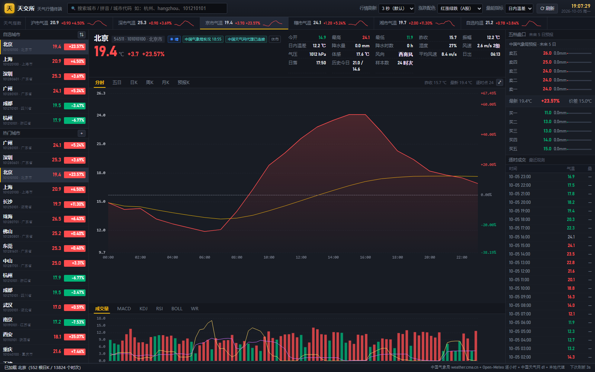

> 上图：分时走势（当日逐小时气温 + 均价线 + 昨收基准线），左侧城市收藏，右侧「未来 5 天高低温」与「每小时气温流水」。

### 界面预览

| 分时走势 | 日 K + 温差 |
| --- | --- |
| 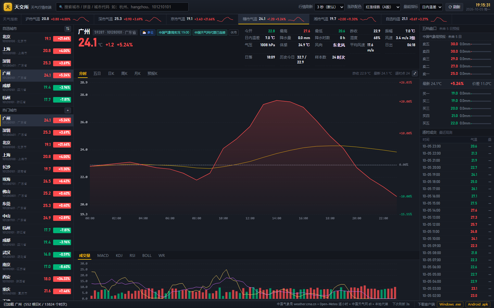 | 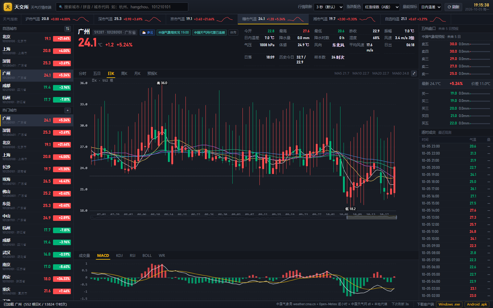 |

| 降水副图（日 K · 按天聚合） | 风副图（周 K · 按周聚合） |
| --- | --- |
| 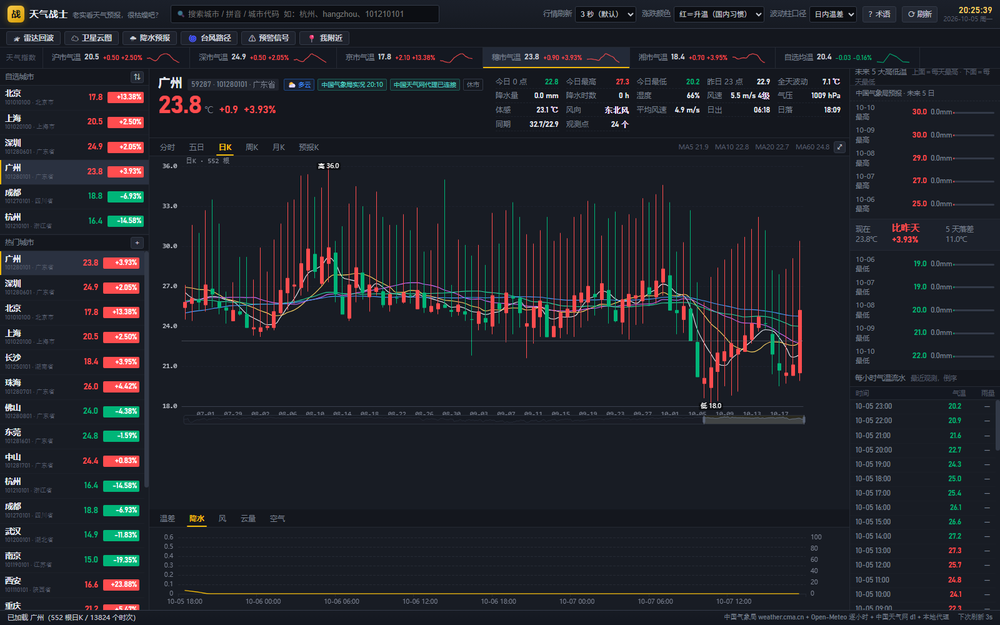 | 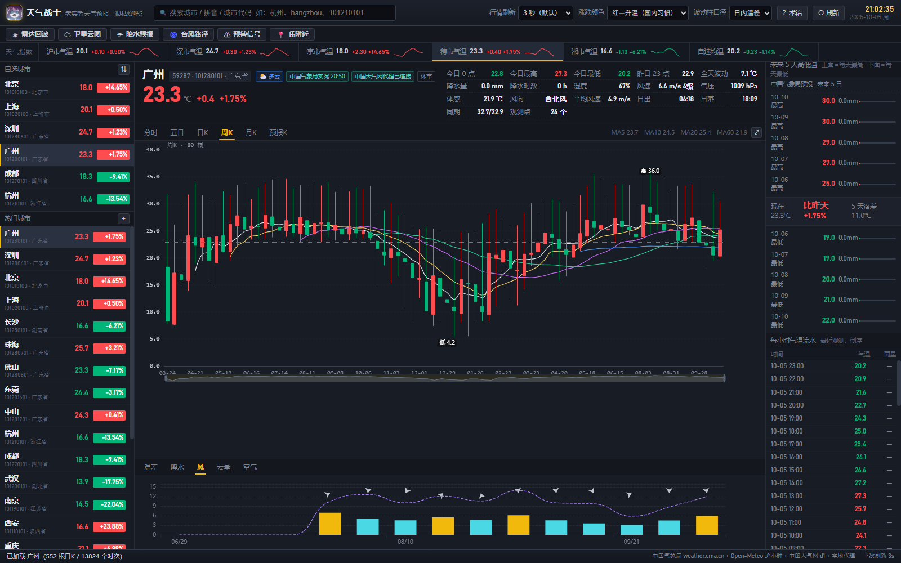 |

| 空气副图（日 K · AQI + PM2.5 + 紫外线） | 雷达回波（八个大区） |
| --- | --- |
| 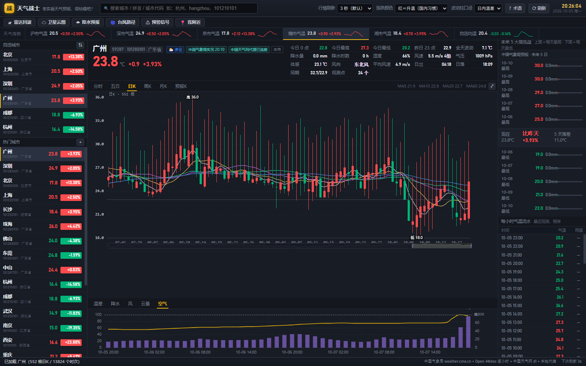 | 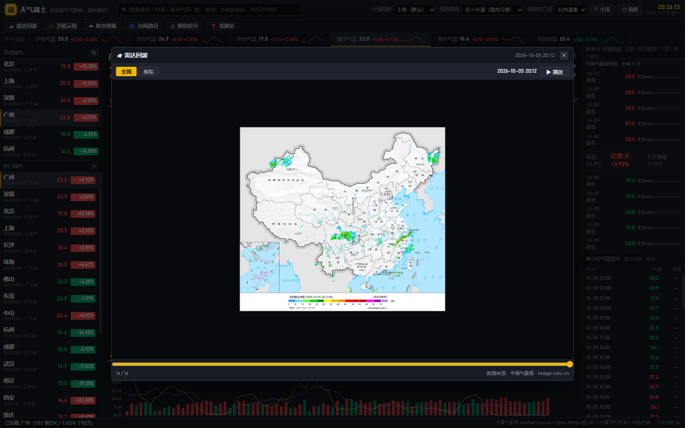 |

| 卫星云图 | 降水预报 |
| --- | --- |
| 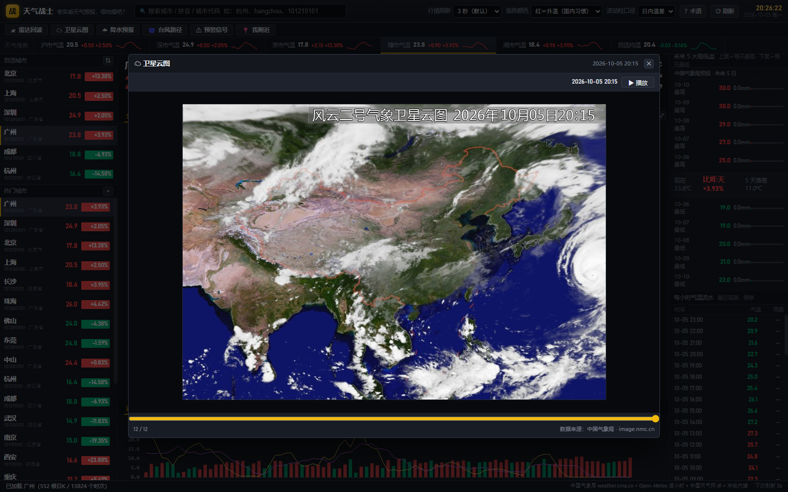 | 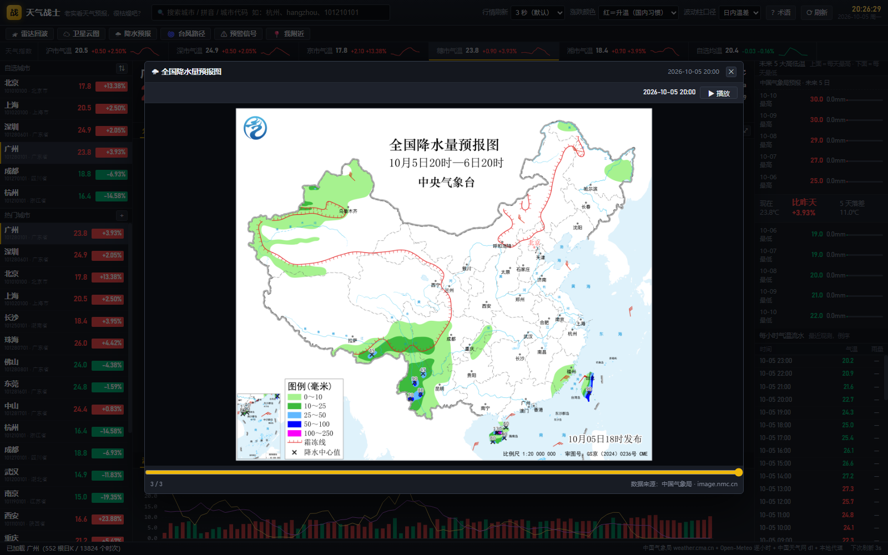 |

| | |
| --- | --- |
| 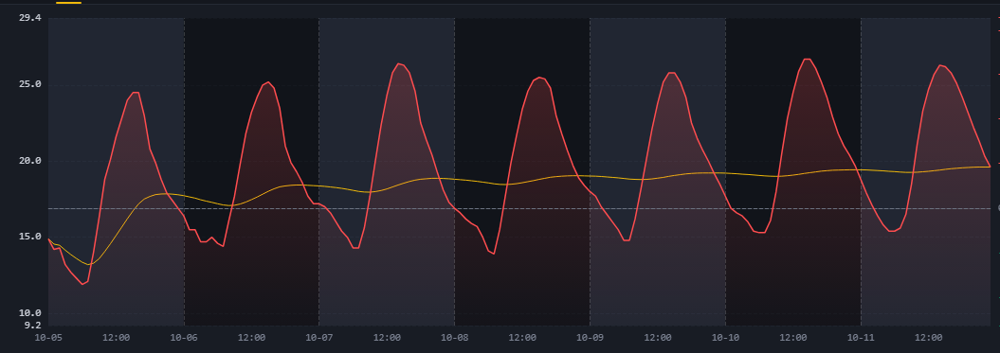 | 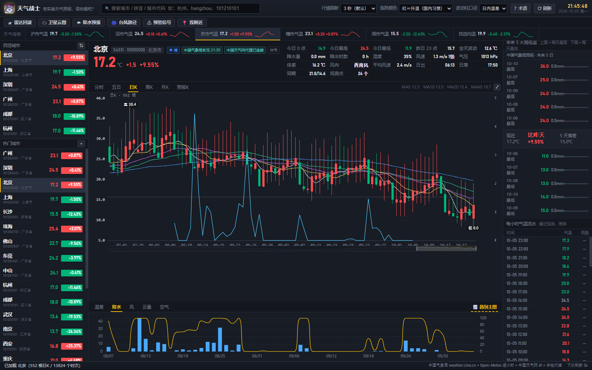 |

> 上左：7日图按自然日铺**明-暗交替**的底色（四明三暗，一眼看出一天一天的界限），紫色 PM2.5 线叠在主图上。
> 上右：日 K 上叠加**降水量线**（青色，走最右侧第 3 根 Y 轴）；副图口径随时可用「📈 叠到主图」按钮拉到主图。

| 台风路径 | 预警信号 |
| --- | --- |
| 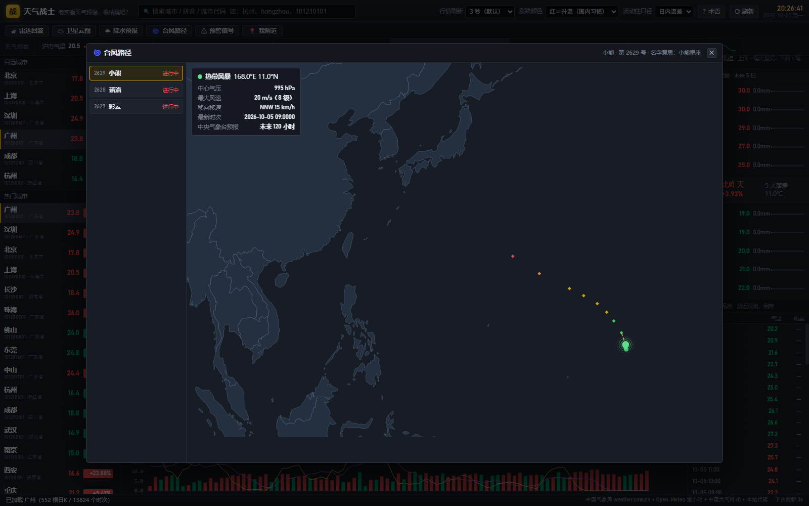 | 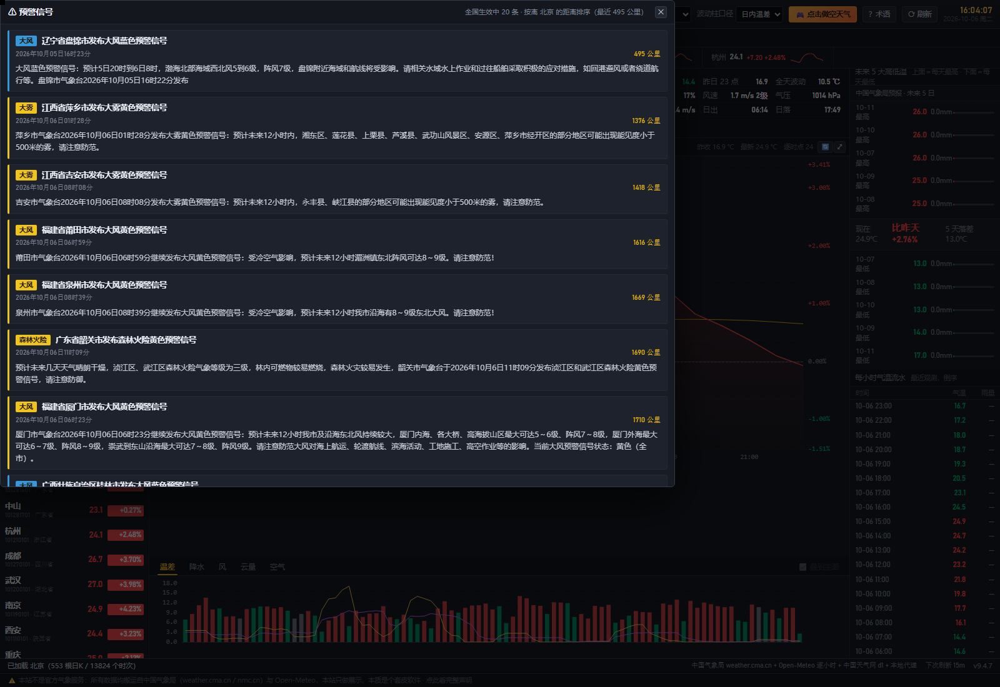 |

| 地震（USGS 真实目录） |
| --- |
| 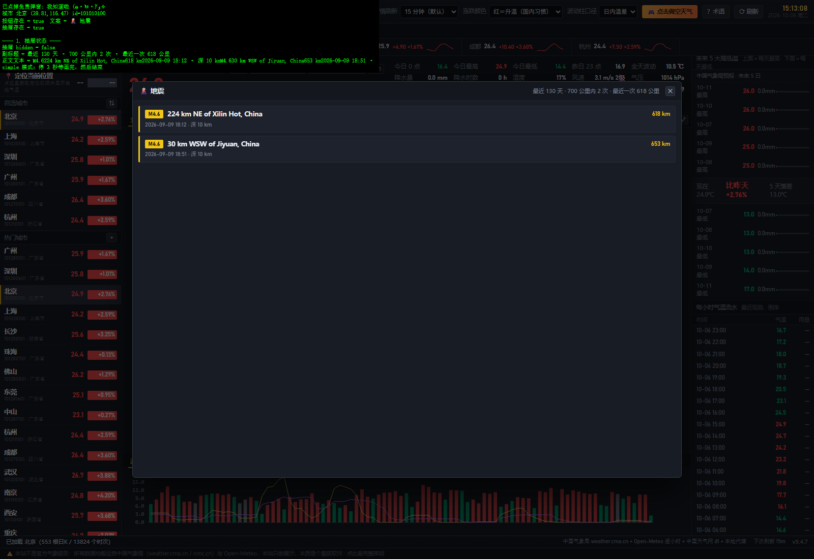 |

> 地震面板用的是 **USGS** 的公开目录（免 key、CORS 全开），按**离当前城市的真实大圆距离**排序，
> 近的排前面；副标题写着「最近 130 天 · 700 公里内 N 次 · 最近一次 X 公里」。
> 为什么不用中国地震台网：`www.ceic.ac.cn` 响应是 200，但**不带 CORS 头**，浏览器里直连读不到。

| 当前所在地（按坐标取的天气） | 指数条 = 左栏镜像 |
| --- | --- |
| 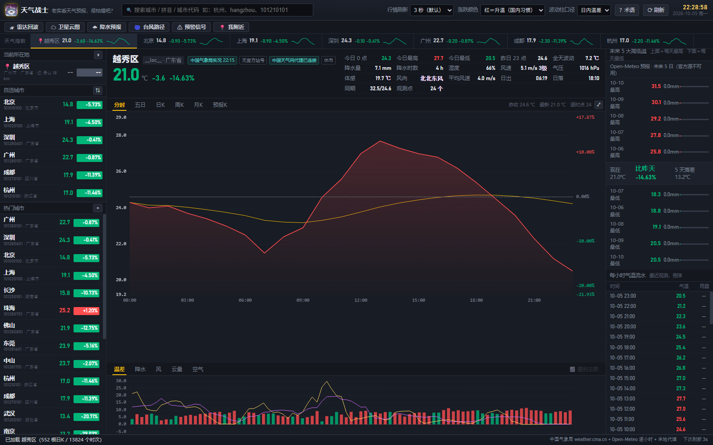 | 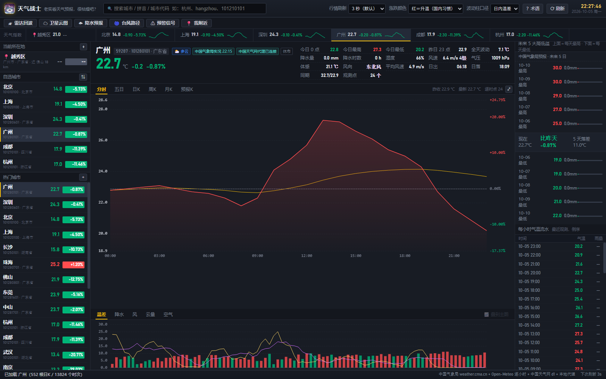 |

> 左：定位到越秀区，天气是**按经纬度直接取的**，所以标「无官方站号」；体感/风向/气压走 Open-Meteo 补齐。
> 右：顶栏指数条跟左栏「当前位置 + 自选城市」完全同步，点一下就能切城市。

| 行情头：统计格 + 月相/昼长 + 预警滚动条 |
| --- |
| 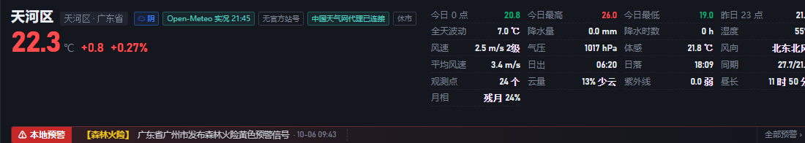 |

> 就是主图正上方那一块。左边是天气 + 价格，右边一格一个数，**按同类分了五行**：
> 今天有多热（最高 / 最低 / 体感 / 全天波动）、风（风速 / 风向 / 平均风速 / 气压）、
> 天上有什么（云量 / 紫外线 / 湿度 / 降水）、日月（日出 / 日落 / 昼长 / 月相）、
> 读数基准（今日 0 点 / 昨日 23 点 / 同期 / 观测点）。
>
> 月相没有任何数据源直接给，是按朔望月自己算的；昼长优先用数据源的日照秒数，没给就拿日出日落相减；
> 云量和紫外线取的是**当前这个小时**的值（抬头看一眼天，和这个数对得上才有用）。
> 算法和取舍都写在 `docs/NOTES.md` 里。
>
> 最下面那条**预警滚动条**是行情软件里"滚动播报"那个位置。它**只滚当前正在看的那座城市的预警**
> ——自选里切到哪座城市，条子就跟着换（不是"我定位在哪就永远滚哪"）；标签上会写清是哪座城市。
> 筛法是把城市名拿去标题里找（气象局的标题自己就点了地名，如「广东省广州市发布森林火险黄色预警信号」），
> **不是按距离画圈** —— 画圈会把隔壁市的一起卷进来。在看区县时会把上级市一起算进来
> （区一级常常没有自己的预警）。这个区市一条都没生效的时候**整条收起来**，不留"暂无预警"占位。
> 内容比可视区短就静态显示，长了才自己慢慢往左走（26 像素/秒）。
> **手指可以随时横向拖、桌面滚轮也能滚** —— 一碰它就停下来让位，松手几秒后接着走。
> 系统里开了「减少动态效果」时不自动走，但仍然拖得动。
> 整条可以点，点开就是完整的预警信号面板（横向拖过就不算点，免得想拖一下却跳进面板）。

| 7日横轴带日期 | 预报 K（10 天历史 + 16 天预报） |
| --- | --- |
| 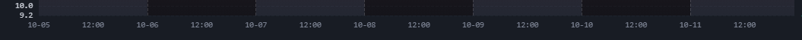 | 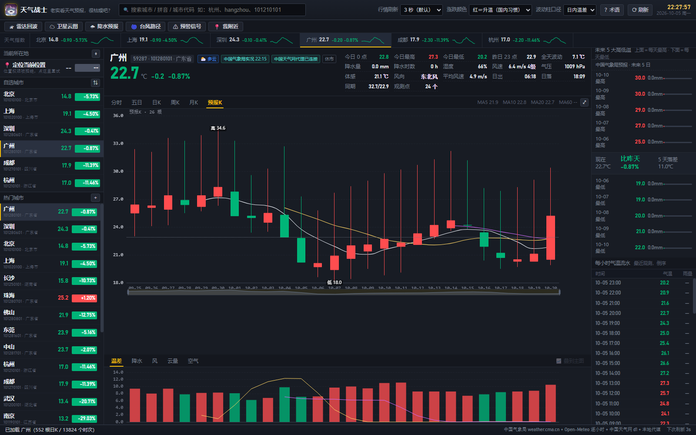 |

| 术语对照表 | 手机竖屏 · 自选 |
| --- | --- |
| 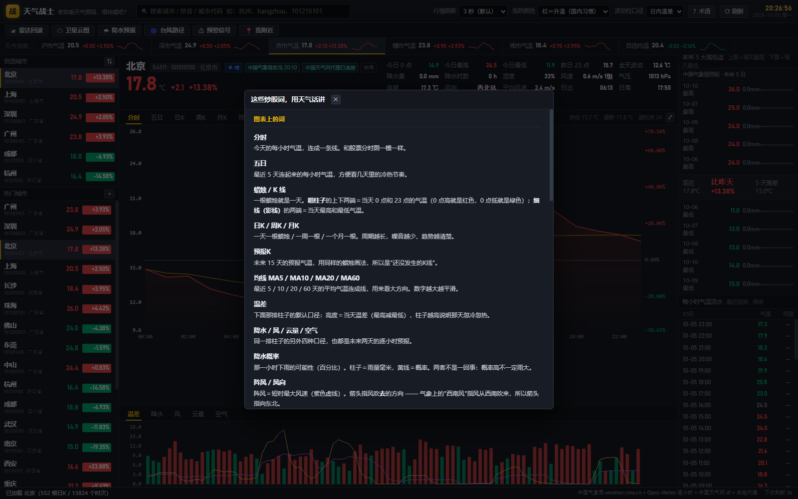 | 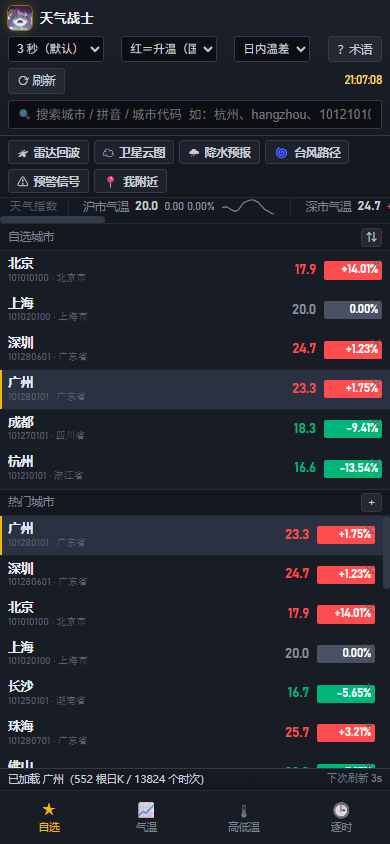 |

> 左：顶栏 **？术语** 打开。里面有一节专门讲 **主图上那几条线** —— 红色实线（气温）、金色线（均价）、
> 灰色水平虚线（基准线，值＝昨天 23 点）、深浅交替的日界带、以及自己叠上去的
> 蓝/绿/灰蓝/紫细线（降水 / 风速 / 云量 / PM2.5）和 K 线图上的 MA5/10/20/30/60。

| 手机竖屏 · 台风 | 手机竖屏 · 雷达（按省自动选中华南） |
| --- | --- |
| 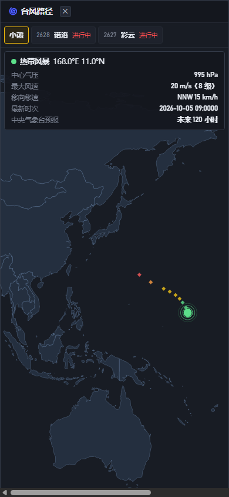 | 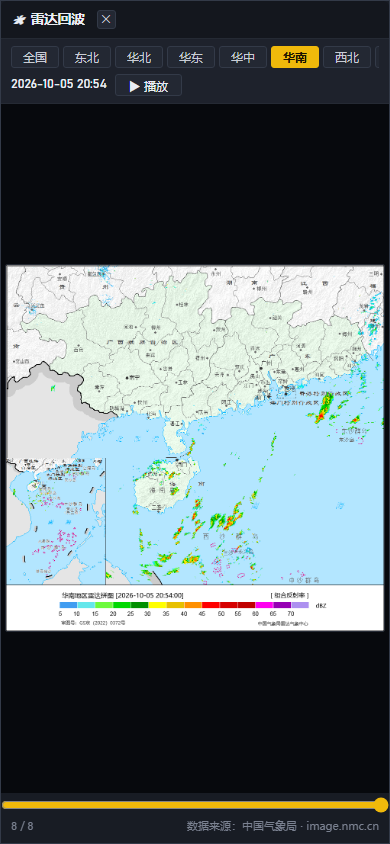 |

| 手机竖屏 · 主图不再被压扁 | 手机竖屏 · 主图全屏（⤢） |
| --- | --- |
| 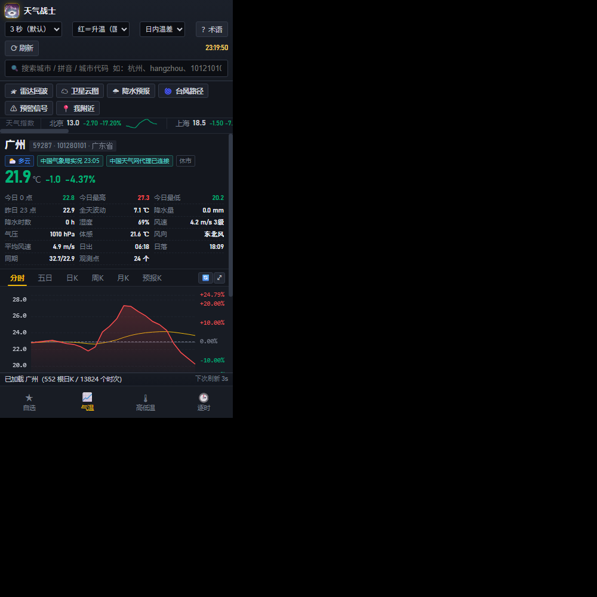 | 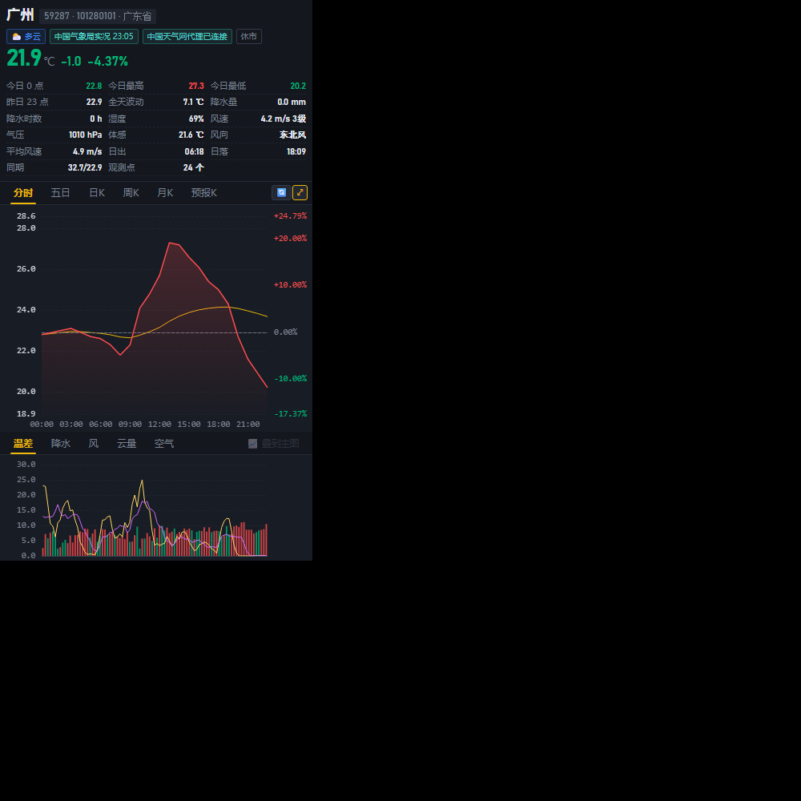 |

> 左：窄高屏上主图原来会被 `flex:1` 压成 **0 高**（页签下面直接就是副图，看起来像"主图不见了"），
> 现在窄屏给 `.chart-box{flex:1 1 auto;min-height:170px}`，整页高度改为 `.pane-center` 内部滚动。
> 行情头在竖屏**默认只留「气温」「天空」两组统计格**、后面三组折起来（点「全部数据 ▾」全放），
> 省下来的高度都给主图；行情头底部那条红色小条是**预警滚动条**（跟着当前城市走）。
> 右：全屏按钮用 **CSS**（`position:fixed;inset:0` + 隐藏其它块）而不是 Fullscreen API ——
> iOS Safari 至今不支持 `Element.requestFullscreen`，CSS 方案在哪都能用，Esc 也能退出。

| 日 K 日期轴不再被缩放条压住 |
| --- |
| 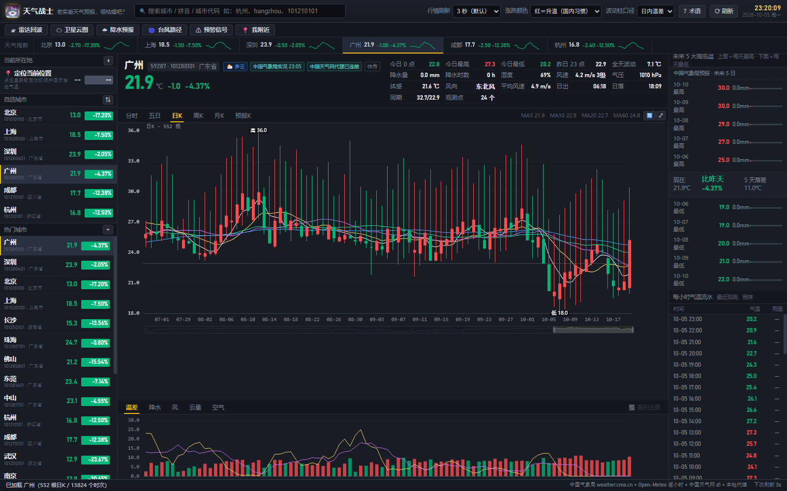 |

> 日期标签原本落在 `H-26 .. H-14`，而 `dataZoom` 滑块的顶边在 `H-20`，两者正好重叠。
> 把主 K 线图的 `grid(52,56,16,34)` 改成 `grid(52,56,16,46)`，把标签抬到滑块上方。

| 涨空心、跌实心（A 股习惯） |
| --- |
| 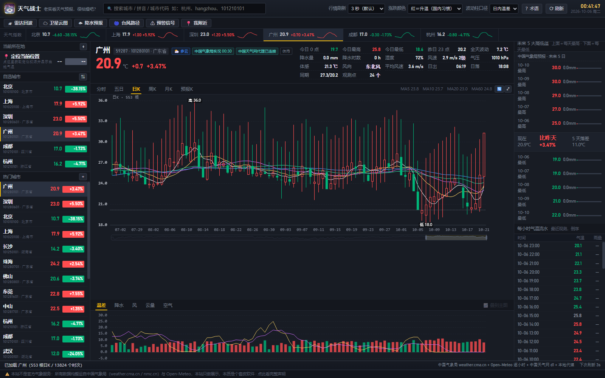 |

> 气温 K 线比真股票密集得多，全实心会糊成一片色块。涨的实体只留描边，跌的实心填充，
> 影线走 `borderColor` 所以仍是涨色 —— 涨跌方向在一堆重叠的 K 线里也能一眼扫出来。

| 首次访问的免责弹窗 | 网页底端常驻的免责声明 |
| --- | --- |
|  | 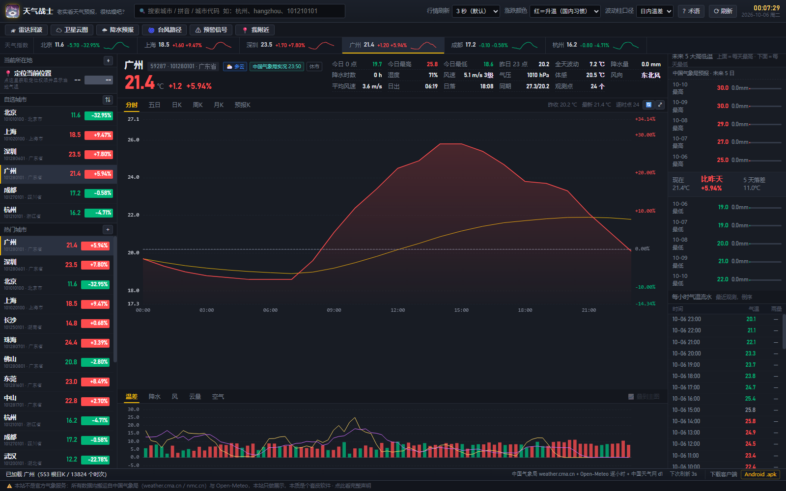 |

> 左：第一次打开弹一次（`localStorage.welcomed` 记住，之后不再弹；`?welcome=1` 可强制弹）。
> 右：弹窗关掉之后，底端那条**一直在**，点它可以把完整声明再弹回来 ——
> 私自开展天气预报业务是违法的，这条不能只藏在弹窗里。

| 免责声明在手机竖屏（落在底部页签上方） |
| --- |
| 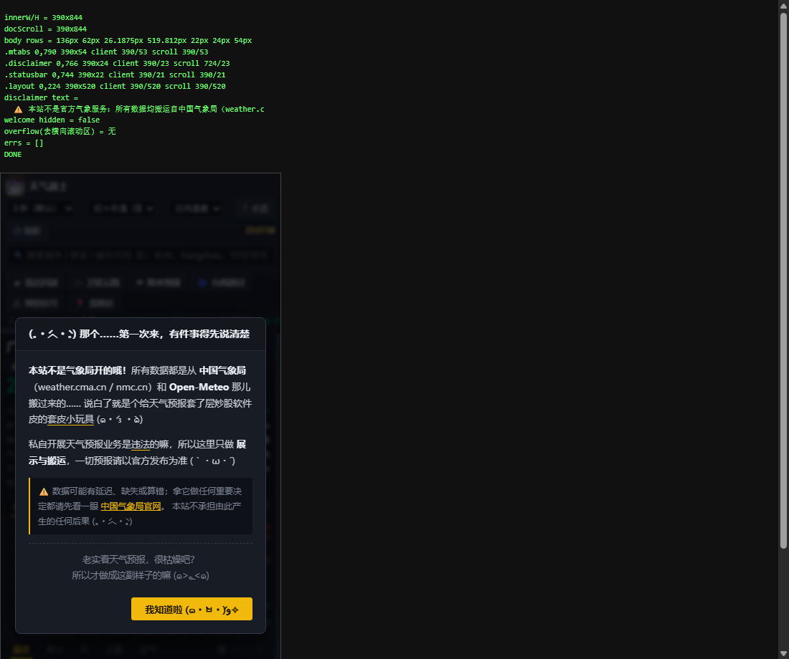 |

> **407×760** 的手机视口。`body` 是 grid，加这一行必须同步改**三处**
> `grid-template-rows`（桌面 / 竖屏 / 横屏），否则最后一行会被挤出视口。
> 实测无横向或纵向溢出，`.disclaimer` 落在底部页签上方。

> 桌面截图 1600×1000。手机截图是 **407×760 的真实手机视口**，不是把桌面版缩小出来的。
> （注意：Windows 上无头 Chrome 会把 `--window-size=407,760` 悄悄夹到约 500px 宽，
> 然后只截左边 407px —— 那样得到的"手机截图"右侧是被裁掉的，不能用。要量真手机布局，
> 必须把页面装进一个 407px 宽的 iframe 里，`getBoundingClientRect()` 拿到的才是真值。）

| 操盘手 · 开局说明 | 操盘手 · 操盘中 |
| --- | --- |
| 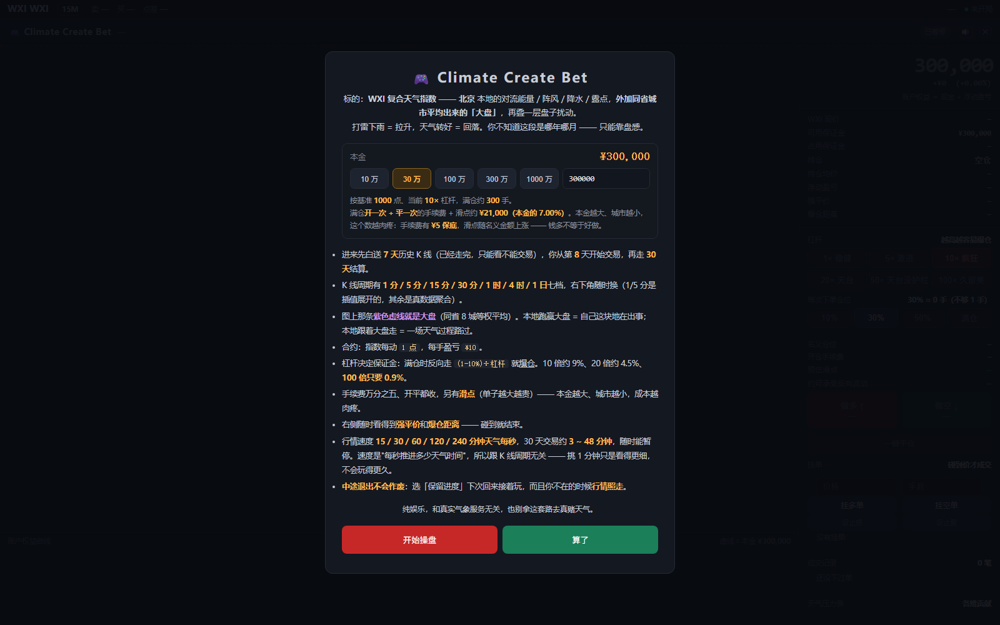 | 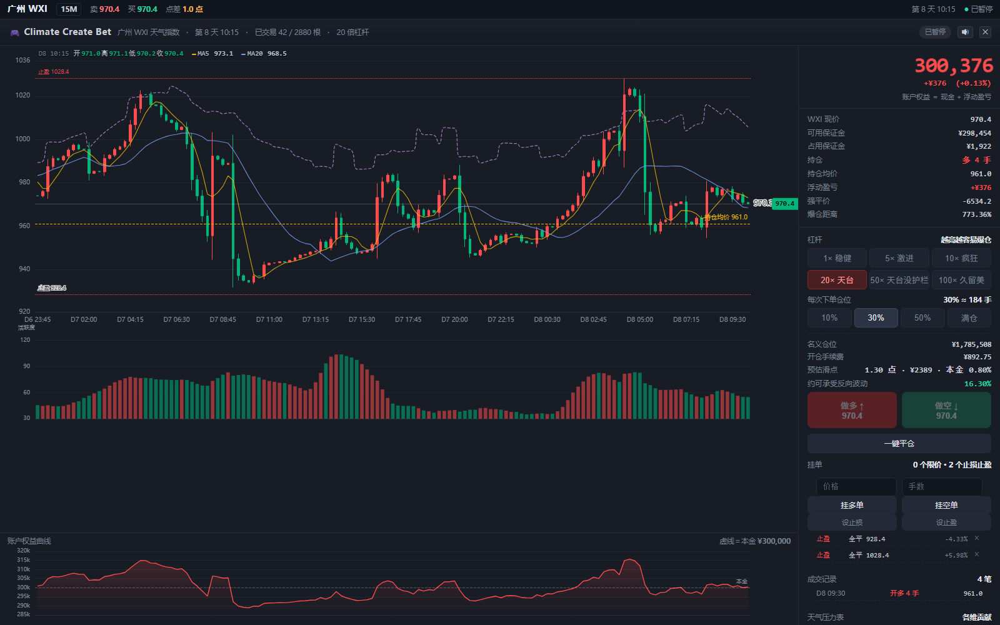 |

> 左：点顶栏的 **🎮 点击做空天气** 进来的开场说明（**面板标题叫 Climate Create Bet**，
> 入口按钮仍然叫「点击做空天气」），把爆仓线一次讲清，最后一条是**中途退出不会作废**。
> 右：一进来图表上**已经铺好 1 周历史 K 线**（只能看不能交易），顶栏显示 `已交易 42 / 2880 根`；
> 蜡烛下面是**活跃度量柱**，紫色虚线是大盘。截图里是 20 倍 + 多 4 手 + 一对止损止盈。

| 操盘手 · 爆仓 | 操盘手 · 结算 |
| --- | --- |
| 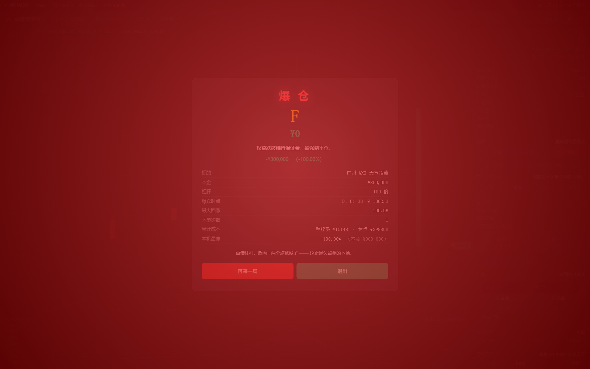 | 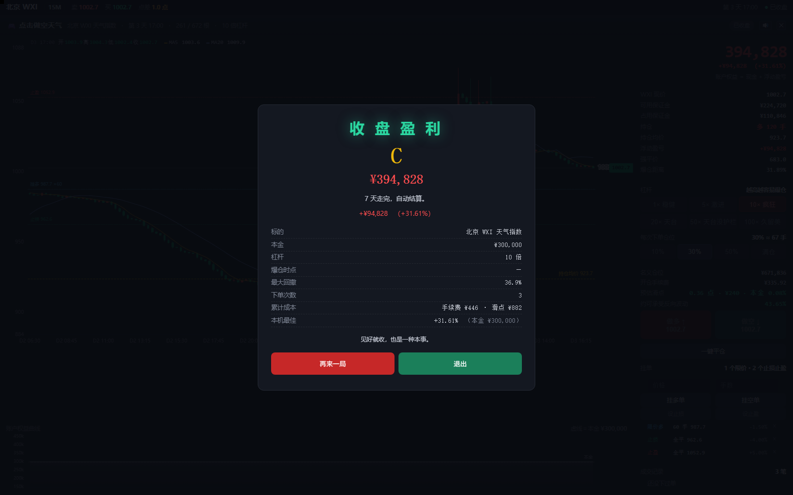 |

> 左：100 倍杠杆满仓，**反向走掉两个点就没了**，整屏红闪 + 震动；结算卡最后一句是
> 「最后请欣赏绚丽多彩的空中飞人表演！」。
> 右：**30 天交易**走完自动结算，按收益倍数评级（S/A/B/C/D/E，爆仓固定 F），记本机最佳（收益率）。
> **收场白只在两个明确的结局上出现**：爆仓一句（红），B 档及以上一句（金）——
> C/D/E 那些不痛不痒的结果不加，多一句反而把"这次到底算好还是不好"搅浑了。

| 操盘手 · K 线周期 |
| --- |
| 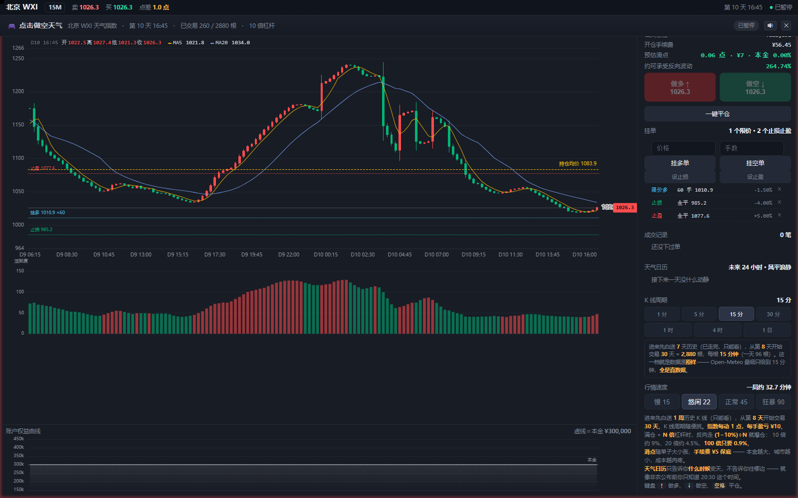 |

> 右下角那块：**1 分 / 5 分 / 15 分 / 30 分 / 1 时 / 4 时 / 1 日**七档，局中随时切。卡片里会直接告诉你这一档
> 是「数据源原样」还是「拿 N 根并成 1 根」还是「插值画出来的」—— 见
> [七档 K 线周期](#七档-k-线周期哪几档是真数据哪几档是画出来的)。
>
> **这块连下面的「行情速度」一起，六项设置都会记住上次调好的那一套** ——
> 本金 / K 线周期 / **行情速度** / 杠杆 / 仓位 / 音效。结束一局、关掉页面、明天再进来还是那个样子。
> 设置跟「进行中的那一局」分开存：点「结束本局」清掉的是那一局，设置不受影响。

| 操盘手 · 手机竖屏 |
| --- |
| 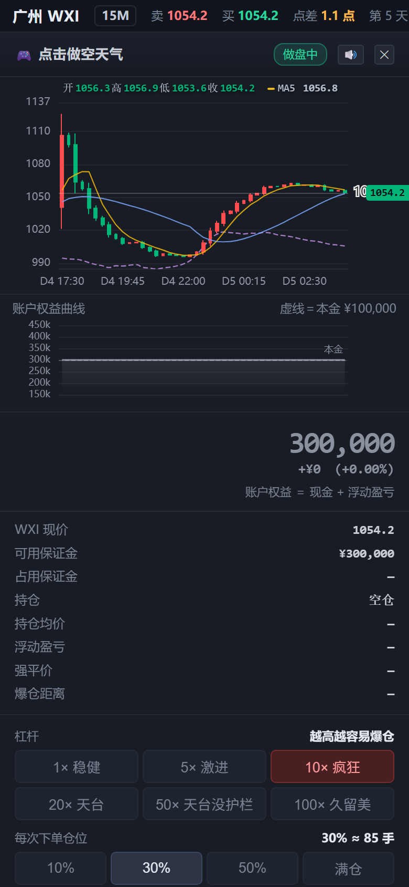 |

> 窄屏：**主图钉在顶部不动，只有控件区滚动，做多 / 做空常驻屏幕最底部** ——
> 可以一边看着图一边下单，不用滚来滚去（滚一下图就被推走那种设计已经改掉了）。
> 卡片弹出来的时候（开场说明 / 新手入门 / 结算 / 退出确认）那条常驻键会自动收起来，
> 不会压住卡片自己的按钮。

| 操盘手 · 新手入门 |
| --- |
| 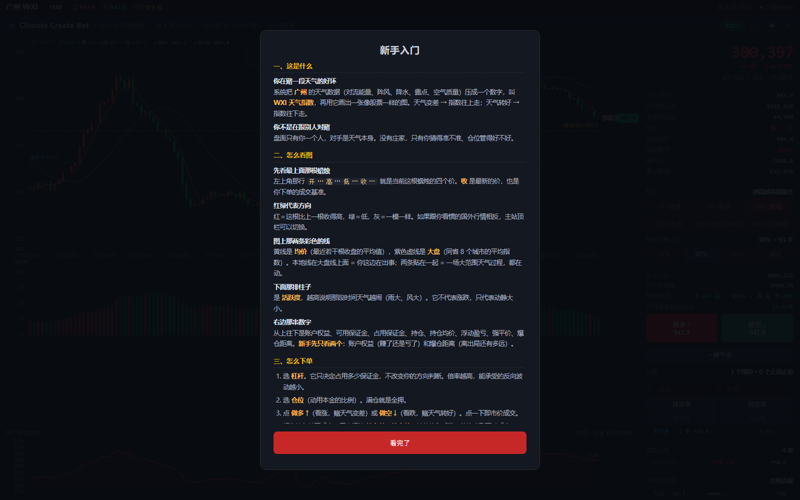 |

> 面板右上角的 **？**：不看股票的人也能照着玩 —— 这是什么、怎么看图、怎么下单、什么时候结束，
> 四节都在一张卡里，手机上整页可滚。
> 截图是 500×1000 的窄视口（Windows 上无头 Chrome 能开的最小宽度），行情是**真实数据**（广州）。

## 这是什么

一个把**气温当成股价**来展示的天气软件。整个交互、配色、术语都照搬 A 股行情终端：

| 股票里的东西 | 这里对应什么 |
| --- | --- |
| 股票代码 | 城市代码（中国天气网的 `101010100` 这类 9 位码） |
| 最新价 / 涨跌幅 | 当前气温 / 相对昨日同一时次的变化（**分母用绝对温标**，见下） |
| 分时图 | 今天 00:00–23:00 的逐小时气温，含均价线、昨收虚线 |
| 日 K / 周 K / 月 K | 每天的开盘价 = 当日 00:00 气温，收盘价 = 当日 23:00 气温，最高/最低 = 当日极值 |
| 成交量（现在叫「温差」） | 日内最高温 − 最低温；底部副图页签可切到 **降水 / 风 / 云量 / 空气** |
| MA5 / MA10 / MA20 / MA60 | 最近 5 / 10 / 20 / 60 天的平均气温，看大方向 |
| MACD / KDJ / RSI / BOLL / WR | **已经删掉了** —— 这几个股票指标对看天气没用，换成了下面「天气功能」里的真东西 |
| 五档盘口（卖五~卖一 / 买一~买五） | 未来 5 天的**预报最高温**（卖盘，由高到低）与**预报最低温**（买盘，由低到高） |
| 成交明细 / 逐笔 | 最近 60 个逐小时观测，涨跌按对上一时次着色 |
| 自选股 | **「城市收藏」**（跟电商里的「商品收藏」同一个构词）。**第一次打开会预置 北京/上海/广州/深圳/长沙/武汉**（只在这一项从没存过时塞；把收藏删光就照实为空，不会再冒出来）。增删就点那颗星：**空心 ☆ = 没收藏，实心 ★（金色）= 收藏了**，全站统一这一个符号。星的位置分两档、**两种档位的横坐标都钉死成一条线**（名字格固定 90px，所以星不随名字长短飘）：**桌面端**紧跟城市名，**手机端**在城市名与涨跌之间那片空档、跨两行垂直居中。**名字比格子长时（区县全名最长 15 字）——桌面端只给「选中那一行」开横向滚动**把名字看全（动内层、外层格子不动，所以星不晃）；手机端名字格占满剩余宽度、根本不超出，不滚。可按涨幅或名称排序、**长按某一行还能上下拖动自定义顺序**（松手即保存）；**行情头城市名旁边那颗星点一下就能加/取**。加城市走搜索框或「全部城市」抽屉（352 城）——**原来的「热门城市」那块已删除**（项目初期的试验内容） |
| 行情刷新频率 | 1s / 3s / 5s / 10s / 30s / 1m / 5m / 手动 |
| 涨跌配色 | 红涨绿跌（A 股）/ 绿涨红跌（美股）一键切换 |
| K 线实体 | **涨空心、跌实心**（A 股习惯）。气温 K 线比真股票密集得多，全实心会糊成一片色块；空心后涨跌一眼可辨。实现上就是把 `itemStyle.color` 设成 `transparent` 只留描边，影线走 `borderColor` 所以仍是涨色 |
| 平盘日 | 画**中性灰**（`--flat: #8b919e`）。开盘价取当日第一个有效整点、收盘价取最后一个，两者相等就是"一天下来没升没降"—— 实测 576 个交易日里有 **19 天（3.3%）**。这种日子既不红也不绿，量柱也同色，跟 tooltip 里的 `U.trendColor()` 一致 |
| 涨跌幅的尺度 | 气温是**间隔尺度**量，摄氏 0 度是人为约定的，所以比值的分母必须加上 273.15 换成绝对温标。否则 0℃ 以下**符号会整个翻转**（实测哈尔滨 90 个交易日里 88 天收盘价在 0℃ 以下、其中 47 天"升温却显示成负数"，最离谱的一天大降温 11.3℃ 却显示 `+235.4%`）。换算之后涨跌幅落在 **±0.2%~2.5%**，恰好是真实股票一天的波动区间 |
| 数据来源与兜底 | 每个城市先试**中国气象局**的官方站号（实况最准），取不到就退回 **Open-Meteo**。注意气象局的"没有观测"不是一个空值，而是一整套 **`9999` 哨兵**（数值字段 9999、字符串字段 `"9999"`、`lastUpdate` 停在最后一次正常上报）—— 澳门/台北这类长期停报的站会一直返回它。所以实况一律先过 `cleanNow()` 清洗，洗完没有可用温度就**当没取到**走 Open-Meteo，而不是把 9999 显示成 `9999.0℃ / +3358%` |

## 天气功能

炒股软件的长相下面，装的是气象台真正会给的东西。顶栏那一排按钮就是入口：

| 按钮 | 打开什么 | 数据源 |
| --- | --- | --- |
| 🛰 雷达回波 | 雷达拼图，**三层可选**：全国 → 八大区（东北／华北／华东／华中／华南／西北／西南）→ **单站（精确到城市）**。三层都是**可横向滚动**的一排按钮（滚轮也能滚，见 [docs/NOTES.md](docs/NOTES.md)）。打开时**默认是你正在看的城市**的雷达站，另有「📡 当前位置」快捷入口可一键跳到所在地的雷达站。城市多到一个省二十几个按钮，所以「📡 当前位置」旁边还有个**城市搜索框**：城市名／拼音／城市代码都能搜，本省找不到就自动去全国目录找（跨省结果显示成 `成都 · 四川`），回车直接进第一条。每 6 分钟一帧，可拖滑块也可自动播放，能回看约 30 小时 | `image.nmc.cn` 中央气象台雷达拼图 |
| ☁ 卫星云图 | 气象卫星云图，**两种产品可切**：**真彩云图**（风云四号 B 星，默认档，白天最好看）/ 红外云图（风云二号，每 30 分钟一张）。能回看一天 | `image.nmc.cn` 国家卫星气象中心 `WXBL` / `WXCL` |
| 🌧 降水预报 | 中央气象台全国降水量预报图，**两种产品可切**：**最近 1 小时实况**（默认档，每小时一张）/ 未来 24 小时预报（每 12 小时一张） | `image.nmc.cn` `STFC_SFER_ER1` / `STFC_SFER_ER24` |
| 🌀 台风路径 | 西北太平洋活动台风的实时路径 + 中央气象台 120 小时预报路径。底图是「亚洲–太平洋」，中国和台风同框，看得出台风往哪走 | `typhoon.nmc.cn` |
| ⚠ 预警信号 | 全国生效中的气象预警，按颜色分级，含发布单位与完整正文。**按离当前城市的距离排序**，最近的排最前，每条标出距离；列表可上下滚动。顶栏下面那条**预警滚动条**点开的也是它 | `typhoon.nmc.cn` 预警接口 |
| 🔭 天文 | 天文爱好者那几样，**五个子页**：**观星指数**（低云／中高云**分层**打分 + 降水／湿度／风／月光／气溶胶，直接给出今晚最合适的那一段；云太多会**封顶**，不让一堆好条件把"全阴"抬成"不错"）· **🌟 此刻**（**不联网**：此刻地平线以上的亮星、五颗肉眼行星、银河中心高度、月球距离与视大小）· **极光与地磁**（**你头顶那一刻的极光概率 %**（NOAA OVATION 1° 网格）+ 太阳风速度/Bz + 太阳耀斑等级 + Kp 未来三天柱状 + G1～G5 等级）· **日月**（日出日落、月出月落、黄金／蓝调时刻、天文夜、月球距离、下次满月/新月）· **流星雨**（接下来五场的极大、ZHR、辐射点、母体彗星，以及极大夜的月光干扰） | NOAA SWPC（极光概率 / Kp / 太阳风 / 耀斑 / 太阳黑子）+ Open-Meteo（分层云量 / 能见度 / 气溶胶）+ 本地推算（亮星 / 行星 / 日月出没 / 月相） |

> **只有雷达能做到城市级**：气象局除了全国拼图和八大区拼图，还发布每个雷达站自己的产品
> （`image.nmc.cn/.../RDCP/..._ECREF_AZ####_...`，图上自带压字「雷达站名 / 数据范围 / 观测时间」）。
> **352 个城市里有 156 个**能匹配到独立站（清单见 `web/data/radar-cities.json`），剩下的
> （佛山、珠海、惠州、东莞、中山、江门、上海、拉萨、香港、澳门、台北……）**用离它最近的那个有站城市的单站产品**：
> 气象局没有「按坐标取雷达」的接口，所以无论手选城市还是纯坐标定位（当前所在地），都只能落到最近的单站产品上。
> 这正是要的 —— 大区拼图一覆盖就是几百公里，本地那块雨根本看不出来。打开时**头部会写明用的是哪一站、离你多远**。
>
> > 这套「就近站」的口径在**雷达**和**天文**两个地方都用到了：雷达是"离你最近的有站城市"，
> > 天文是"用你所在城市的经纬度算日月出没"，都是**本地算完再取数**，不依赖任何"按坐标查询"的服务。
> 单站页**没有入口页面**，靠 slug 拼出来（`{省拼音}/{市拼音}.htm`，如 `guang-dong/guang-zhou.htm`）。
>
> **云图和降水预报官方只有全国版**，没有区域版，所以这两页是「全国图 + 按城市对齐时次」，
> 不能像雷达那样放大到城市。这也是把它们默认档改成「真彩云图 / 最近 1 小时实况」的原因 ——
> 既然放不大，就默认给最新最清晰的那张。
>
> 台风是路径图不是图片，点列表里任意台风就能看它的轨迹。
>
> **打开就先有东西看**：每次冷启动要拉六份数据（历史 560 天、近 92 天 + 16 日预报、实况、预报、
> 官方快照、官方月度日历），手机上一次好几秒；可这里面**绝大部分根本不会变** ——
> 昨天的日K、上个月的历史，跟刚才打开时一模一样。所以：① 这六件事**并发发出去**
> （原来是一条 `await` 接一条的瀑布，要串行等六轮网络往返）；② 上次那份行情存在 `localStorage` 里
> （最多 2 座城市、一份 336 KB，派生数据不存、逐小时只留最近 116 天），
> **下次打开先把它原样渲染出来**，状态栏写明`正在更新 …（当前显示 12 分钟前的数据）`，
> 同时照常去拉最新的，回来再替换 —— 就是手机天气软件那个体感。
>
> 功能页头部那行「这一屏在看什么」的说明，**手机竖屏上也显示**：标题和 ✕ 占第一行，它换到第二行。
>
> **数据源是会挂的，挂的时候要有个交代，而且整站还得能用**：Open-Meteo 的免费额度是**按天/按小时**
> 算的，用尽就全线 429（2026-10-07 真发生过，主站报 `Daily API request limit exceeded. Please try again tomorrow.`）。
> 关键前提：**气象局那三路（实况 / 官方预报 / 官方日历）跟 Open-Meteo 是互相独立的**，
> 那种情况下它们照常返回。所以：
> ① 三份"贵且不太会变"的响应各占一个 `localStorage` 槽位（`arch` 历史逐小时 / `fcst` 近期+预报 /
> `min` 15 分钟行情），每个两档有效期 —— **新鲜期内零请求**，而**数据源挂了时连过期的也认**
> （`arch` 30 天、`fcst`/`min` 14 天）。过期的 K 线照样是那条 K 线，比一张空图强得多。
> ② 历史逐小时的 archive 主机挂了还会换 `historical-forecast-api` 那台（配额是分开的）。
> ③ **降级合并**：新拿回来的那份如果只有气象局几路（曲线是空的），就**把实时的行情栏字段贴到
> 历史曲线上**，而不是拿空曲线把好曲线顶掉。
> ④ **盘口不依赖 Open-Meteo**：`obList()` 优先吃 `fcst.daily`（官方 5 日预报）；以前它先检查
> `d.daily` 非空才往下走 —— 额度一用尽就显示"暂无预报数据"，那条守卫已经拆了。
> ⑤ 空曲线时主图上会写明**原因**，不是干巴巴一句"暂无K线数据"。
> ⑥ 「点击做空天气」只硬依赖 15 分钟行情，给它持久缓存就能照常开局。
>
> > 实测（`tmp/degrade.js`，真实现场）：报价头 **22.9℃ +6.4 +2.21%**、
> > **盘口 12 个子元素 / 官方 5 日预报齐全**、有历史快照时曲线一根不少且 `now` 是刚拉的、
> > **游戏也能开局**（`连接状态 = 行情推送中`）。
> > 只有逐时流水是空的 —— 它读的就是 Open-Meteo 那一份，而气象局的 `now` 只有一个观测点，
> > 凑不出 60 行流水；宁可空着，也不拿一个点重复 60 遍。
>
> **地震**这一页跟上面几个不一样：它是**真目录**不是图片 —— 从 USGS 拉最近 130 天、
> 700 公里内的地震，按到当前城市的**大圆距离**排序，近的排前面，副标题写着
> 「最近 130 天 · 700 公里内 N 次 · 最近一次 X 公里」。震级用颜色分档（≥6 红 / ≥5 橙 /
> ≥4 黄 / 其余蓝）。**不用中国地震台网**是因为 `www.ceic.ac.cn` 响应 200 但不带 CORS 头，
> 浏览器直连读不到。

底部副图页签从股票的 MACD / KDJ / RSI / BOLL / WR 换成了五个天气口径，
而且**每个都跟着上面选的主图周期走**：

| 页签 | 画什么 |
| --- | --- |
| 温差 | 日内温差（最高 − 最低） |
| 降水 | 降水量柱（左轴 mm）+ 降水概率线（右轴 %） |
| 风 | 风速柱（按蒲福风级着色）+ 阵风虚线 + 顶部风向箭头 |
| 云量 | 低云 / 中云 / 高云堆叠面积 + 总云量线 |
| 空气 | PM2.5 柱 + AQI 线（含「良 100」参考线） |

副图右侧还有一个 **「📈 叠到主图」** 按钮：把当前副图的口径**拉一条线画到上面的主图**上
（降水 → 青色降水量线、风 → 绿色风速线、云量 → 灰蓝云量线、空气 → 紫色 PM2.5 线）。
这条线走主图**最右侧的第 3 根 Y 轴**（`offset:44`），不跟百分比轴抢刻度；按钮状态会记在
`localStorage` 里，副图切回「温差」时自动置灰。口径与主图对齐**统一按时间键查表**，不是按下标 ——
按下标会在「分时/7日」上整体错位（主图是「今天 24 小时 / 昨天→未来五天」，而聚合序列是
「从现在往前 2 小时起 24 小时」）。

> **日界明暗带**：7日 / 多日折线图按自然日铺**明-暗交替**的底色（7 天 = 四明三暗），
> 并在每条日界画竖虚线，一眼能看出一天一天的界限。单日分时（只有一天）不铺带。
> 带子挂在一条不画线的独立系列上（`z:1`），保证永远在气温线和均价线之下。

选**分时**就是今天的逐小时，选**7日**就是逐小时 **168** 个点（昨天 + 今天 + 未来五天），
选**日 K** 就按天聚合最近 60 天，
选**周 K / 月 K** 就按周 / 按月，选**预报 K** 就是**最近 10 天 + 未来 16 天**（一共约 26 根）。
聚合口径按物理量定：
降水量**求和**、降水概率取**最大**、风速阵风取**最大**、云量和 PM2.5/AQI 取**平均**；
风向不能平均，取「风最大的那一刻」的风向。

> 预报 K 的窗口以前是往回留 45 天，图上四分之三都是历史 —— 用户反馈"过去日子的占比太多了"，
> 现在历史只留 10 天当参照，重心全部让给预报。

周期页签的「7日」口径是 **昨天 + 今天 + 未来五天**（共 168 个逐时点）——
天气预报最要紧的就是后面这几天，所以窗口是往前压的，不是往回看。
窗口的尾端**故意停在"未来第五天"**：右侧栏那块「未来 5 天高低温」列的就是这五天，
两块图上下对着看，正好一一对应。

> **7日图的横轴会写日期**：`10-05 12:00 10-06 12:00 …`，每个自然日一格日期，
> 正好压在明暗带的交界上，和上面说的日界带是一套东西。
> 这里踩过一个坑：轴标签的 `S.seven` 标志**从来没被传进去过**（`seriesFor()` 的返回对象里没有这个字段），
> 所以 formatter 分支永远走不到，横轴只有 `00:00 / 12:00` 而没有日期。

> **这一档的「温差」副图也跟着主图走，而且逐小时那两档换了口径。**
> 温差（当日最高 − 当日最低）是**每天**的量：一天一个数，摊到 24 个小时上就是一条平线
> （分时档下整幅图只剩一根柱子）。所以**分时 / 7日 改成「较当日均温」**：
> 这一小时的气温比当天平均冷暖多少，围绕 0 上下，每天一个完整的波。
> **日K / 周K / 月K 仍然是"当天的日内温差"** —— 那里一天本来就是一根柱子。
> 横轴类别直接用主图的时间键，上下两块图一格对一格。
> 以前它不管主图什么周期，一律画 553 根日K：主图 24 小时、副图 553 天，说的不是同一段时间。

> 雷达 / 云图 / 降水预报这三张是**图片**，文件名里的时次戳是 **UTC**（不是北京时间），
> 前端按 `floor(分钟/6)*6`（雷达）、`:15 / :45`（云图）、整点（降水实况）对齐到官方出图的
> 整点网格，再换算成本地时区显示。界面上的时次和图上自带的压字时间戳是对得上的 ——
> 这是这套时间换算正确的硬证据。

## 点击做空天气

顶栏右上角有个 **🎮 点击做空天气**，点进去是拿**这个城市的真实天气**当行情的小游戏。

> **入口按钮和面板标题不是一个名字，这是故意的。**
> 按钮（顶栏那个）一直叫 **🎮 点击做空天气**；点进去之后，面板左上角和开场说明上的标题是
> **🎮 Climate Create Bet**。改名时只动了面板里那两处，按钮一个字没碰。

> **不看股票也能玩。** 面板右上角有个 **？**，点开是「新手入门」：这是什么、怎么看图、
> 怎么下单、什么时候结束，四节讲完，不假设你懂 K 线。开场封面讲的是"参数"（天数、杠杆、成本），
> 这一张讲的是"读图"（蜡烛四个价、红绿代表什么、黄线和紫线是什么、右边那串数字只看哪两个），
> 两处不重复。

### 为什么标的是「天气指数」而不是气温

第一版直接拿气温当价格，收到了很准的差评：

> 不太行，因为必然大趋势是冬天降温夏天升温。太稳定了没有什么感觉，只要稳住总会升/降的。

问题在于**气温是个太温和的信号**。它有昼夜循环、有季节趋势，一个小时才挪一两度，
做成 15 分钟 K 线就是一条几乎水平的线 —— 抱着不动就能赢，盘感无从谈起。

真正有波动的是**对流**：CAPE（对流有效位能）能从 0 冲到 5000、阵风能从 2 m/s 冲到 60、
降水绝大多数时刻是 0、打雷时才爆。所以标的是 **WXI 复合天气指数** —— 而且它**有语义**：
**指数高 = 当地天气好，指数低 = 天气差。**

```
① 舒适度 comfort ∈ [0,100]（有绝对含义，不是"偏离常态多少"）
   体感温度 0.34 + 湿度(露点) 0.15 + 降水 0.21 + 天气码 0.20 + 阵风 0.05 + 空气 0.05

   晴/基本晴 ≈ 81.5    多云/阴 ≈ 79.9    毛毛雨 ≈ 74    阵雨 ≈ 65
   雷暴 ≈ 57           雷暴+冰雹 ≈ 50    （广州 92 天实测）

② 基本面 anchor = 1000 + (慢速comfort − 中位) × 8
   "慢速"是半衰期 12 小时的 EMA —— 即时 comfort 会被单根雷暴砸出大坑

③ 价格 —— 事件驱动，不是"连续噪声 + 慢回归"
   每根按到达率生成若干笔"成交事件"，每笔带一次价格冲击：
     impactState = impactState × (1 − INERTIA) + Σ事件冲击
     价格         = anchor + impactState
```

**指数涨 = 天气转好，指数跌 = 天气变差。** 你其实是在赌对流。

#### 为什么用「事件驱动」而不是「连续噪声」

真实 15 分钟行情有个很硬的特征：**lag-1 自相关 ≈ 0**（实测欧易 10 个交易对是
−0.05 ~ +0.02）—— 也就是**几乎无记忆**，上一根涨跌对下一根没有预测力。

而"连续噪声 + 慢速均值回归"这种写法**做不到**这件事：

```
px = pxPrev + (anchor − pxPrev) × REVERT + noise
     ↑ 前景价格出现在等式右边 → 必然产生 AR(1) 记忆
```

只要回归慢（为了钉住基本面），滞后一阶相关就 ≈ 1−REVERT。实测锁死在 **0.38**，
扫 27 组参数下限就是 0.35 —— 数学上的必然，不是没调对。

真市场是**事件驱动**的：一笔成交到达 → 一次价格冲击 → 按韧性**快速衰减** → 下一笔再来。
所以新版把价格**定义**成两个互不依赖的状态之和，前景价格不再出现在等式右边：

```
impactState = impactState × (1 − INERTIA) + Σ单笔冲击     // INERTIA = 0.92
价格         = anchor + impactState
```

关键在**衰减与到达的相对速度**：衰减慢于到达 → 冲击首尾相接 → 又是 AR(1)；
衰减快于到达 → 每笔基本独立 → 自相关降下来。顺带白拿两个真市场特征：

- **波动聚集**：到达率**自激** —— 来的事件多，下一根的到达率就更高
- **肥尾**：单笔冲击用**幂律尾巴**，多数很小、偶尔一次清算瀑布

三项一次对上：

| 指标 | 真实 BTC / WIF | 旧架构 | **事件驱动** |
| --- | --- | --- | --- |
| p90/中位 | 3.50 / 3.25 | 4.2 | **3.95** |
| p99/中位 | 8.76 / 7.69 | 15.6 | **8.6** |
| 单根最大 | 4.2% / 38% | 8.5% | **26%** |
| 峰度 | 16 / 472 | 5~13 | **42** |
| lag-1 自相关 | −0.01 ~ +0.02 | 0.38 | **0.17 ~ 0.28** |

### 复合：大盘、露点、盘子扰动

群里有人提了个很对的意见：

> 你按照地区把这个地区里的所有城市的温度平均加权一下作为该地区的大盘指数，这样大伙要炒的东西
> 从温度变成一个由大盘指数、当地温度、空气质量以及未来的预报等所共同决定的一个新指标。
> ……不然太没有挑战性了。……然后非常小的那种地方，比如小县城之类的，可以把这个随机扰动加大，
> 模拟一下庄家操盘。

所以现在图上多了一条**紫色虚线的大盘**（`REG_C = '#c792ea'`）。它的构成和哪几项是真的：

| 项 | 真假 | 怎么来的 |
| --- | --- | --- |
| 本地 WXI | **真数据** | `minutely_15` 的气温 / 露点 / 降水 / 天气码 / 阵风 + `pm2_5` |
| 区域大盘 | **真数据** | 同省最多 8 城的 15 分钟**逐变量平均**，再套同一套 `comfort()` |
| **空气质量** | **真数据** | `air-quality-api` 的**逐小时** `pm2_5`（92 天），对齐到 15 分钟根 |
| **地震** | **真数据** | USGS 目录里震中/震级/时间，按到本城的大圆距离算冲击 |
| **台风** | **真数据** | 中央气象台 `typhoon.nmc.cn` 的路径点，逐根插值出中心距离与风速 |
| **预报偏离** | **真数据** | `previous-runs-api` 的 `_previous_day1`（提前 24 小时的预报）与实测之差 |
| 盘子扰动 | **建模** | 带衰减的随机游走，振幅按行政层级放大 |
| 成交事件 | **建模** | 到达率 + 幂律幅度（见上）；驱动量（天气、盘子）是真的 |
| K 线上下影线 | **建模** | 15 分钟粒度拿不到根内极值：基础影线按 `|涨跌|×0.30`，另叠**插针** |

三件想说明白的事：

1. **大盘是真的**，不是我编的一条参考线。Open-Meteo 支持**一次请求多个坐标**
   （`latitude=a,b,c&longitude=x,y,z` 直接返回数组），所以同省 8 城只要**一个请求**，
   不额外吃额度。取的是和单城完全相同的变量集，所以能直接喂给同一套 `comfort()` ——
   如果只平均气温，那等于把"趋势"又算了一遍，因为气温太慢太平。
2. **我没按人口加权**。`cities.json` 里只有 `id/name/prov/py/lat/lon/cma/path`，**没有人口字段**，
   所以就是等权。等权就等权，不假装。要加权得先找一个人口数据源，那是另一件事。
3. **"盘子扰动"是唯一一个纯建模项**（加上影线），而且它**故意**在小地方更大：
   `cities.json` 里没有人口，就按**行政层级**分档 —— 直辖市 3.0 / 省会 2.2 /
   有国家站的地级市 1.6 / 有 `path` 的 1.2 / 区县 0.6，取 `1.6 ÷ 该值` 当振幅倍率
   （夹在 `[0.35, 2.6]`）。所以广州（有国家站，1.0×）和惠州（无站无 path，2.60×）
   开出来的行情手感是不一样的 —— 小地方的"庄家操盘"是在这儿体现的，不是靠调大随机数。
   它触发时会在屏幕中间闪一条 **🏦 大单扫货 / 📉 有人出货**。

   顺带：`G.regLine` 是**本局窗口那一截**（长度 = 当前档位的一局根数 `roundBars()`），不是整段 92 天。
   我第一版画线时多加了 `G.regFrom` 偏移，结果那条线在图上**长度是 0**、根本不显示 ——
   探针把 `大盘 series data 长度 = 0` 打出来才发现的。

大盘线**不参与 Y 轴范围计算**，否则它会把蜡烛压扁；它只是个参考指标，不是可交易的合约。

### 四个"压力源"

群里还说了：「如果有什么台风消息地震消息还可以再做一个新的压力源」「反正当地的什么情况，
乱七八糟的参数加进去就好了」。照做了，四项全部接**真数据**：

| 压力源 | 数据源 | 落进指数的形式 | 实测覆盖（广州一段 3552 根） |
| --- | --- | --- | --- |
| PM2.5 | `air-quality-api.open-meteo.com` 的 `hourly=pm2_5` | 稳健标准化后乘 `AIR_K = 6` —— **慢变量**，管的是整段的偏置 | 99.3%，极值 ±47.5 点 |
| 地震 | `earthquake.usgs.gov` 的 `fdsnws/event/1/query` | 事件冲击：`QUAKE_K × (震级 − 3.0) × (1 − 距离/700km)`，之后按 `0.90` 衰减 160 根 | 0.5%（本来就 rare） |
| 台风 | `typhoon.nmc.cn` 的 `list_<年>` + `view_<id>` | **逐根**插值出台风中心，`40 × (风速/30) × (1 − 距离/900km)²` | 53.1%，极值 +9.4 点 |
| 预报偏离 | `previous-runs-api.open-meteo.com` 的 `temperature_2m_previous_day1` | 实测 − 提前一天的预报，稳健标准化后乘 `FCST_K = 2` | 95.8%，极值 ±15.5 点 |

几个实现上的关键点：

- **空气质量只能逐小时**。`air-quality-api` 的 `minutely_15` 返回的 `time` 数组长度是 **0**
  （参数照收、HTTP 200，只看状态码发现不了）。所以 PM2.5 走 `hourly` + `past_days=92`，
  再按小时键对齐到 15 分钟根。**它照样是 92 天的真数据，不是拿 `current` 糊的。**
- **地震为什么不与中国地震台网合作**：`www.ceic.ac.cn` 响应 200 但**不带 CORS 头**，
  浏览器里直连读不到；USGS 是免 key + CORS 全开的，所以用 USGS。顺带主站天气页
  也因此多了一个 🌋 地震面板（见上面截图）。
- **台风的列表是倒序的**。`list_2026` 按新→旧排，只取最新 12 个会把 92 天窗口里
  真正逼近华南的台风全切掉（沙德尔 211km / 紫檀 350km / 美莎克 477km 都在 7~8 月，
  而最新的 12 个是 9 月底之后的）。所以取 **30** 个，并发限流 4，TTL 6 小时。
- **预报偏离的写法是个坑**：正确写法是**变量名加后缀**，不是参数。
  `temperature_2m_previous_day1` 表示"比有效时刻早 24 小时做出的那次预报"。
  所有 `models=xxx_previous_dayN` 的写法都会 **HTTP 400**；
  而 `previous-runs-api` **不加后缀**时返回的数据与 `historical-forecast-api`
  **一模一样**（864 个时刻一字不差），一度让人以为它只是个别名。
- **只在上升沿播报**。这四项都是有惯性的状态量，不加判定的话一局 3552 根里会弹 540 次
  "台风影响"。现在用 `rise(f, 阈值)` / `fall(f, 阈值)` 只在**第一次越过**时播，
  于是一局里台风只剩 4~5 条、地震 0~1 条，其余是天气与盘子消息。
- **窗口偏置**：92 天里台风/地震真的拢共就那么些，纯随机切窗口大多数时候覆盖不到。
  所以 **50% 的局挑"事件分最高"的那十天、50% 纯随机** —— 不是"每局必有事件"，
  那就成安排好的剧情了，也就没有"你不知道这段是哪年月"这个前提。
- **取不到就退化成 0，绝不编数据**。六个源各自独立 `catch`，任何一项挂了
  只影响它那一项。

调参是量出来的，不是拍的（`QUAKE_K` / `FCST_K` / `TYPHOON_K` 各改过一轮）：

- 第一版 `FCST_K = 7` 跑出预报项 `min=-59.5 max=+54.8` —— ±6% 的抖动全来自预报误差，太猛，砍到 **2**。
- `QUAKE_K = 6` 时 M4.6 / 653km 只值 0.64 点，等于没有，提到 **12**。
- `TYPHOON_K = 60` 时 211km / 52m/s 会直接顶到 60 点，降到 **40**。
- 最终整局振幅中位数 **25.1%**（加这四项之前是 26.8%，但窗口口径换过，可比性有限）；
  单根中位涨跌仍是 0.266%。

### 规则

| | |
| --- | --- |
| 行情 | Open-Meteo `minutely_15`（**15 分钟一根**，92 天历史），随机截连续 **37 天**（前 7 天当预热） |
| K 线周期 | **1 分 / 5 分 / 15 分 / 30 分 / 1 时 / 4 时 / 1 日**七档，局中随时切换 |
| 价格 | **WXI 复合天气指数**，基准 1000。**指数高 = 当地天气好**（comfort 基本面 + 事件驱动冲击） |
| 大盘 | 同省最多 8 城的 15 分钟**逐变量等权平均**，图上紫色虚线；拿不到就退化成纯本地行情 |
| 合约 | 1 手，指数每动 **1 点**盈亏 **¥10** |
| 本金 | **可自定义**，1 千 ~ 1 亿，预设 10 万 / 30 万 / 100 万 / 300 万 / 1000 万。默认 **30 万**，开局时选，**局中不给改** |
| 手续费 | 万分之五，开平都收，**单笔最低 ¥5** |
| 滑点 | 单子越大越吃亏：`SLIP_K × 名义金额 ÷ 盘子容量`，上限 10 点；小城市盘子更小 |
| 杠杆 | 1× / 5× / 10× / 20× / 50× / 100×（界面文案：稳健 / 激进 / 疯狂 / 天台 / 天台没护栏 / **久留美**） |
| 单次仓位 | 10% / 30% / 50% / 满仓 |
| 一局 | **预热 7 天（一周）+ 交易 30 天（一个月）**。进面板时前 7 天的 K 线**已经铺满**（只能看，不能下单），从第 8 天开始交易。**每秒变 4 次**（与速度档无关）。速度 15 / 30 / 60 / 120 / 240 **分钟天气每秒**（实时 / 慢 / 悠闲 / 正常 / 狂暴），30 天交易约 **48 / 24 / 12 / 6 / 3 分钟**，随时可暂停。默认「悠闲」= 每次更新正好推进一格 15 分钟天气 |
| 爆仓 | 权益 ≤ 占用保证金 × 10% 即强平 |
| 未收盘那根 | **最后那根 K 线是实时在动的**：收盘价沿着真实的 15 分钟观测往前走，上下影线被逐个真样本刷新。成交也按这个**盘中价**（所见即所得），不是按还没走完的那根的收盘价 |
| 城市差异 | **大城市稳、小城市野**。这个梯度是拿**真实交易所数据标定**的，不是拍的：欧易 9 个对 × 365 天 × 15 分钟，最稳的 BTC 单根中位 0.0994%、最野的 WIF 0.2541%，梯度 **3.09×**。现在游戏里直辖市 0.120%（≈BTC）、省会 0.142%（≈ETH）、地级市 0.175%（≈SOL）、区县更野 |
| 挂单 | 限价单（挂多 / 挂空）+ 止损、止盈各一张，**挂单会冻结保证金** |
| 天气日历 | 只提示**什么时候**变天，**不提示往哪边** |
| 中途退出 | **不作废**。行情按**真实流逝的时间**继续走（见下节），下次进来接着玩 |
| 结算 | 跑满自动结算，按 `最终权益 / 本金` 评级（爆仓固定 F） |

**为什么数据是 15 分钟而不是"更细"**：有人问能不能到每分钟 / 每半小时。实测结论是 ——
`minutely_1` 和 `minutely` 在 Open-Meteo **不存在**：参数照收、HTTP **200**，但 `time` 数组长度是 **0**
（和 `past_days=92` 悄悄返回一串 `null` 一样，**只看状态码发现不了**，得数数组长度）。
所以 15 分钟就是免费源能给到的最细粒度。**比 15 分钟粗的档（30 分 / 1 时 / 4 时 / 1 日）
是把 15 分钟的真数据并起来看，1 分 / 5 分两档则是插值展开的**（见下节）。

> 顺带一提：群里说的"最小只有一个小时"指的是**主站天气页的分时图**
> （`web/js/weather.js` 走的是逐小时）—— 那是另一个页面，不是这个游戏。

#### 七档 K 线周期：哪几档是真数据，哪几档是画出来的

| 档位 | 一天几根 | 一局几根（7 + 30 天） | 预热段 | 交易段 | 怎么来的 |
| --- | --- | --- | --- | --- | --- |
| 1 分 | 1440 | 53280 | 10080 | 43200 | **插值展开**：1 根 15 分钟摊成 15 根 |
| 5 分 | 288 | 10656 | 2016 | 8640 | **插值展开**：1 根 15 分钟摊成 3 根 |
| 15 分 | 96 | 3552 | 672 | 2880 | 数据源原样 |
| 30 分 | 48 | 1776 | 336 | 1440 | **真数据聚合**：2 根并 1 根 |
| 1 时 | 24 | 888 | 168 | 720 | **真数据聚合**：4 根并 1 根 |
| 4 时 | 6 | 222 | 42 | 180 | **真数据聚合**：16 根并 1 根 |
| 1 日 | 1 | 37 | 7 | 30 | **真数据聚合**：96 根并 1 根 |

档位名和排列照着一张真实行情软件的截图（`1分 5分 15分 1时 4时 1日`）来的。

展开的做法是：收盘价沿父根的开 → 收线性走，再叠一个**确定性**小锯齿
（`zag(i, j)`，用的是 `sin` 哈希而不是 `Math.random()` —— 否则同一段行情每次长得不一样，
探针根本没法验收），影线按父根振幅的比例分下去。**最后一根强制收在父根收盘价上**，
所以把 1 分钟档聚合回 15 分钟能和真数据**逐点对上**（探针实测误差 0）。

> 换句话说：**切到 1 分钟不会让你看到更多信息**，只是把同一段天气画细了。
> 七档的首开价和末收价完全相同，起点时间也相同，走势是同一套。

价格模型本身**只跑一遍**、永远按 15 分钟的 3552 根算，重采样是在它之后做的 ——
所以不存在"1 分钟档和 1 日档走势不一样"这种荒唐事。

**局中换周期**：不重新取数据，而是拿开局留的那份 15 分钟原样序列重采样一遍，
再把"已经推进到第几分钟天气"映射到新周期的下标上。映射只认**已经走完**的那些根
（`G.i = floor(nowMin / 周期) - 1`）—— **绝不往前跳**，否则换到粗周期时现价会瞬间变成
一段**未来**天气的收盘价，白白扫掉止损。代价是切到更粗的档时会往回退最多一个周期
（探针实测：切到 1 分 / 5 分 / 15 分 / 30 分 / 1 时**退后 0 分钟**，切到 4 时 / 1 日退后 60 分钟）。
持仓、挂单、权益曲线都原样保留。

#### 关掉页面，行情还在走

「退出游戏就作废」是很没道理的一件事：**现实里的股票不会因为你没打开同花顺就不动。**
所以退出不清进度，而且**离线的那段时间行情照走**。

| 你做了什么 | 会发生什么 |
| --- | --- |
| 点面板右上角的 ✕ / 点遮罩 / 按系统返回 | 弹一张卡：**保留进度** / **结束本局** / **取消**（「取消」= 什么都不做，局继续跑） |
| 选「保留进度」 | 存档落地，面板关掉，行情**从此刻起按真实时间继续走** |
| 选「结束本局」 | 存档清掉，这局作废 |
| 直接关标签页 / 关 App / 手机切后台 | `pagehide` + `beforeunload` 兜住，等于自动选「保留进度」 |
| 在**同一个城市**再点小游戏 | 卡上两个选项：**继续 <上次那个城市>** / **从 <当前城市> 重新开始** |
| 在**别的城市**点小游戏 | 同上 —— 「继续」会把你带回上次那座城市接着玩（不会把 A 城的行情套到 B 城头上） |

**离线追赶怎么算的**：速度档的单位本来就是「**每真实秒推进多少分钟天气**」，
所以 `补的根数 = 离线秒数 × 速度档 ÷ 当前周期`，直接拿它去跑 `stepBars()` ——
和在线时走的是**同一段代码**，滑点、手续费、挂单成交、爆仓判定、新闻一律照常发生。

```
离开 25 秒   → 补 100 根（15 分档 · 悠闲）
离开 2 分钟  → 补 480 根
离开 40 小时 → 直接跑到 30 天交易期结束，自动结算
```

补完之后会 toast 告诉你「你不在的时候行情走了 N 根」。**这段时间不会静音地放过**：
如果离线期间爆了仓，你回来看到的就是爆仓结算 —— 这跟现实一致。

**存档里存的是 15 分钟的 `base` 序列（3552 根 · 约 525 KB），不是当前周期的 `series`。**
1 分钟档的 `series` 有五万多根，塞进 localStorage 会直接把 5 MB 配额撑爆；
存 `base` 则与周期无关，恢复时拿 `resample()` 重采样一遍就回来了 —— 这也正是局中换周期走的同一条路。

#### 设置会记住上次那一套

面板上的**本金 / K 线周期 / 行情速度 / 杠杆 / 仓位 / 音效**六项，调过就记住：结束一局、关掉页面、
明天再进来，还是上次那个样子。**尤其是「行情速度」** —— 以前它每次都被打回默认的「悠闲」，
选过「狂暴」的人每次都得重选一遍。

设置跟「进行中的那一局」是**分开存**的两份东西：

| 存的东西 | 键 | 什么时候会被清掉 |
| --- | --- | --- |
| 进行中的那一局 | `wxgame_save` | 点「结束本局」、到期结算时清掉（局确实没了） |
| 调好的设置 | `wxgame_cfg` | 基本不清 |

两者的先后关系：**开局先读设置当默认值；存档里带着的那套优先**（因为那是"当时正在用的"），
恢复存档时顺手把设置也刷成存档里那套 —— 所以结束一局之后再开局，还是你最后用的那一套，
不会退回初始值。非法值（比如换过版本之后某个档位没了）会被丢掉、退回默认，**不会记住一个点不亮的按钮**。

#### 安卓竖屏：看图还是操作，不用二选一

原先窄屏下整块面板一起滚：主图在上面，下单键在最下面，**你必须滚过去**才能在看着图的时候下单 ——
而滚动本身就会把图推走，等于**看图和操作二选一**。现在改成：

- **主图钉在顶部**（`.gg-chart` 36vh），权益曲线也钉在它下面；
- **只有控件区滚动**（`.gg-right` 是唯一滚动容器），账户明细排成两列省高度；
- **做多 / 做空两个大键常驻屏幕最底部**（`.gg-trade > .gg-btns` 用 `position: fixed`）。

于是主图坐标**永远不动**，手指在下单区滑动时图是钉住的。
探针实测（500×848 视口，这是 Windows 上 Chrome 能开的最小宽度）：滚到底时主图坐标不变，
做多键仍落在可视区内，且**没有横向溢出**。

> 一开始用的是 `position: sticky; bottom: 0`，**不行** —— `.gg-btns` 的父级 `.gg-trade`
> 只包"下单区"那一段，滚出父盒之后 sticky 元素会被带着一起滚走（探针实测滚到底时按钮跑到了 y=15）。
> 只能 `fixed`。选择器也必须写 `.gg-trade > .gg-btns`，否则封面卡里那对「开始操盘 / 算了」
> 也会被钉到底部 —— 那个是 `.gg-card .gg-btns`。


#### 两个旋钮，各管一件事

**流速（`SPEEDS`）和重建频率（`TICK_HZ`）是分开的**，这是这套动画的核心设计：

| 旋钮 | 管什么 | 改它会怎样 |
|---|---|---|
| `SPEEDS` | 天气时间走多快（一格 15 分钟花几秒） | 一局变长/变短，**每秒变几次不变** |
| `TICK_HZ` | 一秒重建几次画面 | 画面更细/更顿，**一局时长不变** |

解耦靠的是推进量除以 `TICK_HZ`：

```js
G.acc += (SPEEDS[speedIdx] / barMin()) / TICK_HZ;
//        └─ G.acc × barMin() = SPEEDS 分钟/秒 —— 与 TICK_HZ 无关
```

所以 `u` 的推进速率 = `SPEEDS×60/barMin` 次/秒，**TICK_HZ 只决定"多久采一次样"**。
`TICK_HZ = 4` 表示**无论速度调到哪一档，蜡烛都是 1 秒变 4 次**。

**速度跟 K 线周期也无关**：推进式子里没有 `barMin()`（它只出现在 `G.acc` 的换算里），
所以切换 1 分 / 1 时 / 1 日只是**换一把尺子看同一条时间轴**，时间流速一点不变。
各档一根 K 线的墙钟时长 = `周期分钟数 ÷ 速度`：

| 默认「悠闲」(60 分钟天气/秒) | 1 分 | 5 分 | 15 分 | 30 分 | 1 时 | 4 时 | 1 日 |
|---|---|---|---|---|---|---|---|
| 一根走完 | 1.0 s | 5.0 s | **15 s** | 30 s | 60 s | 4 min | **24 min** |
| 每秒更新 | 4 次 | 4 次 | 4 次 | 4 次 | 4 次 | 4 次 | **4 次** |
| 每次推进 | 0.25 格 | 1.3 格 | 4 格 | 8 格 | 16 格 | 64 格 | **96 格** |

⚠ 表格里"每次推进几格"是指**源样本（15 分钟）**。只有 1 分 / 5 分 / 15 分档每次推进
≤ 1 格；30 分以上一次更新会跨好几格 —— 这是 4 Hz 的必然结果：
**一格里更新几次** × **一根里几格** = **一根几秒 × 4**，三者绑死。

#### 最后那根 K 线是实时在动的

真实行情软件里，**未收盘的那根蜡烛一直在变**：收盘价跟着最新价走、上下影线被不断刷新、
甚至中途由阳翻阴。这一条是后补的 —— 原来的最后那根是**冻住**的：

`tick()` 只在"攒够一整根"时才把现价设成新一根的收盘价，没攒够就直接 `return`（连重绘都不调），
而图上只画到已经走完的那一根。于是**一根越粗，冻得越久**：

| 档位 | 正常速度下多久才推进一根 | 原来的表现 |
| --- | --- | --- |
| 1 分 / 5 分 / 15 分 | 每帧都在动 | 看不出问题 |
| 1 时 | `60/45` ≈ 1.3 秒 | 一顿一顿 |
| 4 时 | `240/45` ≈ 5.3 秒 | 明显是幻灯片 |
| **1 日** | `1440/45` = **32 秒** | **整整 32 秒画面是死的**，然后"啪"地跳一格 |

现在的做法是让光标沿着**真实的 15 分钟源序列**（`G.base`，3552 根）往前走，
最后那一格画成"未收盘"的样子：

```
dpb  = 周期 / 15                        // 一根 K 线 = 几根 15 分钟源
起点 = 上一根的收盘那根源数据             // live bar 的开盘价就是它
终点 = 本根的收盘那根源数据
光标 = 起点 + u × (终点 − 起点)           // u ∈ [0,1] = 这一根的完成度
```

**所以盘中的波动没有一个是编的**，一根 K 线里能穿过多少根真观测完全由周期算出来：

| 档位 | 一根 = 几根 15 分钟真观测 | 探针实测盘中穿过的真采样数 |
| --- | --- | --- |
| 1 分 / 5 分 | 0.07 / 0.33 | 1（在相邻两根源数据之间走） |
| 15 分 | 1 | 2 |
| 30 分 / 1 时 | 2 / 4 | 3 / 5 |
| 4 时 | 16 | 17 |
| **1 日** | **96** | **97** |

1 日档那根蜡烛，一天里会被 **96 个真实的 15 分钟观测**逐格推着走，上下影线取的是
"已经走到的那些真样本的真实极值" —— 不是按比例摊出来的虚构影线。

**收盘瞬间零跳变**是这套算法必须成立的性质：`u` 走到 1 时光标正好落在整数下标上
（`kf = 0`），此时收盘价**精确等于**那根真 K 线的收盘价，高/低也精确等于它。
探针里这条是硬断言：五档 × `u=1` 与 `resample` 出来的真值逐项相等
（误差 < 1e-9，见 `tools/test_live_wick.js`）。

**成交改成按盘中价**（所见即所得）：以前在收盘前下单，成交价是"你屏幕上还看不到的
那根的收盘价"；现在按下单那一刻屏幕上那根蜡烛的收盘价成交，挂单和止损止盈同理。
账户权益、浮动盈亏、爆仓距离也跟着逐帧在动，**爆仓因此变成按盘中价触发** ——
更像真实强平，代价是止损被"盘中插针"扫掉的概率变高了。

**性能**：半根那一步不能整个重画（`render()` 会把右栏全部 innerHTML 重建一遍，
1 日档下每秒来 10 次纯属浪费）。所以有一条 `liveTick()` 只做局部重绘。
它的 `setOption` **不能传 `notMerge`** —— 传了就只认那一小份 option，
横轴类别、均线、大盘线、dataZoom 全会被清掉。

> 一个容易踩的坑：ECharts 的 option 合并是
> `!n && i in t || (t[i] = T(e[i]))`，而 `data` 是数组、命中 `Y(o)`（isArray）那条分支
> —— **整个数组被替换，不是逐元素合并**。所以哪怕只改最后一根蜡烛，也必须把
> 可视段整段重传（传一根等于把 90 根蜡烛全删了）。`drawCharts()` 和 `liveTick()`
> 共用同一个 `liveNote()` 来造这些数组，口径就不会漂。

#### 开局先铺 1 周（7 天）历史

这是群里提的：进面板的时候**图表上已经有 1 周连续的 K 线**，实际开始玩是从第 8 天起。

做法是把取到的 3552 根 15 分钟序列切成两段 —— 前 672 根是**预热段**，后 2880 根是**交易段**：

- `resetState()` 把光标停在预热段的最后一根（`G.i = warmBars() - 1`），
  第一根能下单的是 `series[warmBars()]`。
- 顶栏进度按**交易段**算：`已交易 260 / 2880 根`，不是"总共走了 932 根"。
- 图表窗口是 `totalBars()`（7 + 30 天），所以一进来就能看到一段完整的历史走势。
- 改成"一周"之后，`WARM_DAYS` 从 10 缩到 7：预热短了，一进来看到的"来历"更少，
  但交易段（一个月）一根没动 —— 换周期、换城市都不用改别的，全部由 `warmBars()` / `totalBars()` 派生。

> 键盘和按钮在预热段就是好的，`G.i` 一被推到 `warmBars()` 之后才可能成交。

#### 底部副图：成交量 = 天气活跃度

真实行情软件底下都有一排量柱，所以照做了一个。它不是真的成交量（天气没有成交量），
而是**天气活跃度**：

```
活跃度 = 1 + 降水 × 10 + max(0, 阵风 − 6) × 2 + CAPE / 60 + |盘子扰动| × 0.5
```

四个驱动量（降水、阵风、对流能量、盘子扰动）**全是真的**，只有系数是建模的。
量柱按本根涨跌红绿着色，挂在第二个 grid 上，跟主图共用 x 轴、独立 y 轴。
它同时是**插针触发概率**的乘数 —— 活跃度高 = 成交活跃、流动性薄 = 更容易打针。

**本金是真的会改变难度的** —— 这一点上一版写错过，现在靠三样东西成立：

1. **手续费有 ¥5 保底**。名义金额 × 万分之五，不足 5 元按 5 元收（这句是照参考软件抄的）。
   大资金感觉不到，小资金被磨得更狠。
2. **滑点与名义金额成正比**。`滑点(点) = SLIP_K × 名义金额 ÷ 盘子容量`，
   而名义金额 ∝ 本金 —— 所以**滑点占本金的比例随本金线性上升**。
   实测（广州、10 倍、30% 仓）：**30 万本金滑点占本金 0.27%，300 万就是 2.67%**，正好 ×10。
3. **小城市盘子更小**。`盘子容量 = CAP_BASE ÷ dishScale(城市)`，`dishScale` 复用盘子扰动那套
   行政层级分档（县城 2.6、省会 1.0 / 0.7、直辖市 0.53）。同一张单子下到县城，滑点要乘 2.6。

滑点上限（`SLIP_MAX`）定死在 **10 点（指数的 1%）**，这不是美化而是**必需**：名义金额 = 本金 × 仓位% × 杠杆，
滑点于是随杠杆**平方**增长 —— 30 万本金、满仓、100 倍时名义 3 亿，不封顶会算出 300 点滑点，
比 100 倍那条 0.9% 的爆仓线远得多，等于"一开仓必爆"，而且结算卡上会出现
「本金 ¥300,000 · 滑点 ¥896,939」这种荒唐数字（截图真逮到过）。
上限取 **10 点**是折中：300 万 / 30% / 10 倍算出来 9.54 点刚好没被削到，
所以上面那条 ×10 的线性在设计区间内成立；再往上就被封住，
表现为"一开仓就归零"，而不是"欠下比本金还多的滑点"。

当然「30% 仓」那条仍然成立（本金翻 10 倍、手数也翻 10 倍，**仓位盈亏比例**一样），
所以开场卡片的提示把成本摆出来给你看，而不是笼统说一句"更难"：
下单卡上那行 **「预估滑点 n.nn 点 · ¥xxx · 本金 x.xx%」** 就是为了让人在按下单键之前先看见代价。

> 顺带把**本机最佳记录从绝对金额改成了收益率**：本金能改之后，「赚了多少万」就没法比大小了
> （本金 1000 万赚 5 万和本金 1 万赚 5 万完全不是一回事）。用新键 `wxgame_bestp` 存收益率、
> `wxgame_bestc` 存当时本金，老的绝对金额记录自然失效，不用做迁移。
>
> 结算卡上还多了一行 **「累计成本：手续费 ¥x · 滑点 ¥y」** —— 打了一局到底被磨掉多少，一目了然。

**爆仓线是这个游戏唯一需要讲明白的数学**：满仓 + N 倍杠杆时，价格反向走 `(1 − 10%) / N` 就被强平 ——
10 倍约 **9%**，20 倍约 **4.5%**，50 倍约 **1.8%**，100 倍只要 **0.9%**。
按指数 1000 点算，100 倍满仓反向动 **9 个点**就没了。所以右侧那 8 行里的
**强平价**和**爆仓距离**是命门，它们一直显示在那儿，价格碰到就结束。

### 挂单与天气日历

这两样是后加的，各自解决一个「光靠手点不够」的问题。

**挂单**。限价单挂在某个价位，价格碰到就按**挂牌价**成交；止损 / 止盈各只能有一张，
触发时全平。几条不那么显然的实现约束（完整版在 [NOTES](docs/NOTES.md)）：

- **挂单要冻结保证金**（`reservedMargin()`）。不冻的话可以靠挂一堆远单把仓位吹到天上 ——
  真券商不是这么干的。冻结之后 `freeEq()` 变成 `权益 − 占用保证金 − 冻结保证金`。
- **成交判定必须带上本根的上下影线**：区间是
  `[min(上一根收, 本根收, 本根低), max(上一根收, 本根收, 本根高)]`，
  只用收盘价的话「插针扫止损」永远模拟不出来。
- **同一根里同时碰到多张单时，按离上一根收盘的距离从近到远依次成交**。
- **`processOrders()` 排在爆仓判定之前**。顺序反了的话，止损单会因为「这一根已经先爆仓了」
  而永远来不及救你 —— 这是写的时候最容易搞反的地方。
- 仓位平掉后，止损 / 止盈自动撤（限价单留着）。
- **滑点只吃市价单**：做多 / 做空 / 一键平仓按不利方向加点成交；**限价单按挂牌价原价成交**
  （"要么按我的价，要么别成交"，代价是可能根本不成交）；**止损止盈照吃**（触发时本质是市价单，
  插针被扫得最惨的正是它们）。没有模拟跳空 —— 真实市场里跳空会按更差的价成交，这里没做。

**天气日历**。它把「未来 24 小时内哪几根 K 线会发生剧烈变化」列出来，
但**只给时间、不给方向** —— 用的是 `|Δseverity|` 的绝对值，方向信息在取绝对值那一步就丢了。
理由和没法做财经日历一样：给了方向就等于剧透这局。界面上那句提示写的是
「就像非农公布前你只知道 20:30 这个时间」。

强度档不是拍脑袋定的，是照实测分布定的：整局 `|Δseverity|` 的**中位 0.034、p90 0.21、p99 约 2.0、max 约 3.8**，
超过 `JUMP_AT` 的大约只占 **4% 的 K 线**。所以最初定的
「`≥3.4` 剧烈 / `≥1.9` 明显」几乎永远出不来，改成
**`≥2.0` 剧烈 / `≥1.3` 明显 / 其余一般**（分别占 1.0% / 2.4%），条数按 `ceil(d / 0.7)` 最多 4 格。
它和价格里的突发行情用的是同一个 `Δseverity` —— 日历上标出来的每一段，
K 线上**一定**会出现对应的那根长阴 / 长阳，不是两套互不相干的逻辑。

## 三个版本

| 形态 | 说明 | 需要什么 |
| --- | --- | --- |
| **网页版** | [lolikonnn.github.io/weather-fighter](https://lolikonnn.github.io/weather-fighter/) | 一个现代浏览器 |
| **Android APK** | `dist\天气战士.apk`，`minSdk 21`，**版本 9.4.7**（`versionCode 90407`）—— 版本号**固定不变**，功能更新不跟着加 | Android 5.0+ |

两个版本界面**完全相同**，区别只在数据怎么取（见下）。

想在电脑上用，直接开网页版即可 —— 它是纯静态的，可以「添加到主屏幕 / 固定到任务栏」当应用用。
（曾经还有一个 Windows EXE，已经**放弃并删除**：PyInstaller 单文件版每次启动都要往 `%TEMP%` 解压，
在部分机器上被安全软件挡住就起不来，收益配不上这个维护成本。）

### 直接下载

网页版打开后，**右下角状态栏**会出现「下载客户端」按钮（只有在安装包真的存在时才显示，点了不会 404）：

| 平台 | 直链 |
| --- | --- |
| Android | <https://lolikonnn.github.io/weather-fighter/dist/weather-fighter-android.apk> |

> `web/dist/` 不提交进仓库。部署时 `.github/workflows/deploy.yml` 会把 `dist/` 里的安装包
> 拷成上面这个 **纯 ASCII 文件名**再发布 —— 中文文件名在 CDN 和各浏览器里的百分号编码
> 行为不一致，用别名能保证链接到处都点得通，下载下来的文件名也不会乱码。
> 仓库里的原始文件仍是 `dist\天气战士.apk`。

## 数据从哪来

本项目**不生产数据**，只是把公开的官方天气数据画成 K 线。

**一条贯穿全站的原则：以气象局为主，只有气象局缺的那部分才用 Open-Meteo 补齐。**
（2026-10-08 定的，之前不是这样 —— 副图整条线是纯 Open-Meteo，`obList` 还优先吃 Open-Meteo 的日高低温。）

| 数据 | **主供：气象局 / 中国天气网** | 补缺：Open-Meteo |
| --- | --- | --- |
| 实况（气温/体感/风/气压/湿度/降水） | ✅ `Cma.now` | 站点没有实况时 |
| 日高低温 | ✅ 气象局站点预报 → 中国天气网 d1 官方日历 | 官方只给 7 天，第 8 天起 |
| 逐小时 气温/湿度/风速/风向/降水/总云量/低云量/天气码/能见度 | ✅ `Cma.hourly`（3 小时一档，未来 7 天） | 3 小时之间那两小时、第 8 天起、**全部历史 560 天** |
| 紫外线 · 降水概率 · 阵风 · 中/高云 · 露点 | — 气象局这个接口没有 | ✅ |
| 气溶胶 AOD · 空气质量 PM2.5 | — | ✅ |
| 历史逐小时（K 线引擎）· 15 分钟级（游戏） | — 气象局不提供 | ✅ |
| 雷达 / 云图 / 降水预报 / 台风 / 预警 | ✅ | — |
| 地震目录 | ✅ USGS（`earthquake.usgs.gov`） | — |

对齐方式是**整点键对齐 + 差值插值**：气象局给的是 3 小时一档，中间那两小时**不是照搬 Open-Meteo**，
而是"以气象局为锚、借 Open-Meteo 的逐时形状" —— 先算出锚点上的差值 `d = 气象局 − Open-Meteo`，
再把它在相邻两锚点之间**线性铺开**加到 Open-Meteo 的逐时值上，锚点本身严格等于气象局的值。

> 为什么必须这么补：两家在同一个整点上**并不一致**（实测 51 个锚点最大差 **5.30℃**、平均 **1.45℃**），
> 照搬式拼接（气象局值 → Open-Meteo 值 → 气象局值）会硬拼出 5℃ 的尖角，
> 7 日分时看上去全是锯齿。实测扎手程度（平均 |二阶差分|）从 **1.9387 → 0.4038**，降到 1/4.8。
> 两个字段**不插值**：**降水**和**天气码**（分类码 / 多为 0，插出来是假的），只在锚点上覆盖。
> 实现是 `API.overlayCma()`，主表与副图共用同一条规则。另外分时折线开了 `smooth: 0.25`
> （不是 `true`，那会过冲），折角不再那么硬。

> **逐条端点、参数、粒度、代理路由、踩过的坑 → [docs/APIS.md](docs/APIS.md)**（含"试过但没用上的"那一节）。

### 授权

| 数据 | 来源 | 授权 |
| --- | --- | --- |
| 实况观测、7 天预报、15/40 天趋势、预警、历史同期气候均值、**逐 3 小时要素** | **中国气象局 / 中国天气网**（`weather.cma.cn`、`d1.weather.com.cn`、`www.weather.com.cn`、`nmc.cn`） | 数据版权归中国气象局所有 |
| 历史逐小时气温（用来算真实 OHLC）、全球城市坐标、无官方站号城市的实况兜底 | **Open-Meteo**（ERA5 再分析） | CC-BY-4.0，非商业免费 |
| 空气质量 PM2.5（逐小时，92 天） | **Open-Meteo Air Quality API** | CC-BY-4.0 |
| 提前 24 小时的预报（用来算"预报偏离"） | **Open-Meteo Previous Runs API** | CC-BY-4.0 |
| 地震目录（震中 / 震级 / 深度 / 时间） | **USGS**（`earthquake.usgs.gov`，FDSN event query） | 美国政府作品，公有领域 |
| 台风路径与强度 | **中央气象台台风网**（`typhoon.nmc.cn`） | 数据版权归中国气象局所有 |

> 后面四项走同一个 Open-Meteo 账号体系，所以额度是一起算的（见「额度」那一节）。
> USGS 与台风网都是免 key 的独立源，不占额度。

## 城市范围

当前收录 **352 个城市**（全国地级市，`web/data/cities.json`，50 KB）：

- 每个城市带中国天气网 city id、经纬度、拼音、省份
- 其中 **310 个**有中国气象局官方站号，剩下 42 个（佛山、惠州、江门、肇庆、香港……）
  没有站号，走 Open-Meteo 实况，界面上会标「无官方站号」

**搜索框搜得到全部 352 个**，不是只有预置的那几个。

在此之上还有一份 **省 / 地级市 / 区县三级地名目录 `web/data/places.json`**（3237 条，
222 KB，来自阿里 DataV 的行政区划边界数据，每条带中心点经纬度）：**义乌、昆山、敦煌、
察隅、漠河、浦东新区**这类县级市 / 区在这里才搜得到，`cities.json` 只有地级市所以没有它们。

- 搜到的区县没有气象局站号，但**带经纬度**，直接按坐标走 Open-Meteo 取天气 —— 与
  「当前所在地」是同一条通路，蜡烛图、副图、叠加线、雷达（挑最近的有站城市）都正常
- 下拉里区县会标出上级：`义乌市 | 浙江省 · 金华市 | 区县`
- `tools/build_places.py` 会逐级爬 DataV（1 + 34 + 475 次请求）重新生成它；
  地级市里已经有站号的会被去重，避免同一城市出现两条

> ⚠️ 这里踩过一个坑：早先为了控制仓库体积，用 `tools/scope_cities.py` 把目录裁到了 45 个城市，
> 结果**顺手把搜索能力也砍掉了** —— 目录就是搜索的唯一数据源。现在目录保持全量
> （352 地级市 + 2903 区县），体积改由「预抓范围」单独控制：`cities.json` 里的 `prefetch`
> 字段列出 45 个重点城市（`tools/prefetch_official.py` 默认只抓这些），想全抓加 `--all`。

> 浏览器自带的定位、以及第三方地理编码接口都试过，**对中国区县都不可靠**：
> Open-Meteo 的 geocoding 对「昆山」返回的是福建三明的一个同名村，「敦煌」「察隅」干脆 0 命中。
> 所以最终没有用联网地理编码，而是把 DataV 的行政区划目录**离线打包进来**，搜索走本地索引。

### 当前所在地

左栏最上面一栏是 **当前所在地**，用浏览器 / 系统的定位权限取坐标，**再把坐标换算成具体区县**：

1. BigDataCloud 反查地名（`localityLanguage=zh-Hans`）
2. 同时算出最近的城市和距离，显示成 `广州市 · 广东省 · 近 佛山 18 km`

天气是**直接按经纬度取的**（Open-Meteo 逐小时 + 历史），不是拿最近城市的天气糊弄你 ——
所以报价头会标「无官方站号」。反查失败也不影响出天气，名字退化成「近 <最近城市>」。

- **点那一行才要权限**：加载时不会静默调 `getCurrentPosition`，只有浏览器已经授权过才静默刷新
- 首次访问才会自动切到当前位置；用 `?city=` 或上次打开的城市明确指定过就不劫持
- 位置记在 `localStorage`，30 分钟内不重复定位
- 拒绝授权、定位超时都各有文案提示，不会静默失败

> ⚠️ **权限提示一辈子只弹一次。** 早先的实现在页面加载时就调 `getCurrentPosition`，
> 用户在没预期的情况下把提示点掉（或拉黑），权限就永久变成 `denied` ——
> **再点也弹不出来了**，表现为"点了没反应"。现在改成：
> `navigator.permissions.query({name:'geolocation'})` 先看状态，
> `prompt` 状态下一个字都不问（等用户点），`denied` 时文案改成
> "已被浏览器禁止 · 点地址栏 🔒 把「位置」改成「允许」后点这里"，
> 因为 Chrome 确实不会再弹了，只能引导用户自己去改站点权限。

> **坐标换算全在本机做**，只有反查地名那一步会把坐标发给 BigDataCloud；
> 天气数据本身是按坐标查 Open-Meteo 的，不经过任何中间服务器。

### 指数条

顶栏那一排（`北京 14.8 -0.90 -5.73% ︿`）就是左栏 **「当前位置 + 自选城市」的镜像**，
顺序和左栏一致，**点一下就能切城市**，当前城市高亮。

> 它以前是写死的沪/深/京/穗/湘五个城市，外加一个 computed 的「自选均温」（自选城市的平均气温）。
> 那个平均温既没有数据源也不知道点它干什么，用户反馈"这是什么东西"。现在整条跟着自选走。

## 快速开始

### 网页版

直接打开 <https://lolikonnn.github.io/weather-fighter/>。

本地跑：因为前端用 `fetch` 读 `data/cities.json`，**不能直接双击 `index.html`**（`file://` 会被同源策略拦），要起个静态服务：

```bash
cd weather-fighter
python server/app.py            # 打开 http://127.0.0.1:8765/
```

`server/app.py` 同时是本地代理，所以本地跑起来的数据最全（跟 APK 一样）。

只想起个本地服务、不开浏览器窗口：

```bash
python server/app.py --port 8765 --quiet
```

### Android APK

```
dist\天气战士.apk
```

传到手机上安装（需要允许"安装未知来源应用"）。APK 自带 Java 侧代理，
所以官方预报、预警这些必须带 Referer 的数据在手机上也拿得到。

APK 里申请了 `ACCESS_FINE_LOCATION` / `ACCESS_COARSE_LOCATION`（`android.hardware.location.gps` 是可选的），
所以「当前所在地」在手机上能用。首次定位时系统会弹权限框，授权后 WebView 的
`onGeolocationPermissionsShowPrompt` 才会回调 —— 注意 `WebSettings.setGeolocationEnabled(true)`
**默认是关的**，不开的话这个回调永远不会触发。

## 自己构建

环境要求：**Python 3.10+**；打 APK 额外需要 **JDK 11+**（本项目用 `D:\Java`，JDK 23）。

```bash
cd weather-fighter

# 1) 重建城市数据集（联网，会用 tools/.cache3 缓存）
python tools\resolve_cities.py --workers 8
python tools\build_catalog.py                # 全量 352 城 -> cities.json（含 prefetch 预抓清单）

# 1b) 城市级雷达站：探测哪些城市有独立单站（联网，约 350 次请求）
python tools\radar_slugs.py --workers 10     # -> web/data/radar-cities.json

# 1c) 省/市/区县三级地名目录（联网，约 510 次请求）—— 区县级搜索靠它
python tools\build_places.py --workers 10    # -> web/data/places.json

# 2) 预抓中国天气网官方数据（供 Pages 静态兜底；默认只抓 prefetch 里的 45 城）
python tools\prefetch_official.py --workers 8
#    想全抓 352 城加 --all（体积会明显变大，日历文件每城每月约 24 KB）

# 3) Android APK（无需 Gradle）
python tools\fetch_android_sdk.py            # 下载 build-tools 34 + platform 35
python tools\make_icon.py                    # 生成各密度启动图标
python tools\build_apk.py                    # -> dist\天气战士.apk（约 0.9 MB）

# 4) 冒烟测试 21 个端点
python tools\smoke.py

# 5) 未收盘那根 K 线（live bar）的数学自检 —— 不需要浏览器，不联网
node tools\test_live_wick.js
```

### 想重新标定操盘手的手感

系数（`web/js/game.js` 顶部的 `P`）是拿**真实交易所数据**标定出来的，标定链路也是可复跑的：

```bash
python tools\fetch_crypto.py                  # 下欧易公开 K 线（9 个对 × 365 天）→ data/crypto/
python tools\fetch_weather.py                 # 抓 game.js 真正吃的那组 Open-Meteo 变量
node   tools\export_game_series.js            # 跑**真代码**导出游戏序列（不重写公式）
python tools\analyze_crypto.py --game         # 真实 9 币 vs 游戏分层，同一套指标对拍

node   tools\shape_check.js                   # 只看分布形状（p90/中位、p99/中位）
node   tools\tune_shape.js                    # 小网格搜参（逐行打印进度）
node   tools\probe_components.js              # 把价格拆成每一项，量各自 σ 与自相关
```

标定用的靶子（真实欧易 15 分钟，见 [docs/NOTES.md](docs/NOTES.md)）：
**中位 0.1848%、城市梯度 3.09×、自相关 ≈0、p90/中位 3.35、p99/中位 8.30**。
其中水平与梯度已达标，形状与自相关**结构性做不到**（原因写在 NOTES 里，不是没调）。

> ⚠️ **不要再用 `tools/scope_cities.py` 裁剪 `cities.json`**：它是搜索的唯一数据源，
> 裁掉城市就等于砍掉搜索能力。要控制仓库体积请调 `prefetch`（预抓范围），
> 那是另一回事。

## 发布到自己的仓库

这台机器上通常没有装 `git`，而 GitHub 从 2021-08-13 起就不再接受账号密码做 API 调用，
所以推送走 **GitHub REST API（Git Data API）**，只需要一个 Personal Access Token：

1. <https://github.com/settings/tokens/new>
2. 勾 **`repo`**（必需）+ **`workflow`**（必需，否则 `.github/workflows/` 下的文件会被拒收）
3. 生成后：

```powershell
$env:GH_TOKEN = "ghp_xxxxxxxx"          # 也可以直接 --token 传
python tools\push_github.py --dry       # 先看要传什么（310 个文件 / 14.9 MB）
python tools\push_github.py             # 建仓库 -> 传文件 -> 提交 -> 开 Pages
```

推送完 Pages 会自动开始构建（`.github/workflows/deploy.yml` 首次由 `push` 事件触发）。
大约 1~2 分钟后站点在 `https://<你的用户名>.github.io/weather-fighter/`。

> **仓库必须是 public**：免费账号的 Pages 不支持私有仓库（私有仓库开 Pages 需要 GitHub Pro）。

## 数据自动更新

`.github/workflows/deploy.yml` 每 30 分钟跑一次：

1. `tools/prefetch_official.py` 带着正确的 `Referer` / `UA` 抓中国天气网与气象局的数据，写进 `web/data/official/`
2. 有变化就 `git commit && git push`
3. 把 `web/` 整个发布到 GitHub Pages

> 抓数据和部署**必须写在同一个 workflow 里** —— 用 `GITHUB_TOKEN` 推送产生的 commit
> 不会触发其它 workflow，拆成两个文件的话 Pages 永远不会更新。

## 验证过的行为

三条取数路径都实际跑过，不是"应该能跑"：

| 场景 | 怎么复现 | 结果 |
| --- | --- | --- |
| **本地代理**（APK / 本地调试） | `python server\app.py --port 8765` 然后 `python tools\smoke.py` | 21/21 端点 200 |
| **GitHub Pages**（无代理、浏览器直连） | 见下方"子路径复现" | 报价头部 / 日K / 未来 5 天高低温 / 逐时气温流水 / 自选全部正常；雷达、云图、降水预报、台风、预警、地震、天文七个功能页全部出图；`window.__errs` 为空。走**静态预抓**这一级 |
| **APK 里的 Java 解析器**（本机没有设备也能测） | `python tools\test_apk_parser.py` | 25 项断言全过，见下方"没有手机怎么测 APK" |
| **未收盘那根 K 线 + 天气模型**（离线，不需要浏览器） | `node tools\test_live_wick.js` | **127 项断言全过**：五档 × 多个 `G.i`，逐项验 `u=0` 退化成一个点、极值 h/l 单调、`u=1` 逐位等于真 K 线、乱序/重复推进幂等（`liveAt` 必须只依赖当前状态）、以及全 7 档的有界性与有限性 |
| **模型 vs 真实行情对账** | `python tools\analyze_crypto.py --game` | 真实 10 个欧易交易对 × 365 天 vs 游戏 5 个城市分层 × 8 局，**同一套指标**逐项可比：中位涨跌 / p90 / p99 / 峰度 / 自相关 / 波动聚集 / 城市梯度 |
| **区县级搜索 + 无站号城市出天气** | 搜「义乌」→ 点 `义乌市 \| 浙江省 · 金华市 \| 区县` | 报价头 `义乌市 \| p330782 · 浙江省 \| 无官方站号`，**17.3 ℃ -1.5 -7.98%**，体感/风向/气压齐全（Open-Meteo 按坐标补），主副图 canvas 各 1，`__errs = []` |
| **区县级搜索覆盖面** | 同上搜索框，依次输 15 个词 | 义乌/敦煌/昆山/察隅/朝阳区/浦东新区/漠河/阿里 全部命中且省份正确；苏州 10 条、唐山 15 条（本地城市 + 下属区县） |
| **手机竖屏 · 主图与底部页签** | 390×844 / 390×**700** 的 iframe 里量 `getBoundingClientRect()` | 两种高度下 `#mainChartBox` 都是 **170px**（修复前 700 高时会塌成 **0**）；依次点 mtab0..3 → `body[data-mtab]=0/1/2/3` 全部跟随（修复前**四个按钮都没绑事件**）；点 `#btnFull` → `body.fullchart`、`.layout` 变成 `0,0 390x844`，再点/Esc 退出 |
| **日 K 日期轴不被缩放条遮挡** | `?p=day` 截图 | `07-01 … 10-17` 整行日期完整可见，滑块移到标签**下方**（`grid` 底边 34 → 46） |
| **搜索结果直接加自选** | 搜索框输词 → 点结果行右侧的 ☆ | ☆ 变为 ★（这条功能一直有，本次只是把 13px 放大到 16px 并加了触屏内边距） |
| **行情头城市名旁边的自选星** | 探针 `tmp/starport.js`：点 `#qStar` 两个来回，再走一遍真实搜索（`#search` 填「成都」→ 点结果行）切城 | `★ ⇄ ☆` 双向都生效、左侧自选列表**同步刷新**；切城后星**自动对上**新城；443/407/360/320 四个宽度报错都是 **0 条** |
| **手机竖屏 · 行情栏统计格不再重叠** | 同探针，四个宽度的 iframe 里逐格量「数值 span 的右边缘有没有超出本格右边」 | **0 格溢出**，相邻格最小间距 **8px**（负数才是重叠），五组布局全是 **4 列 × 1 行 / 4 格**（无孤格）；行情头总高 306px（320px 下 330px） |
| **天文几何链路（本地推算）** | 探针 `tmp/astroc.js`，两条硬标准卡 | **北极星地平高度 39.38° vs 纬度 39.90°（差 −0.52°）**；`sunAlt()` 与 `azOf(sunRaDec())` **逐位相同**；12 时太阳 **179°正南 / 45.0°**（理论 44.6°）；月亮 **377134 km / 0.528°**；**银河中心 21.0°正南**（= 90−39.9−29.0）；行星星等 金星 −4.45 / 木星 −1.90 / 土星 0.64（距角 **176°**＝冲日） |
| **天文面板五页 + 三档新数据** | 探针 `tmp/astrod.js`（真取接口） | 五页全渲染、**报错 0 条**；`auroraProb{prob:0, gridLon:116, gridLat:40}`（OVATION 1° 网格）· `solarWind{speed:364, bt:4, bz:0}`（59/60 B 接口）· `flareNow{A0.0, 峰值 C1.6}` · `astroAir{48 时次, AOD 0.2→0.25}`；观星页 11 行逐小时、云列 **`0/0`**（低云/中高云真在用） |
| **雷达页城市搜索框** | 探针 `tmp/radarsearch.js`（8 个场景，报错 0 条） | 默认广东省 **21 城全列**；搜「深」→深圳、`chongqing`→`重庆 · 重庆`、`101280701`→珠海、跨省「成都」→**`成都 · 四川`**（区县不倒出来）、`zzzz`→"没有匹配的城市"、清空回到 21 城；**回车真的切过去了**：头部变成`雷达回波 · 深圳 单站雷达（珠海 没有自己的站，用最近的 深圳，约 53 km）`，搜索框仍在且值为 `""` |
| **搜索框的几何位置** | 探针 `tmp/rgeo.js`（三档宽度，报错 0 条） | 1400px：框 128×22 @(992,88)、输入框 96px，**与第一行「📡 当前位置」的 top 差 0px**；443px：输入框撑到 **389px**、换行独占一行；360px：**306px**、同样独占一行。三档都完整落在 `.wx-pbar` 里、**没压住任何按钮** |
| **拼接锯齿（差值插值）** | 探针 `tmp/smooth.js`（三方对照，**围着气象局锚点**量，报错 0 条） | 平均 \|二阶差分\|：纯 Open-Meteo **0.3360** / 旧做法（锚点直盖）**1.9387（5.77×）** / 新做法 **0.4038（1.20×）** → 扎手降到 **1/4.8**；最大单小时跳变 2.60 / **5.10** / **2.77℃**；锚点 51 个值不一致 **0**；账本 `{cma:51, om:13773, interp:600}`；降水/天气码未被插值；图表里气温线与均温线 `smooth` 均读到 **0.25** |
| **左栏收藏星（＋/✕ 改 ☆/★）** | 探针 `tmp/starui.js`（宽屏 1500×1000 **与**竖屏 500×900 各跑一遍，报错均 0 条） | 收藏行 6 个**全是 ★ 且带 on**；#hotlist 还在吗 = false、抽屉 352 行（未收藏的星改从「全部城市」抽屉里看）；`opacity=1`，宽屏 **22×17**、竖屏 **30×26**；已收藏 `rgb(240,185,11)` / 未收藏 `rgb(87,94,109)`；**桌面判据**（紧贴名字右边、间距 ≤14px、同一行）**0 处不合规**、**竖屏判据**（在价格左边、跨两行垂直居中 ±8px）**0 处不合规**，压住/溢出/无尺寸 0 处；点 ☆ 收藏 6→7 且**没顺手切城市**、已持久化，点 ★ 取消收藏 7→6；左栏标题 = **城市收藏**、＋/✕ 节点 **0**、竖屏页签 `["收藏","气温","高低温","逐时"]`；星上按住 500ms **不触发**拖动排序 |
| **收藏星横坐标钉死** | 探针 `tmp/staralign.js`（抽样**按名字长度降序取** —— 原来只挑 1~5 字，永远抽不到最长的那两个 7 字名，等于边界从没测过；宽屏/竖屏各跑一遍，报错 0 条） | 星的 `left` 跨度：桌面 **38…63（歪 25px）→ 103…103（0px）**、竖屏 **355…363（歪 9px）→ 324…324（0px）**；抽样含 `恩施土家族苗族(7) 红河哈尼族彝族(7) 阿坝藏族羌族(6) 文山壮族苗族(6)` 等 10 行；**城市名被裁 0 行**（名字格 **90px ≈ 7 个汉字**，`cities.json` 里最长名实测 87.5px 放得下 —— 给 72px 时这两个名字会被截）、小字被裁 **0 行**（桌面最宽 135px / 竖屏 310px）；竖屏价格与涨跌幅也齐（360 / 418 恒定）。遗留：桌面端价格在 `--` 与数字间摆 **8px** —— 钉死它就得让名字格让出 8px、把小字（135px）截成省略号，选了小字优先。**（超过 7 字的名字不在这里，见下面那条「超长名字横向滚动」）** |
| **超长城市名 · 桌面端横向滚动** | 探针 `tmp/marquee.js`（往目录里塞**两条真实存在的 15 字区县名** —— `places.json` 里最长就是 15 字；宽屏/竖屏各跑一遍，报错 0 条）+ `tmp/degrade2.js`（**不删任何 CSS 规则**，直接读 `animationName`） | 宽屏：名字格 90 / 文字 **188** → 标 `.ovf`、`--sw-over = 98px`；**有动画的行恰好 1 行 = 选中那行**（其余 `none`）；**滚动时星的 left 103…103（0px）**；`@keyframes` 原文 = `0%,15% → translateX(0)`、`85%,100% → translateX(calc(-1 * var(--sw-over, 0px)))`；切城市后动画**跟到新的选中行**。竖屏：名字格 **317** / 文字 188 → **不超出、不标**，**0 行动画**、星 331…331（0px）。名字的 `title` = 全名兜底。⚠ **`--virtual-time-budget` 下 CSS 动画时钟不可信**（改读 `@keyframes` 原文验位移）。⚠ **曾经翻过的车**：上一版加了 `@media (prefers-reduced-motion: reduce){animation:none}`，而 **Windows 关掉「显示动画」时 Chrome 就报 `reduce`** → 使用者那边"点了双江根本不滚"；无头探针报的就是 `true`，我当时把"必须先删掉这条规则才验得到动画"当成了环境怪癖，其实那正是它在真实浏览器里也关着的证据。现已**去掉这道闸**（90px 格里滚动是看全 15 字名的唯一方式），只在竖屏保留 `animation:none` |
| **额度用尽时的降级（别再"啥都没有"）** | 探针 `tmp/degrade2.js`（用 **fetch 拦截**把 Open-Meteo 打成 429 —— 上游恢复后不能再靠真实故障；宽屏，报错 0 条） | `d.degraded = true`、`d.daily.length = 0`（确实走的降级路径）；**行情头今日高/低/全天波动** 从 `--` 变成官方值 **26.0 / 12.0 / 14.0℃**（`officialToday`，气象局站点预报）；**逐时流水** 从「暂无观测」变成 **51 行**、口径小字如实写成「气象局逐 3 小时**预报**，正序（逐时观测暂时取不到）」—— 它是预报不是观测，`#tapeHint` 会跟着改。**加载期间点城市不再被丢**：记进 `S.pendingCity` + 状态栏提示，`finally` 里自动补切。⚠ 回退那段一度照抄逐小时的 `i >= 1` 倒序写法，把 `cmaHourly` 里**唯一一条今天的数据**（下标 0）排除掉 → 一格都渲染不出来；**探针的诊断也照抄了同一个错**，两边一起报 0。教训：探针要独立于实现来写 |
| **删掉热门城市 + 首次预置收藏** | 探针 `tmp/hotgone.js`（**用 iframe 各装一次应用**，三种 localStorage 状态，报错 0 条） | 结构：`#hotlist` = **null**、左栏标题 = `["当前所在地","城市收藏"]`（**没有「热门城市」**）、`#watchlist` 带 `grow`（**637 / 744 px**）；「全部城市」入口还在，点开抽屉 **352 城**、✕ 关得上。**A 没存过 watch** → `S.watch` = `[101010100,101020100,101280101,101280601,101250101,101200101]`，显示 **`["北京","上海","广州","深圳","长沙","武汉"]`**；**B 存的是空数组** → 照实为空、显示空状态文案，**没把默认值塞回来**；**C 存了别的城市** → 原样保留。星：点一下收藏 6 → 5 成功 |
| **抽屉里的星对齐 + 城市代码不再截尾** | 探针 `tmp/dwstar.js`（打开抽屉量 **352 个格子**，宽屏 1500×1000 与竖屏 500×900 各跑一遍，报错均 0 条） | 星的**相对偏移**跨度：**10.4px → 0.09px（宽屏）/ 0.08px（竖屏）**；每列内部星的绝对 x **0 列不一致**（宽屏 4 列 105/88/83/76 个、竖屏 2 列 188/164 个）；**代码宽 46 × 352 全同**（修前 40.2–44.7 —— 比例字体下 9 位数字每个宽度不同，而它在星的右边，一变星就跑）；名字被省略号截 **0 / 352**（修前 2 个：`恩施土家族苗族`、`红河哈尼族彝族`）；显示的是**完整 9 位 id**、**352 种取值无重复**（对照：截后三位只有 16 种、`101` 被 52 座共用）；tooltip = `中国天气网城市代码 101010100 · 气象局站号 54511`；点 ☆ 收藏 6→7 且**没切城市** |
| **接口 CORS 体检** | `tmp/astro_src*.py`，真发请求看状态码 + `ACAO` | 可用：SWPC OVATION（919 KB／**gzip 142 KB**）、`summary/solar-wind-speed`（**59 B**）、`.../mag-field`（**60 B**）、`xray-flares-latest`（437 B）、Open-Meteo（分层云量/能见度/AOD）。**假阴性**：Open-Meteo 只在带 `Origin` 头时才回 `ACAO`，不带就看不到。淘汰：7Timer（无 ACAO + 另一套模型）、CelesTrak（无 ACAO）、open-notify（404）、SWPC 老路径 `plasma-1-day`/`mag-1-day`（**404**） |
| **自选列表长按拖动排序** | 探针 `tmp/dragsort.js`（合成 PointerEvent 走完整条路，报错 0 条） | 按下 **120ms 还没** dragging、**520ms 已** dragging；拖动后 `S.watch` 与 DOM **一致**、localStorage **已写**、`dragging` 类已摘、**没顺手切城市**；没到 350ms 就移动 40px → **不重排**（当成滚动）；长按够但没动 → **不重排**；普通单击仍**切城市**；在「按涨幅排序」下拖 → `sortMode` 自动 1 → **0** |
| **气象局为主、Open-Meteo 只补缺** | 探针 `tmp/cmamain.js`（逐个时次、逐个字段跟气象局原始值对，报错 0 条） | 主表 8 个字段在气象局的 **51 个时次上全部 0 不一致**（能见度 `12.5 km → 12500 m` 换算正确）；副图 `hourlySrc = {cma:51, om:2541}`、**不一致 0**、风向 `170.6/219.5/277.6` 逐位对上；官方 7 天日高低温**全部对上**（`10-12 页面 22/13 vs om参考 26.7/17.1`，差 4.7℃） |
| **数据源挂掉时的降级** | 探针 `tmp/degrade.js`（真实现场：Open-Meteo 全线 429） | 无快照时不再出现「加载失败」，报价头 **22.9℃ +6.4 +2.21%**、**盘口 12 个子元素 / 官方 5 日预报齐全**、主图写明原因；有快照时曲线**保住 30 根**且 `now.temp` 是**刚拉的**；游戏也能开局（`连接状态 = 行情推送中`） |
| **气温涨跌幅的尺度** | 探针里对 `U.pctOf` 穷举 `base ∈ [-40,45]℃ × ΔT ∈ [-15,15]℃`（12151 组） | 与绝对差**同号**的比例 100%，无一非有限值；哈尔滨 `-4.8 → -16.1` 由 `+235.4%` 变 **`-4.211%`**、`5.9 → -10.9` 由 `-284.75%` 变 **`-6.020%`**、`-15.5 → -3.9` 由 `-74.84%` 变 **`+4.502%`**、`0.0 → 1.0` 由**除零**变 **`+0.366%`**、`-0.5 → 3.0` 由 `-700%` 变 **`+1.284%`** |
| **冷启动先显示上次的数据** | 探针 `tmp/bootcache.js`（报错 0 条）。不用 reload 计时 —— gprobe 跑在 `--virtual-time-budget` 下，第二个页面拿不到虚拟时间会卡到硬超时，虚拟时钟下的 `performance.now()` 也不可信。改用**与时钟无关的两条硬判据** | **顺序**：清空 `S.data` → 点一下自选行 → `click()` 一返回就查，已经有 **576 根日K**，同一瞬间**新增 API 请求 = 0**、加载遮罩已撤、状态栏写着`正在更新 北京 …（当前显示 刚刚的数据）` → 快照是**同步**上屏的。**并发**：Resource Timing 求时间轴最大重叠数 = **7**（瀑布写法只可能是 1~2）。快照 **336 KB**（第一版 1622 KB，砍掉派生数据 524 KB + 裁掉逐小时长尾） |
| **竖屏功能页的头部说明** | 探针 `tmp/wxhead.js`（报错 0 条，390px 与 360px 两档，用最长那条真实文案量最坏情况） | `.wx-sub` 的 `display=block`（不再是 `none`）；标题与 ✕ 同一行、✕ 靠右；说明在标题下方、**占满整行**、**不压正文**；头部高 67px（最长文案 2 行）。卫星云图 / 天文 / 地震三页的说明也跟着显示出来了 |
| **数据源挂掉时的行为** | 探针 `tmp/omfail.js`（报错 0 条）。赶上真实故障现场：Open-Meteo 全站 429，气象局那两路正常 | 没有快照时状态栏是**人话**（`逐小时与日K 暂时取不到 —— 数据源 Open-Meteo 返回了 429…`）而不是 `Cannot read properties of undefined`；**有快照时行情不被顶掉** —— 点下去同步上屏 30 根日K，实时那轮失败后**还是 30 根**，状态栏写`更新失败：…（仍显示 刚刚的数据）`；快照坏掉（缺 `hourly`）时被丢掉、`S.loading` 始终 `false`、应用能继续用 |
| **历史逐小时的持久缓存** | 探针 `tmp/archcache.js`（报错 0 条）。**不需要网络** —— 手动塞一份假历史进 `localStorage`，看命中不命中 | 新鲜缓存：拿回来 100 个时次（假数据就是 100）、**期间 Open-Meteo 请求 = 0**；13 小时前的：失效并去要网（**429** 正好证明它真发了请求）；只改 `endDate`：key 对不上、重新要。一份 3000 时次 70 KB，真实那份（约 467 天 × 24 × 2 变量）约 260 KB |
| **手机竖屏 · 图表与容器** | 390×844 的 iframe 里把主图容器压矮 70px（模拟系统栏 inset 后补、不触发 `window.resize`） | 修复前实例仍量到 170、canvas 越界 **70px**（压在副图页签行上）；修复后实例 100、越界 **0px**。K 线 tooltip 左越界由 **-32px** 变 **0px**，窄屏高度 215 → 191px |

`?local=0` / `?local=1` 是专门为上面第二行加的开关 —— 在本地一条命令就能复现 Pages 的取数路径，
不用真的等部署。

> **联网地理编码试过但没用**：Open-Meteo 的 geocoding 对「昆山」返回福建三明的一个同名村
> （江苏昆山根本不在返回里）、「敦煌」「察隅」0 命中；Nominatim 在本机直接连不上。
> 所以区县搜索走的是**离线打包的 DataV 行政区划目录**，不依赖任何联网地理编码服务。

**子路径复现（重要）**：Pages 上线后站点在 `https://<user>.github.io/weather-fighter/`，
是**带子路径**的，绝对路径 `/js/app.js` 这种写法会直接 404。所以 `web/` 里所有静态资源引用
（`data/cities.json`、`data/official/**`、`vendor/echarts.min.js`、`dist/weather-fighter-*.apk`）
**都是相对路径**，只有 `/api/*` 是绝对路径（那是本地代理专用，在 Pages 上注定 404 并被 catch 掉）。

这一条也实测过 —— 用目录联接把站点挂到 `/weather-fighter/` 下再跑无头浏览器：

```powershell
$root = "$PWD\tmp\pages-root"          # 用绝对路径：New-Item -ItemType Junction 会静默失败，必须用 mklink /J
cmd /c mklink /J "$root\weather-fighter" "$PWD\web"
python -m http.server 8767 --bind 127.0.0.1 --directory $root
# 浏览器打开 http://127.0.0.1:8767/weather-fighter/?local=0&city=101280101&p=day&ind=macd
```

> **坑**：目录联接只能用 `cmd /c mklink /J` 建 —— `New-Item -ItemType Junction` 在 PowerShell 5.1 下
> 对含中文/长路径的目标会**返回成功但什么都不建**，之后 `http.server` 就一直 404。

结果（`tmp\subpath.py` 可一键复跑）：`#qPrice 24.1`、`#qChange +3.1`、`#qPct +1.05%`、
`#chartHint "MA5 24.1，MA10 23.8，MA20 23.1，MA60 24.9"`、10 行预报、8 个 canvas、
文档里绝对 `/js/` 引用 **0 处**（子路径安全）。
> `+1.05%` 就是绝对温标口径的数：昨收 21.0℃、今天 24.1℃，`3.1 / (21.0 + 273.15) = +1.05%`；
> 同一份数据在旧的摄氏口径下是 `+14.76%`。

## 目录结构

```
weather-fighter/
├── web/                     前端（纯静态，无构建步骤）
│   ├── index.html           同花顺风格的行情终端
│   ├── css/app.css          深色皮肤、配色令牌（body.us 一键翻转红绿）
│   ├── js/util.js           工具函数、格式化、配色、股市话术
│   ├── js/indicators.js     MA/EMA/MACD/KDJ/RSI/BOLL/WR + 周月聚合
│   ├── js/api.js            三级取数、缓存、城市索引
│   ├── js/chart.js          ECharts 主图/副图（十字光标联动）
│   ├── js/weather.js        雷达/云图/降水预报/台风/预警取数 + 时间网格对齐
│   ├── js/wxui.js           七个天气功能页的 UI（播放器、台风轨迹、预警列表、地震目录）
│   ├── js/app.js            状态机、渲染、轮询、搜索、抽屉
│   ├── data/cities.json     352 个地级市（代码/坐标/站号/拼音/预抓清单）
│   ├── data/places.json     省/市/区县三级地名目录 3237 条，222 KB（搜索兜底，带中心点）
│   ├── data/china.json      省级底图（指数条 / 台风底图兜底）
│   ├── data/world.json      亚洲–太平洋裁剪底图，154 KB（台风页专用，首开才加载）
│   ├── data/official/       Actions 预抓的官方数据
│   ├── img/logo.png         站标（由 tools/logo-src.png 生成）
│   └── vendor/echarts.min.js
├── server/app.py            本地代理 + 静态服务（APK 用同一套解析逻辑）
├── android/                 Java 代理 + 清单 + 资源（不走 Gradle）
├── tools/                   数据集构建、预抓、打包脚本
│   ├── build_catalog.py     把 352 城全量目录写回 cities.json（并单独标出预抓范围）
│   ├── build_places.py      爬阿里 DataV 生成 data/places.json（区县级搜索兜底）
│   ├── radar_slugs.py       探测 352 城里哪些有单站雷达（拼 {省拼音}/{市拼音}.htm）
│   ├── slim_world.py        把 echarts world.json 裁成 data/world.json
│   ├── make_icon.py         从 logo-src.png 生成站标与五种密度的 launcher 图标
│   ├── logo-src.png         站标源图（**故意不放在 web/ 下**，否则 1.2 MB 会被打进 APK）
│   ├── test_apk_parser.py   在 PC 上单测 APK 里的 Java 解析器
│   ├── test_live_wick.js    未收盘那根 K 线的几何性质 + 天气模型（127 项断言，node，离线）
│   └── build_apk.py         手工 aapt2 + d8 + apksigner 打包
├── docs/                    文档（不发布到 Pages，只在仓库里看）
│   ├── APIS.md              数据接口汇总：每个数字来自哪个接口
│   ├── NOTES.md             实现上的坑与取舍
│   └── screenshots/         文档用截图
├── CHANGELOG.md             更新日志（立项至今，按时间倒序）
└── dist/                    产物
```

## 免责声明

本项目仅用于学习与技术演示。天气数据来自中国气象局 / 中国天气网与 Open-Meteo，
版权归各自所有；本项目不保证数据准确性，**请勿用于任何生产或安全决策**。
"K 线""涨跌"等只是可视化隐喻，气温不是证券。

**私自开展天气预报业务是违法的**，所以本站只做「搬运 + 展示」，不生产任何预报。
这条声明在界面上有两处落地，缺一不可：

1. **常驻网页底端**（`.disclaimer`，独立占一行网格）：`index.html` 里
   `</footer>` 之后、`nav.mtabs` 之前。点它可以随时把完整版弹回来。
2. **第一次打开时自动弹一次**（`#welcome`）。用 `localStorage` 的 `welcomed`
   记「弹过了」，所以只弹一次；`?welcome=1` 可以强制弹（方便截图自查，
   也方便把链接发给别人看声明）。语气刻意做得像《FX 战士久留美》那味，
   但把「不是官方服务」「违法」「以官方发布为准」三件事都说死了。

布局上要注意：`body` 是 grid，加这一行**必须同步改三处
`grid-template-rows`**（桌面 `/`、`@media (max-width:860px)` 竖屏、
`and (orientation:landscape)` 横屏），否则最后一行会被挤出视口。
手机端这一行放在 `nav.mtabs` **之前**（免责声明在页签上方），
因为底部页签是该吸底的导航，声明压它下面会显得像错位。
