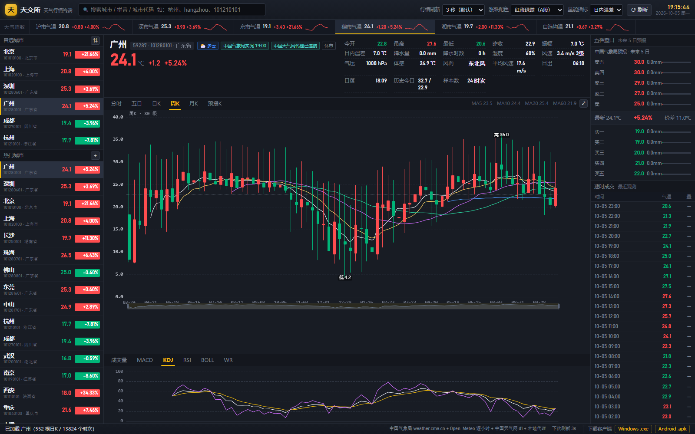
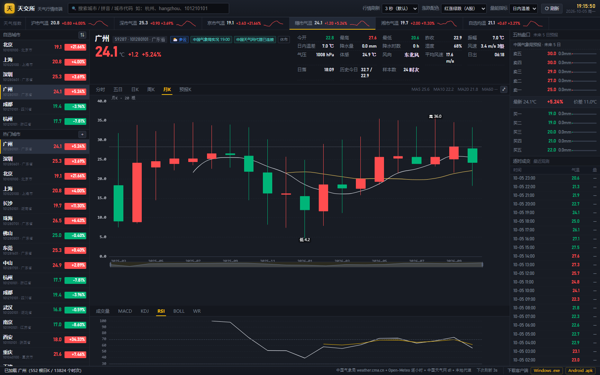
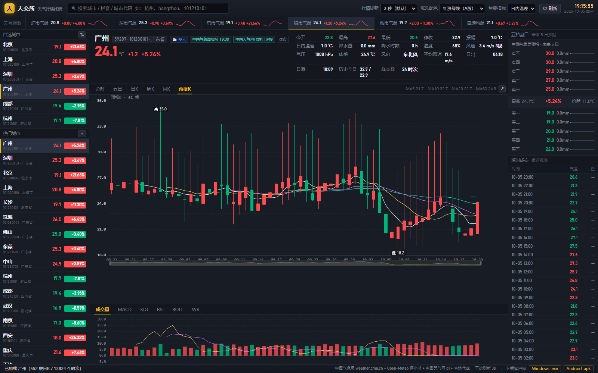
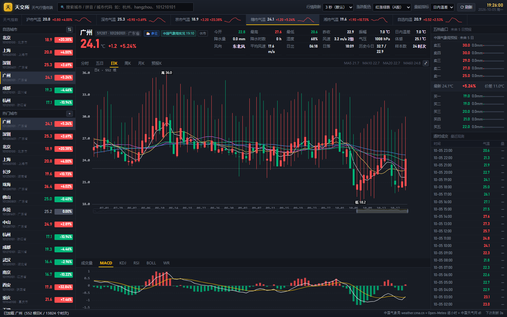

<div align="center">

# 天交所 · 天气行情终端

**用看股票的方式看天气**

蜡烛图 · 分时走势 · 日/周/月 K 线 · 五档盘口 · 成交明细 · 自选城市 · 行情刷新频率

网页版 · Windows EXE · Android APK

</div>

---


> 上图：分时走势（当日逐小时气温 + 均价线 + 昨收基准线），左侧自选/热门城市，右侧五档盘口与逐时成交明细。

### 界面预览

| 分时走势 | 日 K + MACD |
| --- | --- |
|  |  |

| 周 K + KDJ | 月 K + RSI |
| --- | --- |
|  |  |

| 预报 K 线 + 成交量 | GitHub Pages 静态托底模式 |
| --- | --- |
|  |  |

## 这是什么

一个把**气温当成股价**来展示的天气软件。整个交互、配色、术语都照搬 A 股行情终端：

| 股票里的东西 | 这里对应什么 |
| --- | --- |
| 股票代码 | 城市代码（中国天气网的 `101010100` 这类 9 位码） |
| 最新价 / 涨跌幅 | 当前气温 / 相对昨日同一时次的变化 |
| 分时图 | 今天 00:00–23:00 的逐小时气温，含均价线、昨收虚线 |
| 日 K / 周 K / 月 K | 每天的开盘价 = 当日 00:00 气温，收盘价 = 当日 23:00 气温，最高/最低 = 当日极值 |
| 成交量 | 日内温差（可切换成降水量 / 风速 / 湿度） |
| MA / MACD / KDJ / RSI / BOLL / WR | 都用气温算，算法与股票完全一致 |
| 五档盘口（卖五~卖一 / 买一~买五） | 未来 5 天的**预报最高温**（卖盘，由高到低）与**预报最低温**（买盘，由低到高） |
| 成交明细 / 逐笔 | 最近 60 个逐小时观测，涨跌按对上一时次着色 |
| 自选股 | 自选城市，可增删、可按涨幅或名称排序 |
| 行情刷新频率 | 1s / 3s / 5s / 10s / 30s / 1m / 5m / 手动 |
| 涨跌配色 | 红涨绿跌（A 股）/ 绿涨红跌（美股）一键切换 |

## 三个版本

| 形态 | 说明 | 需要什么 |
| --- | --- | --- |
| **网页版** | [lolikonnn.github.io/weather-exchange](https://lolikonnn.github.io/weather-exchange/) | 一个现代浏览器 |
| **Windows EXE** | `dist\天交所-天气行情终端.exe`，双击即用，单文件免安装 | Win10/11（自带 Edge 即可，无需 Python） |
| **Android APK** | `dist\天交所-天气行情终端.apk`，`minSdk 21` | Android 5.0+ |

三个版本界面**完全相同**，区别只在数据怎么取（见下）。

### 直接下载

网页版打开后，**右下角状态栏**会出现「下载客户端」两个按钮（只有在安装包真的存在时才显示，点了不会 404）：

| 平台 | 直链 |
| --- | --- |
| Windows | <https://lolikonnn.github.io/weather-exchange/dist/tjs-weather-windows.exe> |
| Android | <https://lolikonnn.github.io/weather-exchange/dist/tjs-weather-android.apk> |

> `web/dist/` 不提交进仓库。部署时 `.github/workflows/deploy.yml` 会把 `dist/` 里的安装包
> 拷成上面这两个 **纯 ASCII 文件名**再发布 —— 中文文件名在 CDN 和各浏览器里的百分号编码
> 行为不一致，用别名能保证链接到处都点得通，下载下来的文件名也不会乱码。
> 仓库里的原始文件仍是 `dist\天交所-天气行情终端.{exe,apk}`。

## 数据从哪来

本项目**不生产数据**，只是把公开的官方天气数据画成 K 线。

| 数据 | 来源 | 授权 |
| --- | --- | --- |
| 实况观测、7 天预报、15/40 天趋势、预警、历史同期气候均值 | **中国气象局 / 中国天气网**（`weather.cma.cn`、`d1.weather.com.cn`、`www.weather.com.cn`、`nmc.cn`） | 数据版权归中国气象局所有 |
| 历史逐小时气温（用来算真实 OHLC）、全球城市坐标、无官方站号城市的实况兜底 | **Open-Meteo**（ERA5 再分析） | CC-BY-4.0，非商业免费 |

### 为什么需要"三级取数"

`d1.weather.com.cn` 会**强制校验 `Referer` 必须是 `weather.com.cn`**，浏览器里补不了这个头；
`weather.cma.cn` 又会在非浏览器 UA 下返回 `406`。所以前端按下面的顺序依次尝试，谁通用谁：

```
① 本地代理（EXE / APK 自带）  →  服务端补 Referer / UA，最稳
② 浏览器直连                  →  网页版走这条；weather.cma.cn 有 CORS 头，d1 拿不到
③ 静态兜底 data/official/**   →  GitHub Actions 每 30 分钟预抓并提交的 JSON
```

网页版因此是 ② + ③：能直连的就直连，拿不到（比如 d1 的官方预报）就读仓库里 Actions 刚抓好的快照。

## 城市范围

当前收录 **45 个城市**（在 `tools/scope.py` 里定义，随时可改）：

- **广东珠三角 9 市**：广州、深圳、珠海、佛山、惠州、东莞、中山、江门、肇庆
- **湖南长株潭 + 娄底**：长沙、株洲、湘潭、娄底
- **省会 / 直辖市 / 特别行政区 / 台北**：北京、天津、上海、重庆、石家庄、太原、呼和浩特、沈阳、长春、哈尔滨、南京、杭州、合肥、福州、南昌、济南、郑州、武汉、南宁、海口、成都、贵阳、昆明、拉萨、西安、兰州、西宁、银川、乌鲁木齐、香港、澳门、台北

其中 40 个有中国气象局官方站号，5 个（佛山、惠州、江门、肇庆、香港）走 Open-Meteo 实况，界面上会标"无官方站号"。

想加城市：改 `tools/scope.py` 的列表，然后跑 `python tools\scope_cities.py --restore` 还原完整数据、再 `python tools\scope_cities.py` 重新裁剪。

## 快速开始

### 网页版

直接打开 <https://lolikonnn.github.io/weather-exchange/>。

本地跑：因为前端用 `fetch` 读 `data/cities.json`，**不能直接双击 `index.html`**（`file://` 会被同源策略拦），要起个静态服务：

```bash
cd weather-exchange
python server/app.py            # 打开 http://127.0.0.1:8765/
```

`server/app.py` 同时是本地代理，所以本地跑起来的数据最全（跟 EXE 一样）。

### Windows EXE

```
dist\天交所-天气行情终端.exe
```

双击即可。命令行参数：

```
--port N        固定端口（默认自动找空闲）
--serve-only    只起本地服务不开窗口（自检 / 当本地代理用）
--browser       用系统默认浏览器打开（默认用 Edge/Chrome 的应用窗口）
--no-wait       开完窗口就退出
```

### Android APK

```
dist\天交所-天气行情终端.apk
```

传到手机上安装（需要允许"安装未知来源应用"）。APK 自带 Java 侧代理，
所以官方预报、预警这些必须带 Referer 的数据在手机上也拿得到。

## 自己构建

环境要求：**Python 3.10+**；打 APK 额外需要 **JDK 11+**（本项目用 `D:\Java`，JDK 23）。

```bash
cd weather-exchange

# 1) 重建城市数据集（联网，会用 tools/.cache3 缓存）
python tools\resolve_cities.py --workers 8
python tools\scope_cities.py                 # 裁剪到 45 城

# 2) 预抓中国天气网官方数据（供 Pages 静态兜底）
python tools\prefetch_official.py --workers 8

# 3) Windows EXE
python -m pip install pyinstaller
python tools\build_exe.py                    # -> dist\天交所-天气行情终端.exe

# 4) Android APK（无需 Gradle）
python tools\fetch_android_sdk.py            # 下载 build-tools 34 + platform 35
python tools\make_icon.py                    # 生成各密度启动图标
python tools\build_apk.py                    # -> dist\天交所-天气行情终端.apk

# 5) 冒烟测试 20 个端点
python tools\smoke.py
```

## 发布到自己的仓库

这台机器上通常没有装 `git`，而 GitHub 从 2021-08-13 起就不再接受账号密码做 API 调用，
所以推送走 **GitHub REST API（Git Data API）**，只需要一个 Personal Access Token：

1. <https://github.com/settings/tokens/new>
2. 勾 **`repo`**（必需）+ **`workflow`**（必需，否则 `.github/workflows/` 下的文件会被拒收）
3. 生成后：

```powershell
$env:GH_TOKEN = "ghp_xxxxxxxx"          # 也可以直接 --token 传
python tools\push_github.py --dry       # 先看要传什么（310 个文件 / 14.9 MB）
python tools\push_github.py             # 建仓库 -> 传文件 -> 提交 -> 开 Pages
```

推送完 Pages 会自动开始构建（`.github/workflows/deploy.yml` 首次由 `push` 事件触发）。
大约 1~2 分钟后站点在 `https://<你的用户名>.github.io/weather-exchange/`。

> **仓库必须是 public**：免费账号的 Pages 不支持私有仓库（私有仓库开 Pages 需要 GitHub Pro）。

## 数据自动更新

`.github/workflows/deploy.yml` 每 30 分钟跑一次：

1. `tools/prefetch_official.py` 带着正确的 `Referer` / `UA` 抓中国天气网与气象局的数据，写进 `web/data/official/`
2. 有变化就 `git commit && git push`
3. 把 `web/` 整个发布到 GitHub Pages

> 抓数据和部署**必须写在同一个 workflow 里** —— 用 `GITHUB_TOKEN` 推送产生的 commit
> 不会触发其它 workflow，拆成两个文件的话 Pages 永远不会更新。

## 验证过的行为

三条取数路径都实际跑过，不是"应该能跑"：

| 场景 | 怎么复现 | 结果 |
| --- | --- | --- |
| **本地代理**（EXE / APK） | `python server\app.py --port 8765` 然后 `python tools\smoke.py` | 20/20 端点 200 |
| **GitHub Pages**（无代理、浏览器直连也失败） | 见下方"子路径复现" | 报价头部 / 日K / 五档盘口 / 自选全部正常，`window.__errs` 为空，走**静态预抓**这一级 |
| **打包后的 EXE** | `dist\天交所-天气行情终端.exe --serve-only --port 8811` | `/api/health` 200，`/data/cities.json` 的 `count` 为 45 |

`?local=0` / `?local=1` 是专门为上面第二行加的开关 —— 在本地一条命令就能复现 Pages 的取数路径，
不用真的等部署。截图见 `docs/screenshots/pages-static.png`。

**子路径复现（重要）**：Pages 上线后站点在 `https://<user>.github.io/weather-exchange/`，
是**带子路径**的，绝对路径 `/js/app.js` 这种写法会直接 404。所以 `web/` 里所有静态资源引用
（`data/cities.json`、`data/official/**`、`vendor/echarts.min.js`、`dist/tjs-weather-*.{exe,apk}`）
**都是相对路径**，只有 `/api/*` 是绝对路径（那是本地代理专用，在 Pages 上注定 404 并被 catch 掉）。

这一条也实测过 —— 用目录联接把站点挂到 `/weather-exchange/` 下再跑无头浏览器：

```powershell
$root = "weather-exchange\tmp\pages-root"
New-Item -ItemType Junction -Path "$root\weather-exchange" -Target "weather-exchange\web"
python -m http.server 8767 --directory $root
# 浏览器打开 http://127.0.0.1:8767/weather-exchange/?local=0&city=101280101&p=day&ind=macd
```

结果：`#qPrice 24.1`、`#qChange +1.2`、`#qPct +5.24%`、`#chartHint "MA5 21.9 …"`、
28 个 `.stock-row`、8 个 canvas、`window.__errs` 为 `[]`。

## 目录结构

```
weather-exchange/
├── web/                     前端（纯静态，无构建步骤）
│   ├── index.html           同花顺风格的行情终端
│   ├── css/app.css          深色皮肤、配色令牌（body.us 一键翻转红绿）
│   ├── js/util.js           工具函数、格式化、配色、股市话术
│   ├── js/indicators.js     MA/EMA/MACD/KDJ/RSI/BOLL/WR + 周月聚合
│   ├── js/api.js            三级取数、缓存、城市索引
│   ├── js/chart.js          ECharts 主图/副图（十字光标联动）
│   ├── js/app.js            状态机、渲染、轮询、搜索、抽屉
│   ├── data/cities.json     45 城数据集（代码/坐标/站号/拼音）
│   ├── data/cities.full.json 未裁剪的 352 城全量（备份）
│   ├── data/official/       Actions 预抓的官方数据
│   └── vendor/echarts.min.js
├── server/app.py            本地代理 + 静态服务（EXE/APK 共用同一套解析）
├── desktop/main.py          Windows 外壳（本地服务 + Edge/Chrome 应用窗口）
├── android/                 Java 代理 + 清单 + 资源（不走 Gradle）
├── tools/                   数据集构建、预抓、打包脚本
└── dist/                    产物
```

## 一些实现上的坑（给后来的人）

- **d8 崩在非静态内部类上**：`build-tools 34` 的 R8 8.2.2 处理"继承 `android.jar` 里某个类、
  且带合成 `this$0` 字段的嵌套类"时抛 `NullPointerException: Cannot invoke "String.length()"`。
  必须把 `WebViewClient` 子类写成 `private static class` 并持有外部引用。javac 也要用 `--release 8`
  （Java 9+ 的 `invokedynamic` 字符串拼接 R8 处理不了）。
- **`aapt2 link` 的资源包必须用位置参数**：写成 `-R res.zip` 会被当成 overlay，报
  `resource string/app_name does not override an existing resource`。
- **PyInstaller onefile 的 `%TEMP%` 必须可写**，否则启动即 `Could not create temporary directory!`。
- **不要用 pywebview**：onefile 里必定挂在 `pythonnet` → `clr_loader`
  （`Failed to resolve Python.Runtime.Loader.Initialize`）。用浏览器的 `--app=` 模式更稳。
- **浏览器直连 `weather.cma.cn` 会失败**（`TypeError: Failed to fetch`），而
  `no-cors` 又是 opaque，Python `urllib` 带浏览器 UA 则正常 200。原因未明，所以必须有代理层。

## 免责声明

本项目仅用于学习与技术演示。天气数据来自中国气象局 / 中国天气网与 Open-Meteo，
版权归各自所有；本项目不保证数据准确性，**请勿用于任何生产或安全决策**。
"K 线""涨跌"等只是可视化隐喻，气温不是证券。
