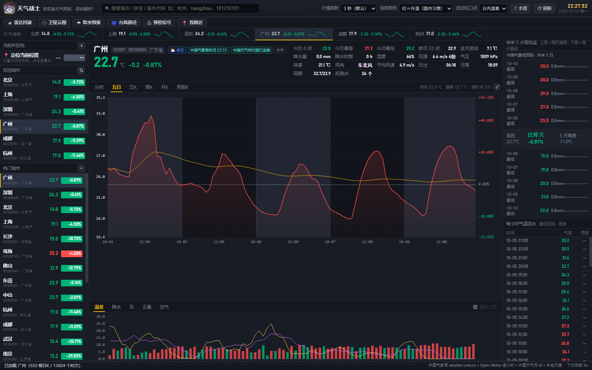

<div align="center">

# 天气战士 · 老实看天气预报，很枯燥吧？

**用看股票的方式看天气**

蜡烛图 · 分时走势 · 日/周/月 K 线 · 五档盘口 · 成交明细 · 自选城市 · 行情刷新频率

网页版 · Android APK

[**lolikonnn.github.io/weather-fighter**](https://lolikonnn.github.io/weather-fighter/)

</div>

> **改名说明**：仓库原叫 `weather-exchange`，已改名为 **`weather-fighter`**。
> 旧网址 `https://lolikonnn.github.io/weather-exchange/` 现在是 **404** —— GitHub Pages
> 不会跟着仓库改名做路径跳转，请换用上面的新地址。

---


> 上图：分时走势（当日逐小时气温 + 均价线 + 昨收基准线），左侧自选/热门城市，右侧「未来 5 天高低温」与「每小时气温流水」。

### 界面预览

| 分时走势 | 日 K + 温差 |
| --- | --- |
|  |  |

| 降水副图（日 K · 按天聚合） | 风副图（周 K · 按周聚合） |
| --- | --- |
|  |  |

| 空气副图（日 K · 按天聚合） | 雷达回波（八个大区） |
| --- | --- |
|  |  |

| 卫星云图 | 降水预报 |
| --- | --- |
|  |  |

| | |
| --- | --- |
|  |  |

> 上左：五日图按自然日铺**明-暗交替**的底色（三明两暗，一眼看出一天一天的界限），紫色 PM2.5 线叠在主图上。
> 上右：日 K 上叠加**降水量线**（青色，走最右侧第 3 根 Y 轴）；副图口径随时可用「📈 叠到主图」按钮拉到主图。

| 台风路径 | 预警信号 |
| --- | --- |
|  |  |

| 当前所在地（按坐标取的天气） | 指数条 = 左栏镜像 |
| --- | --- |
|  |  |

> 左：定位到越秀区，天气是**按经纬度直接取的**，所以标「无官方站号」；体感/风向/气压走 Open-Meteo 补齐。
> 右：顶栏指数条跟左栏「当前位置 + 自选城市」完全同步，点一下就能切城市。

| 五日横轴带日期 | 预报 K（10 天历史 + 16 天预报） |
| --- | --- |
|  |  |

| 术语对照表 | 手机竖屏 · 自选 |
| --- | --- |
|  |  |

| 手机竖屏 · 台风 | 手机竖屏 · 雷达（按省自动选中华南） |
| --- | --- |
|  |  |

| 手机竖屏 · 主图不再被压扁 | 手机竖屏 · 主图全屏（⤢） |
| --- | --- |
|  |  |

> 左：窄高屏上主图原来会被 `flex:1` 压成 **0 高**（页签下面直接就是副图，看起来像"主图不见了"），
> 现在窄屏给 `.chart-box{flex:1 1 auto;min-height:170px}`，整页高度改为 `.pane-center` 内部滚动。
> 右：全屏按钮用 **CSS**（`position:fixed;inset:0` + 隐藏其它块）而不是 Fullscreen API ——
> iOS Safari 至今不支持 `Element.requestFullscreen`，CSS 方案在哪都能用，Esc 也能退出。

| 日 K 日期轴不再被缩放条压住 |
| --- |
|  |

> 日期标签原本落在 `H-26 .. H-14`，而 `dataZoom` 滑块的顶边在 `H-20`，两者正好重叠。
> 把主 K 线图的 `grid(52,56,16,34)` 改成 `grid(52,56,16,46)`，把标签抬到滑块上方。

| 涨空心、跌实心（A 股习惯） |
| --- |
|  |

> 气温 K 线比真股票密集得多，全实心会糊成一片色块。涨的实体只留描边，跌的实心填充，
> 影线走 `borderColor` 所以仍是涨色 —— 涨跌方向在一堆重叠的 K 线里也能一眼扫出来。

| 首次访问的免责弹窗 | 网页底端常驻的免责声明 |
| --- | --- |
|  |  |

> 左：第一次打开弹一次（`localStorage.welcomed` 记住，之后不再弹；`?welcome=1` 可强制弹）。
> 右：弹窗关掉之后，底端那条**一直在**，点它可以把完整声明再弹回来 ——
> 私自开展天气预报业务是违法的，这条不能只藏在弹窗里。

| 免责声明在手机竖屏（落在底部页签上方） |
| --- |
|  |

> 390×844 真实手机视口。`body` 是 grid，加这一行必须同步改**三处**
> `grid-template-rows`（桌面 / 竖屏 / 横屏），否则最后一行会被挤出视口。
> 实测 `docScroll = 390x844`，无横向或纵向溢出，`.disclaimer` 占 `0,766 390x24`。

> 桌面截图 1600×1000。手机截图是 **390×844 的真实手机视口**，不是把桌面版缩小出来的。
> （注意：Windows 上无头 Chrome 会把 `--window-size=390,844` 悄悄夹到约 500px 宽，
> 然后只截左边 390px —— 那样得到的"手机截图"右侧是被裁掉的，不能用。要量真手机布局，
> 必须把页面装进一个 390px 宽的 iframe 里。）

## 这是什么

一个把**气温当成股价**来展示的天气软件。整个交互、配色、术语都照搬 A 股行情终端：

| 股票里的东西 | 这里对应什么 |
| --- | --- |
| 股票代码 | 城市代码（中国天气网的 `101010100` 这类 9 位码） |
| 最新价 / 涨跌幅 | 当前气温 / 相对昨日同一时次的变化 |
| 分时图 | 今天 00:00–23:00 的逐小时气温，含均价线、昨收虚线 |
| 日 K / 周 K / 月 K | 每天的开盘价 = 当日 00:00 气温，收盘价 = 当日 23:00 气温，最高/最低 = 当日极值 |
| 成交量（现在叫「温差」） | 日内最高温 − 最低温；底部副图页签可切到 **降水 / 风 / 云量 / 空气** |
| MA5 / MA10 / MA20 / MA60 | 最近 5 / 10 / 20 / 60 天的平均气温，看大方向 |
| MACD / KDJ / RSI / BOLL / WR | **已经删掉了** —— 这几个股票指标对看天气没用，换成了下面「天气功能」里的真东西 |
| 五档盘口（卖五~卖一 / 买一~买五） | 未来 5 天的**预报最高温**（卖盘，由高到低）与**预报最低温**（买盘，由低到高） |
| 成交明细 / 逐笔 | 最近 60 个逐小时观测，涨跌按对上一时次着色 |
| 自选股 | 自选城市，可增删、可按涨幅或名称排序 |
| 行情刷新频率 | 1s / 3s / 5s / 10s / 30s / 1m / 5m / 手动 |
| 涨跌配色 | 红涨绿跌（A 股）/ 绿涨红跌（美股）一键切换 |
| K 线实体 | **涨空心、跌实心**（A 股习惯）。气温 K 线比真股票密集得多，全实心会糊成一片色块；空心后涨跌一眼可辨。实现上就是把 `itemStyle.color` 设成 `transparent` 只留描边，影线走 `borderColor` 所以仍是涨色 |

## 天气功能

炒股软件的长相下面，装的是气象台真正会给的东西。顶栏那一排按钮就是入口：

| 按钮 | 打开什么 | 数据源 |
| --- | --- | --- |
| 🛰 雷达回波 | 雷达拼图，**三层可选**：全国 → 八大区（东北／华北／华东／华中／华南／西北／西南）→ **单站（精确到城市）**。打开时**默认是你正在看的城市**的雷达站，另有「📡 当前位置」快捷入口可一键跳到所在地的雷达站。每 6 分钟一帧，可拖滑块也可自动播放，能回看约 30 小时 | `image.nmc.cn` 中央气象台雷达拼图 |
| ☁ 卫星云图 | 气象卫星云图，**两种产品可切**：**真彩云图**（风云四号 B 星，默认档，白天最好看）/ 红外云图（风云二号，每 30 分钟一张）。能回看一天 | `image.nmc.cn` 国家卫星气象中心 `WXBL` / `WXCL` |
| 🌧 降水预报 | 中央气象台全国降水量预报图，**两种产品可切**：**最近 1 小时实况**（默认档，每小时一张）/ 未来 24 小时预报（每 12 小时一张） | `image.nmc.cn` `STFC_SFER_ER1` / `STFC_SFER_ER24` |
| 🌀 台风路径 | 西北太平洋活动台风的实时路径 + 中央气象台 120 小时预报路径。底图是「亚洲–太平洋」，中国和台风同框，看得出台风往哪走 | `typhoon.nmc.cn` |
| ⚠ 预警信号 | 全国生效中的气象预警，按颜色分级，含发布单位与完整正文 | `typhoon.nmc.cn` 预警接口 |
| 📍 我附近 | 用浏览器定位找到最近的城市并切过去。**坐标换算全在本机做，不往任何服务器发位置** | 浏览器 Geolocation |

> **只有雷达能做到城市级**：气象局除了全国拼图和八大区拼图，还发布每个雷达站自己的产品
> （`image.nmc.cn/.../RDCP/..._ECREF_AZ####_...`，图上自带压字「雷达站名 / 数据范围 / 观测时间」）。
> **352 个城市里有 156 个**能匹配到独立站（清单见 `web/data/radar-cities.json`），剩下的
> （佛山、珠海、惠州、东莞、中山、江门、上海、拉萨、香港、澳门、台北……）自动回落到所在大区拼图 ——
> 气象局没有「按坐标取雷达」的接口，所以纯坐标定位（当前所在地）会挑**最近的有站城市**的雷达。
> 单站页**没有入口页面**，靠 slug 拼出来（`{省拼音}/{市拼音}.htm`，如 `guang-dong/guang-zhou.htm`）。
>
> **云图和降水预报官方只有全国版**，没有区域版，所以这两页是「全国图 + 按城市对齐时次」，
> 不能像雷达那样放大到城市。这也是把它们默认档改成「真彩云图 / 最近 1 小时实况」的原因 ——
> 既然放不大，就默认给最新最清晰的那张。
>
> 台风是路径图不是图片，点列表里任意台风就能看它的轨迹。

底部副图页签从股票的 MACD / KDJ / RSI / BOLL / WR 换成了五个天气口径，
而且**每个都跟着上面选的主图周期走**：

| 页签 | 画什么 |
| --- | --- |
| 温差 | 日内温差（最高 − 最低） |
| 降水 | 降水量柱（左轴 mm）+ 降水概率线（右轴 %） |
| 风 | 风速柱（按蒲福风级着色）+ 阵风虚线 + 顶部风向箭头 |
| 云量 | 低云 / 中云 / 高云堆叠面积 + 总云量线 |
| 空气 | PM2.5 柱 + AQI 线（含「良 100」参考线） |

副图右侧还有一个 **「📈 叠到主图」** 按钮：把当前副图的口径**拉一条线画到上面的主图**上
（降水 → 青色降水量线、风 → 绿色风速线、云量 → 灰蓝云量线、空气 → 紫色 PM2.5 线）。
这条线走主图**最右侧的第 3 根 Y 轴**（`offset:44`），不跟百分比轴抢刻度；按钮状态会记在
`localStorage` 里，副图切回「温差」时自动置灰。口径与主图对齐**统一按时间键查表**，不是按下标 ——
按下标会在「分时/五日」上整体错位（主图是「今天 24 小时 / 昨天→未来三天」，而聚合序列是
「从现在往前 2 小时起 24 小时」）。

> **日界明暗带**：五日 / 多日折线图按自然日铺**明-暗交替**的底色（5 天 = 三明两暗），
> 并在每条日界画竖虚线，一眼能看出一天一天的界限。单日分时（只有一天）不铺带。
> 带子挂在一条不画线的独立系列上（`z:1`），保证永远在气温线和均价线之下。

选**分时**就是今天的逐小时，选**五日**就是逐小时 120 个点，选**日 K** 就按天聚合最近 60 天，
选**周 K / 月 K** 就按周 / 按月，选**预报 K** 就是**最近 10 天 + 未来 16 天**（一共约 26 根）。
聚合口径按物理量定：
降水量**求和**、降水概率取**最大**、风速阵风取**最大**、云量和 PM2.5/AQI 取**平均**；
风向不能平均，取「风最大的那一刻」的风向。

> 预报 K 的窗口以前是往回留 45 天，图上四分之三都是历史 —— 用户反馈"过去日子的占比太多了"，
> 现在历史只留 10 天当参照，重心全部让给预报。

周期页签的「五日」口径是 **昨天 + 今天 + 未来三天**（共 120 个逐时点）——
天气预报最要紧的就是后面这三四天，所以窗口是往前压的，不是往回看。

> **五日图的横轴会写日期**：`10-04 12:00 10-05 12:00 …`，每个自然日一格日期，
> 正好压在明暗带的交界上，和上面说的日界带是一套东西。
> 这里踩过一个坑：轴标签的 `S.five` 标志**从来没被传进去过**（`seriesFor()` 的返回对象里没有这个字段），
> 所以 formatter 分支永远走不到，横轴只有 `00:00 / 12:00` 而没有日期。

> 雷达 / 云图 / 降水预报这三张是**图片**，文件名里的时次戳是 **UTC**（不是北京时间），
> 前端按 `floor(分钟/6)*6`（雷达）、`:15 / :45`（云图）、整点（降水实况）对齐到官方出图的
> 整点网格，再换算成本地时区显示。界面上的时次和图上自带的压字时间戳是对得上的 ——
> 这是这套时间换算正确的硬证据。

## 三个版本

| 形态 | 说明 | 需要什么 |
| --- | --- | --- |
| **网页版** | [lolikonnn.github.io/weather-fighter](https://lolikonnn.github.io/weather-fighter/) | 一个现代浏览器 |
| **Android APK** | `dist\天气战士.apk`，`minSdk 21` | Android 5.0+ |

两个版本界面**完全相同**，区别只在数据怎么取（见下）。

想在电脑上用，直接开网页版即可 —— 它是纯静态的，可以「添加到主屏幕 / 固定到任务栏」当应用用。
（曾经还有一个 Windows EXE，已经**放弃并删除**：PyInstaller 单文件版每次启动都要往 `%TEMP%` 解压，
在部分机器上被安全软件挡住就起不来，收益配不上这个维护成本。）

### 直接下载

网页版打开后，**右下角状态栏**会出现「下载客户端」按钮（只有在安装包真的存在时才显示，点了不会 404）：

| 平台 | 直链 |
| --- | --- |
| Android | <https://lolikonnn.github.io/weather-fighter/dist/weather-fighter-android.apk> |

> `web/dist/` 不提交进仓库。部署时 `.github/workflows/deploy.yml` 会把 `dist/` 里的安装包
> 拷成上面这个 **纯 ASCII 文件名**再发布 —— 中文文件名在 CDN 和各浏览器里的百分号编码
> 行为不一致，用别名能保证链接到处都点得通，下载下来的文件名也不会乱码。
> 仓库里的原始文件仍是 `dist\天气战士.apk`。

## 数据从哪来

本项目**不生产数据**，只是把公开的官方天气数据画成 K 线。

| 数据 | 来源 | 授权 |
| --- | --- | --- |
| 实况观测、7 天预报、15/40 天趋势、预警、历史同期气候均值 | **中国气象局 / 中国天气网**（`weather.cma.cn`、`d1.weather.com.cn`、`www.weather.com.cn`、`nmc.cn`） | 数据版权归中国气象局所有 |
| 历史逐小时气温（用来算真实 OHLC）、全球城市坐标、无官方站号城市的实况兜底 | **Open-Meteo**（ERA5 再分析） | CC-BY-4.0，非商业免费 |

### 为什么需要"三级取数"

`d1.weather.com.cn` 会**强制校验 `Referer` 必须是 `weather.com.cn`**，浏览器里补不了这个头；
`weather.cma.cn` 又会在非浏览器 UA 下返回 `406`。所以前端按下面的顺序依次尝试，谁通用谁：

```
① 本地代理（APK 自带 / 本地调试用）  →  服务端补 Referer / UA，最稳
② 浏览器直连                  →  网页版走这条；weather.cma.cn 有 CORS 头，d1 拿不到
③ 静态兜底 data/official/**   →  GitHub Actions 每 30 分钟预抓并提交的 JSON
```

网页版因此是 ② + ③：能直连的就直连，拿不到（比如 d1 的官方预报）就读仓库里 Actions 刚抓好的快照。

### Open-Meteo 的免费额度，以及为此做的节流

Open-Meteo 免费档（非商业）的硬上限是**每分钟 600 次 / 每小时 5,000 次 / 每天 10,000 次**，
**超了不会提前通知，直接封 IP**。被限流时接口返回的就是这一句：

```json
{"error":true,"reason":"Daily API request limit exceeded. Please try again tomorrow."}
```

本站绝大多数请求走的是中国天气网（`Cma.now`，无论多少城市都只读一份快照），
真正会随「城市数 × 时间」放大的是 Open-Meteo。实测方式：`?local=0` 把页面挂 2 小时
（用 `--virtual-time-budget` 压缩应用时间），从 iframe 的 Resource Timing 里数请求。
最初的构成是：

| 调用 | 次数 / 2 小时 | 说明 |
| --- | --- | --- |
| `current=` 实况兜底 | **720** | 无官方站号的城市（典型是「当前所在地」）用 Open-Meteo 当前值当报价 |
| `brief` 昨收 / 迷你走势 | 68 | 自选 + 热门，每个坐标 4 次 = 2 小时里 4 轮 |
| `past_days=92` 历史逐时 | 12 | 画日 K 用的 92 天历史 |
| `archive` / `air-quality` | 4 / 4 | 归档与空气质量 |

折合约 **9,650 次/天**，正卡在免费额度上。根因不是"请求太多"，而是
**缓存只在请求成功返回之后才写入** —— 只要一次请求还没落地（网络慢，或者上游 20 秒
的超时比 10 秒的轮询间隔还长），下一个 tick 就再发一次，于是永远存不上，退化成
「每个轮询 tick 一次」。

修法在 `web/js/api.js` 的 `getJSON()`：

- **`inflight` 表**：同一个 cache key 正在飞的请求只保留一个 Promise，后来者直接复用
- **失败也缓存**（`FAIL_TTL = 60000`）：上游 429 / 超时之后 60 秒内不再重试
- `warmQuotes()` 里 `BRIEF_MS = 1800000`（30 分钟一轮）、`BRIEF_MAX = 40`（一轮最多 40 城）；
  注意 **brief 的 TTL 必须写成和节流周期同一个值**，否则缓存先过期，节流等于没做
- 轮询间隔默认从 3 秒改成 **10 秒**（`web/index.html` 的下拉里仍可选 3 秒）

改完复测同样 2 小时：**总请求 804 → 183，其中 `current=` 720 → 103**，折合约 2,200 次/天。

轮询间隔默认设成 **15 分钟**（下拉里仍可选 1 秒 ~ 5 分钟）。因为额度是**按 IP 计**的，
被限流时接口返回的就是上面那句 429 —— 而且**只影响被限流的那台机器**，
换一台设备、换一个网络出口，额度就是全新的一份。所以调试时千万别用
`--virtual-time-budget` 长时间跑页面，那会把真实当天的额度一次性烧光。

一个曾经踩过的坑：`OpenMeteo.archive()` 的缓存键漏了 `endDate`
（原来是 `'a|' + lat + ',' + lon + '|' + startDate`）。同一 start、不同 end 的两次调用
会互相命中缓存，第二次等于没发出去。目前只有一个调用点所以没暴露，但键该带上就带上。

## 城市范围

当前收录 **352 个城市**（全国地级市，`web/data/cities.json`，50 KB）：

- 每个城市带中国天气网 city id、经纬度、拼音、省份
- 其中 **310 个**有中国气象局官方站号，剩下 42 个（佛山、惠州、江门、肇庆、香港……）
  没有站号，走 Open-Meteo 实况，界面上会标「无官方站号」

**搜索框搜得到全部 352 个**，不是只有热门那几个。

在此之上还有一份 **省 / 地级市 / 区县三级地名目录 `web/data/places.json`**（3237 条，
222 KB，来自阿里 DataV 的行政区划边界数据，每条带中心点经纬度）：**义乌、昆山、敦煌、
察隅、漠河、浦东新区**这类县级市 / 区在这里才搜得到，`cities.json` 只有地级市所以没有它们。

- 搜到的区县没有气象局站号，但**带经纬度**，直接按坐标走 Open-Meteo 取天气 —— 与
  「当前所在地」是同一条通路，蜡烛图、副图、叠加线、雷达（挑最近的有站城市）都正常
- 下拉里区县会标出上级：`义乌市 | 浙江省 · 金华市 | 区县`
- `tools/build_places.py` 会逐级爬 DataV（1 + 34 + 475 次请求）重新生成它；
  地级市里已经有站号的会被去重，避免同一城市出现两条

> ⚠️ 这里踩过一个坑：早先为了控制仓库体积，用 `tools/scope_cities.py` 把目录裁到了 45 个城市，
> 结果**顺手把搜索能力也砍掉了** —— 目录就是搜索的唯一数据源。现在目录保持全量
> （352 地级市 + 2903 区县），体积改由「预抓范围」单独控制：`cities.json` 里的 `prefetch`
> 字段列出 45 个重点城市（`tools/prefetch_official.py` 默认只抓这些），想全抓加 `--all`。

> 浏览器自带的定位、以及第三方地理编码接口都试过，**对中国区县都不可靠**：
> Open-Meteo 的 geocoding 对「昆山」返回的是福建三明的一个同名村，「敦煌」「察隅」干脆 0 命中。
> 所以最终没有用联网地理编码，而是把 DataV 的行政区划目录**离线打包进来**，搜索走本地索引。

### 当前所在地

左栏最上面一栏是 **当前所在地**，用浏览器 / 系统的定位权限取坐标，**再把坐标换算成具体区县**：

1. BigDataCloud 反查地名（`localityLanguage=zh-Hans`）
2. 同时算出最近的城市和距离，显示成 `广州市 · 广东省 · 近 佛山 18 km`

天气是**直接按经纬度取的**（Open-Meteo 逐小时 + 历史），不是拿最近城市的天气糊弄你 ——
所以报价头会标「无官方站号」。反查失败也不影响出天气，名字退化成「近 <最近城市>」。

- **点那一行才要权限**：加载时不会静默调 `getCurrentPosition`，只有浏览器已经授权过才静默刷新
- 首次访问才会自动切到当前位置；用 `?city=` 或上次打开的城市明确指定过就不劫持
- 位置记在 `localStorage`，30 分钟内不重复定位
- 拒绝授权、定位超时都各有文案提示，不会静默失败

> ⚠️ **权限提示一辈子只弹一次。** 早先的实现在页面加载时就调 `getCurrentPosition`，
> 用户在没预期的情况下把提示点掉（或拉黑），权限就永久变成 `denied` ——
> **再点也弹不出来了**，表现为"点了没反应"。现在改成：
> `navigator.permissions.query({name:'geolocation'})` 先看状态，
> `prompt` 状态下一个字都不问（等用户点），`denied` 时文案改成
> "已被浏览器禁止 · 点地址栏 🔒 把「位置」改成「允许」后点这里"，
> 因为 Chrome 确实不会再弹了，只能引导用户自己去改站点权限。

> **坐标换算全在本机做**，只有反查地名那一步会把坐标发给 BigDataCloud；
> 天气数据本身是按坐标查 Open-Meteo 的，不经过任何中间服务器。

### 指数条

顶栏那一排（`北京 14.8 -0.90 -5.73% ︿`）就是左栏 **「当前位置 + 自选城市」的镜像**，
顺序和左栏一致，**点一下就能切城市**，当前城市高亮。

> 它以前是写死的沪/深/京/穗/湘五个城市，外加一个 computed 的「自选均温」（自选城市的平均气温）。
> 那个平均温既没有数据源也不知道点它干什么，用户反馈"这是什么东西"。现在整条跟着自选走。

## 快速开始

### 网页版

直接打开 <https://lolikonnn.github.io/weather-fighter/>。

本地跑：因为前端用 `fetch` 读 `data/cities.json`，**不能直接双击 `index.html`**（`file://` 会被同源策略拦），要起个静态服务：

```bash
cd weather-fighter
python server/app.py            # 打开 http://127.0.0.1:8765/
```

`server/app.py` 同时是本地代理，所以本地跑起来的数据最全（跟 APK 一样）。

只想起个本地服务、不开浏览器窗口：

```bash
python server/app.py --port 8765 --quiet
```

### Android APK

```
dist\天气战士.apk
```

传到手机上安装（需要允许"安装未知来源应用"）。APK 自带 Java 侧代理，
所以官方预报、预警这些必须带 Referer 的数据在手机上也拿得到。

APK 里申请了 `ACCESS_FINE_LOCATION` / `ACCESS_COARSE_LOCATION`（`android.hardware.location.gps` 是可选的），
所以「当前所在地」在手机上能用。首次定位时系统会弹权限框，授权后 WebView 的
`onGeolocationPermissionsShowPrompt` 才会回调 —— 注意 `WebSettings.setGeolocationEnabled(true)`
**默认是关的**，不开的话这个回调永远不会触发。

## 自己构建

环境要求：**Python 3.10+**；打 APK 额外需要 **JDK 11+**（本项目用 `D:\Java`，JDK 23）。

```bash
cd weather-fighter

# 1) 重建城市数据集（联网，会用 tools/.cache3 缓存）
python tools\resolve_cities.py --workers 8
python tools\build_catalog.py                # 全量 352 城 -> cities.json（含 prefetch 预抓清单）

# 1b) 城市级雷达站：探测哪些城市有独立单站（联网，约 350 次请求）
python tools\radar_slugs.py --workers 10     # -> web/data/radar-cities.json

# 1c) 省/市/区县三级地名目录（联网，约 510 次请求）—— 区县级搜索靠它
python tools\build_places.py --workers 10    # -> web/data/places.json

# 2) 预抓中国天气网官方数据（供 Pages 静态兜底；默认只抓 prefetch 里的 45 城）
python tools\prefetch_official.py --workers 8
#    想全抓 352 城加 --all（体积会明显变大，日历文件每城每月约 24 KB）

# 3) Android APK（无需 Gradle）
python tools\fetch_android_sdk.py            # 下载 build-tools 34 + platform 35
python tools\make_icon.py                    # 生成各密度启动图标
python tools\build_apk.py                    # -> dist\天气战士.apk（约 0.9 MB）

# 4) 冒烟测试 20 个端点
python tools\smoke.py
```

> ⚠️ **不要再用 `tools/scope_cities.py` 裁剪 `cities.json`**：它是搜索的唯一数据源，
> 裁掉城市就等于砍掉搜索能力。要控制仓库体积请调 `prefetch`（预抓范围），
> 那是另一回事。

## 发布到自己的仓库

这台机器上通常没有装 `git`，而 GitHub 从 2021-08-13 起就不再接受账号密码做 API 调用，
所以推送走 **GitHub REST API（Git Data API）**，只需要一个 Personal Access Token：

1. <https://github.com/settings/tokens/new>
2. 勾 **`repo`**（必需）+ **`workflow`**（必需，否则 `.github/workflows/` 下的文件会被拒收）
3. 生成后：

```powershell
$env:GH_TOKEN = "ghp_xxxxxxxx"          # 也可以直接 --token 传
python tools\push_github.py --dry       # 先看要传什么（310 个文件 / 14.9 MB）
python tools\push_github.py             # 建仓库 -> 传文件 -> 提交 -> 开 Pages
```

推送完 Pages 会自动开始构建（`.github/workflows/deploy.yml` 首次由 `push` 事件触发）。
大约 1~2 分钟后站点在 `https://<你的用户名>.github.io/weather-fighter/`。

> **仓库必须是 public**：免费账号的 Pages 不支持私有仓库（私有仓库开 Pages 需要 GitHub Pro）。

## 数据自动更新

`.github/workflows/deploy.yml` 每 30 分钟跑一次：

1. `tools/prefetch_official.py` 带着正确的 `Referer` / `UA` 抓中国天气网与气象局的数据，写进 `web/data/official/`
2. 有变化就 `git commit && git push`
3. 把 `web/` 整个发布到 GitHub Pages

> 抓数据和部署**必须写在同一个 workflow 里** —— 用 `GITHUB_TOKEN` 推送产生的 commit
> 不会触发其它 workflow，拆成两个文件的话 Pages 永远不会更新。

## 验证过的行为

三条取数路径都实际跑过，不是"应该能跑"：

| 场景 | 怎么复现 | 结果 |
| --- | --- | --- |
| **本地代理**（APK / 本地调试） | `python server\app.py --port 8765` 然后 `python tools\smoke.py` | 20/20 端点 200 |
| **GitHub Pages**（无代理、浏览器直连） | 见下方"子路径复现" | 报价头部 / 日K / 未来 5 天高低温 / 逐时气温流水 / 自选全部正常；雷达、云图、降水预报、台风、预警、我附近六个功能页全部出图；`window.__errs` 为空。走**静态预抓**这一级 |
| **APK 里的 Java 解析器**（本机没有设备也能测） | `python tools\test_apk_parser.py` | 25 项断言全过，见下方"没有手机怎么测 APK" |
| **区县级搜索 + 无站号城市出天气** | 搜「义乌」→ 点 `义乌市 \| 浙江省 · 金华市 \| 区县` | 报价头 `义乌市 \| p330782 · 浙江省 \| 无官方站号`，**17.3 ℃ -1.5 -7.98%**，体感/风向/气压齐全（Open-Meteo 按坐标补），主副图 canvas 各 1，`__errs = []` |
| **区县级搜索覆盖面** | 同上搜索框，依次输 15 个词 | 义乌/敦煌/昆山/察隅/朝阳区/浦东新区/漠河/阿里 全部命中且省份正确；苏州 10 条、唐山 15 条（本地城市 + 下属区县） |
| **手机竖屏 · 主图与底部页签** | 390×844 / 390×**700** 的 iframe 里量 `getBoundingClientRect()` | 两种高度下 `#mainChartBox` 都是 **170px**（修复前 700 高时会塌成 **0**）；依次点 mtab0..3 → `body[data-mtab]=0/1/2/3` 全部跟随（修复前**四个按钮都没绑事件**）；点 `#btnFull` → `body.fullchart`、`.layout` 变成 `0,0 390x844`，再点/Esc 退出 |
| **日 K 日期轴不被缩放条遮挡** | `?p=day` 截图 | `07-01 … 10-17` 整行日期完整可见，滑块移到标签**下方**（`grid` 底边 34 → 46） |
| **搜索结果直接加自选** | 搜索框输词 → 点结果行右侧的 ☆ | ☆ 变为 ★（这条功能一直有，本次只是把 13px 放大到 16px 并加了触屏内边距） |

`?local=0` / `?local=1` 是专门为上面第二行加的开关 —— 在本地一条命令就能复现 Pages 的取数路径，
不用真的等部署。

> **联网地理编码试过但没用**：Open-Meteo 的 geocoding 对「昆山」返回福建三明的一个同名村
> （江苏昆山根本不在返回里）、「敦煌」「察隅」0 命中；Nominatim 在本机直接连不上。
> 所以区县搜索走的是**离线打包的 DataV 行政区划目录**，不依赖任何联网地理编码服务。

**子路径复现（重要）**：Pages 上线后站点在 `https://<user>.github.io/weather-fighter/`，
是**带子路径**的，绝对路径 `/js/app.js` 这种写法会直接 404。所以 `web/` 里所有静态资源引用
（`data/cities.json`、`data/official/**`、`vendor/echarts.min.js`、`dist/weather-fighter-*.apk`）
**都是相对路径**，只有 `/api/*` 是绝对路径（那是本地代理专用，在 Pages 上注定 404 并被 catch 掉）。

这一条也实测过 —— 用目录联接把站点挂到 `/weather-fighter/` 下再跑无头浏览器：

```powershell
$root = "$PWD\tmp\pages-root"          # 用绝对路径：New-Item -ItemType Junction 会静默失败，必须用 mklink /J
cmd /c mklink /J "$root\weather-fighter" "$PWD\web"
python -m http.server 8767 --bind 127.0.0.1 --directory $root
# 浏览器打开 http://127.0.0.1:8767/weather-fighter/?local=0&city=101280101&p=day&ind=macd
```

> **坑**：目录联接只能用 `cmd /c mklink /J` 建 —— `New-Item -ItemType Junction` 在 PowerShell 5.1 下
> 对含中文/长路径的目标会**返回成功但什么都不建**，之后 `http.server` 就一直 404。

结果：`#qPrice 24.1`、`#qChange +1.2`、`#qPct +5.24%`、`#chartHint "MA5 21.9 …"`、
28 行预报、8 个 canvas、`window.__errs` 为 `[]`。

## 没有手机怎么测 APK

本机没有 `adb`、也没有连过任何安卓设备，所以"装到手机上"这一步没法自动化。
退一步，**把最容易出错的那部分单独拎出来在 PC 上跑**：APK 里真正容易被改坏的，是
`MainActivity` 里那些把中国天气网的文件解析成 JSON 的 Java 代码（正则、编码、`var` 前缀剥离）。

- `tools\test_apk_parser.py` 直接 `subprocess` 调 `D:\Java\bin\javac` / `java`，把
  `android\test\TjsParseTest.java` 编出来跑，喂进真实的抓取内容，**25 项断言**覆盖：
  `var cityDZ101010100 ={...}` 的 `var` 剥离、GBK 解码、`sk_2d` / `dingzhi` / `calendar_new`
  三种文件形态、`oot` 字段空缺、以及台风 JSONP 的双层括号。
- `android\test\` 只进仓库、**不进 APK**（`build_apk.py` 的 `SKIP_ASSET` / 编译清单都不含它）。

其余部分（WebView 装载、拦截器路由、签名）只能靠真机验证 —— 这一点在下面的
「已知限制」里如实写着。

## 目录结构

```
weather-fighter/
├── web/                     前端（纯静态，无构建步骤）
│   ├── index.html           同花顺风格的行情终端
│   ├── css/app.css          深色皮肤、配色令牌（body.us 一键翻转红绿）
│   ├── js/util.js           工具函数、格式化、配色、股市话术
│   ├── js/indicators.js     MA/EMA/MACD/KDJ/RSI/BOLL/WR + 周月聚合
│   ├── js/api.js            三级取数、缓存、城市索引
│   ├── js/chart.js          ECharts 主图/副图（十字光标联动）
│   ├── js/weather.js        雷达/云图/降水预报/台风/预警取数 + 时间网格对齐
│   ├── js/wxui.js           六个天气功能页的 UI（播放器、台风轨迹、预警列表）
│   ├── js/app.js            状态机、渲染、轮询、搜索、抽屉
│   ├── data/cities.json     352 个地级市（代码/坐标/站号/拼音/预抓清单）
│   ├── data/places.json     省/市/区县三级地名目录 3237 条，222 KB（搜索兜底，带中心点）
│   ├── data/china.json      省级底图（指数条 / 台风底图兜底）
│   ├── data/world.json      亚洲–太平洋裁剪底图，154 KB（台风页专用，首开才加载）
│   ├── data/official/       Actions 预抓的官方数据
│   ├── img/logo.png         站标（由 tools/logo-src.png 生成）
│   └── vendor/echarts.min.js
├── server/app.py            本地代理 + 静态服务（APK 用同一套解析逻辑）
├── android/                 Java 代理 + 清单 + 资源（不走 Gradle）
├── tools/                   数据集构建、预抓、打包脚本
│   ├── build_catalog.py     把 352 城全量目录写回 cities.json（并单独标出预抓范围）
│   ├── build_places.py      爬阿里 DataV 生成 data/places.json（区县级搜索兜底）
│   ├── radar_slugs.py      探测 352 城里哪些有单站雷达（拼 {省拼音}/{市拼音}.htm）
│   ├── slim_world.py        把 echarts world.json 裁成 data/world.json
│   ├── make_icon.py         从 logo-src.png 生成站标与五种密度的 launcher 图标
│   ├── logo-src.png         站标源图（**故意不放在 web/ 下**，否则 1.2 MB 会被打进 APK）
│   ├── test_apk_parser.py   在 PC 上单测 APK 里的 Java 解析器
│   └── build_apk.py         手工 aapt2 + d8 + apksigner 打包
└── dist/                    产物
```

## 一些实现上的坑（给后来的人）

- **手机窄高屏上 `flex:1` 的图表会塌成 0 高**：`.chart-box{flex:1;min-height:0}` 在高度不够时会被压到 0，
  而隔壁 `.chart-box.sub{flex:0 0 132px}` 有固定 basis 照样可见 —— 表现就是"主图不见了，页签下面直接是副图"。
  窄屏必须给 `.chart-box{flex:1 1 auto;min-height:170px}`，再把整页高度交给 `.pane-center` 内部滚动。
- **底部页签不会自己工作**：`index.html` 里 `<button class="mtab" data-mtab="N">` 只是标记，
  事件要在 `bind()` 里自己挂（`closest('.mtab[data-mtab]')` → `setMTab`）。当初只有 `setMTab`/`syncMTabs`
  和深链分支，四个按钮全是死的 —— 而且不报错，只是点了没反应。
- **ECharts 的 x 轴标签会被自己的 dataZoom 滑块盖住**：`grid(l,r,t,b)` 的 `b` 必须大于
  滑块高度 + 底部间距。`{type:'slider', height:15, bottom:5}` 占 `H-20` 往上，而 `b=34` 时
  标签正好落在 `H-26 .. H-14` —— 两者重叠。主 K 线图现在用 `b=46`。
- **定位权限提示一辈子只弹一次**：`getCurrentPosition` 在页面加载时被无条件调用，用户随手点掉
  或拉黑之后就永久 `denied`，再点"定位"也只是立刻失败（看起来像"点了没反应"）。
  正确做法是加载时先用 `navigator.permissions.query({name:'geolocation'})` 判断，
  只有 `granted` 才静默取数，其余一律等用户点那一行。
- **全屏不要用 Fullscreen API**：iOS Safari 至今不支持 `Element.requestFullscreen`。
  用 `body.fullchart .layout{position:fixed;inset:0}` + 把其它块 `visibility:hidden`
  （不是 `display:none` —— 用 `visibility` 布局不跳变，进出全屏前后量测一致，ECharts 只需 resize 一次）。
- **d8 崩在非静态内部类上**：`build-tools 34` 的 R8 8.2.2 处理"继承 `android.jar` 里某个类、
  且带合成 `this$0` 字段的嵌套类"时抛 `NullPointerException: Cannot invoke "String.length()"`。
  必须把 `WebViewClient` 子类写成 `private static class` 并持有外部引用。javac 也要用 `--release 8`
  （Java 9+ 的 `invokedynamic` 字符串拼接 R8 处理不了）。
- **Android 15 强制 edge-to-edge，会把页面顶端压到状态栏底下**：APK 的
  `targetSdkVersion="35"`，从 Android 15 起系统对这类应用**强制 edge-to-edge** ——
  窗口铺满整屏、状态栏浮在页面之上。于是 `getWindow().setFlags(FLAG_FULLSCREEN, 0)`
  变成 no-op（状态栏不再被隐藏），WebView 从屏幕最顶端开始布局，第一行被状态栏盖掉一截
  （用户反馈的"安卓 app 顶端被吞掉一些内容"）。
  **不能用 CSS 修**：`index.html` 虽然写了 `viewport-fit=cover`，但
  **Android WebView 里 `env(safe-area-inset-*)` 恒为 0**（只有 Chrome 浏览器自己会填），
  页面侧拿不到状态栏高度。正确做法是让原生侧把系统栏高度变成根布局的 padding：
  `MainActivity` 里给根 `FrameLayout` 挂一个 `static` 嵌套类
  `InsetPadder implements View.OnApplyWindowInsetsListener`，用
  `in.getInsets(WindowInsets.Type.systemBars())` 取 top/bottom，
  bottom 还要与 `Type.ime()` 取 `max`（edge-to-edge 下 `adjustResize` 不再改变窗口大小，
  键盘只能靠 padding 让位），值变化时 `setPadding(0, top, 0, bottom)`，
  最后 `return WindowInsets.CONSUMED`（已换算成 padding，再往下传会让 WebView
  自己又按 safe-area 处理一遍 → 双倍留白）。
  用**实际收到的 inset** 而不是写死高度，所以低版本 Android 或状态栏真被隐藏时 inset 为 0，
  等于不加 padding，观感与以前一致。
- **`aapt2 link` 的资源包必须用位置参数**：写成 `-R res.zip` 会被当成 overlay，报
  `resource string/app_name does not override an existing resource`。
- **不再做 Windows EXE**：PyInstaller 单文件版每次启动都要往 `%TEMP%` 解压，在锁住临时目录的机器上直接起不来（`Could not create temporary directory!`）。相关产物与 `tools/build_exe.py`、`desktop/` 已删除，历史版本见 git 提交 `d6418f71dc`。
- **不要用 pywebview**：onefile 里必定挂在 `pythonnet` → `clr_loader`
  （`Failed to resolve Python.Runtime.Loader.Initialize`）。用浏览器的 `--app=` 模式更稳。
- **浏览器直连 `weather.cma.cn` 会失败**（`TypeError: Failed to fetch`），而
  `no-cors` 又是 opaque，Python `urllib` 带浏览器 UA 则正常 200。原因未明，所以必须有代理层。
- **气象局的图片文件名用 UTC，不是北京时间**：`image.nmc.cn` 上雷达 / 云图 / 降水预报的
  时次戳都是 UTC。按北京时间去拼文件名会 100% 404。显示时用本地 getter 自动变回北京时间，
  和图上自带的压字时间戳一致。
- **八个雷达大区里只有`ACHN`（全国）有 `small/` 和 `medium/` 档**：`image.nmc.cn/product/.../RDCP/`
  下 `small/` 只有全国拼图有（约 200 KB），东北 / 华北 / 华东 / 华中 / 华南 / 西北 / 西南
  七个大区**只有原图**（每帧 479–960 KB）。所以判定要写成"只有 `ACHN` 用 `small/`"，
  而且切到大区时每帧大得多，一次别取太多帧。
- **气象局的 JSONP 剥壳层次不统一**：`/typhoon/jsons/list_default` 是 `fname(({...}))`（两层括号），
  `/typhoon/jsons/view_{id}` 是 `fname({...})`，`/fetch_json/warning/json` 是 `fname([[...]])`。
  只剥一层会在 `JSON.parse` 上炸 `Unexpected token '('`。要逐个候选试解析，谁成功用谁。
- **无头 Chrome 会把窄窗口夹到约 500px 宽**：Windows 上传 `--window-size=390,844`，
  实际页面按 ~500px 排版，而截图只画左边 390px。看着像"手机版右侧被裁掉"，
  其实是**截图工具**的问题，不是 CSS。要验真手机布局，必须把页面塞进 390px 宽的 iframe 再量。
- **Open-Meteo 的 air-quality 接口不接受 `past_days` 与 `forecast_days` 同时出现**：
  两个都给直接 `400 Bad Request`。只给 `past_days=92` 时它自己会带上 92 天历史 + 5 天预报，
  足够画日 K / 周 K。气象主接口没这个限制，可以两个都给。
- **参数名写错会被默认值静默兜住，界面看起来"毫无变化"**：副图接周期时写成了 `S.p`，
  而状态里存的是 `S.period`，`undefined` 落进 `period = period || 'trend'` 又不报错，
  于是日 K / 周 K 的副图全都还是分时，白验一轮。这种失败模式只能靠**前后截图对比**发现，
  改完参数接线一定要重拍一张对比，不能只看"页面没报错"。
- **主图和副图的横轴必须共用同一份契约，否则刻度会逐像素错开**：用户反馈"上下日期没对齐"时，
  主图（五日）x 轴只有 `10-05`、`10-06 12:00` 这么几根，副图（降水）却是 `00:00 04:00`
  密密麻麻，而且整体早了一天。最后一共修掉**六处**不同来源的偏差，全部收敛到
  `web/js/chart.js` 导出的同一组常量与函数上：

  | 缺陷 | 主图 | 副图（原） | 收敛方式 |
  | --- | --- | --- | --- |
  | 左右留白 | `52 / 56` | `46 / 52` | 共用 `PAD_L = 52, PAD_R = 56` |
  | `boundaryGap` | `false` | `true` | 由 `axisOf(period, n)` 按周期统一给 |
  | 刻度间隔 / formatter | `interval:0` + 自定义 | `interval:5` + 默认 | 共用 `axisOf(period, n)` |
  | `dataZoom` | 有 | 完全没有 | 共用 `zoomStart(n, view)` |
  | 分桶粒度 | 日 K 553 根 | 60 个桶 | 新增 `alignSeries(cats, s)` 按主图类别数组重建 |
  | 类别数组本身 | 取自 `d.intraday` | 用 `dayStr(T[hourly.i0])` 当"今天" | 一律用真当地日期 |

  最后一条最隐蔽：`web/js/weather.js` 为了容忍 Open-Meteo 的发布延迟，故意把"现在"往前
  **退了 3 小时**（`i0` 再退 1 小时），又拿这个滞后的时次去算 `today` —— 于是**北京时间
  00:00~04:00 之间 `today` 会落到前一天**，副图整个取数窗口前移一天，白天却完全正常。
  这类"只在特定时段复现"的 bug，只能靠**探针把两边的横轴参数都打出来逐项对比**
  （`L/R`、`gap`、`interval`、首末类别、`dataZoom` 区间），肉眼看截图很容易漏。
  顺带：`optSub` 的 `bottom` 原来是 6，把 x 轴标签裁掉了，改成 26。
- **横排的 segmented 按钮要 `flex:none` + `white-space:nowrap`**：否则窄屏上按钮会被压扁，
  把「华南」这种两字标签折成两行，整条工具栏高度翻倍。
- **别用 `python -c "..."` 从 PowerShell 传含引号的脚本**：PS 会把内层双引号吃掉，
  Python 收到 `open(p,encoding=utf-8)` 这种残缺代码 → `SyntaxError`。
  改文件要么写成 `.py` 再跑，要么用 `[IO.File]::ReadAllText` + `.Replace()` + `WriteAllText`。
- **A 股配色反转必须靠 CSS 变量**：`body.us` 只是把 `--up` / `--down` 两个变量的值对调，
  所有图表和列表都读变量，就不用改 JS。
- **单站雷达没有任何入口页**：气象局的雷达产品有三层，全国拼图 `chinaall.html` 和八个大区
  都在导航里有链接，**独独第三层「单站雷达」没有入口** —— `chinaall.html` 里只链了全国、
  八个大区，外加北京大兴一个样例。其它城市的页面只能靠拼 slug 猜：
  `/publish/radar/{省拼音}/{市拼音}.htm`（`guang-dong/guang-zhou.htm`、`hei-long-jiang/ha-er-bin.htm`、
  直辖市是 `tian-jin/tian-jin.htm`）。所以有了 `tools/radar_slugs.py`：用 pypinyin 生成候选、
  逐个探测、把命中的写进 `web/data/radar-cities.json` 供前端读（45 城命中 30）。
  站号形如 `AZ9200`，图片是 `image.nmc.cn/product/{Y}/{m}/{d}/RDCP/{tier}SEVP_AOC_RDCP_SLDAS3_ECREF_AZ####_L88_PI_{ts}00000.PNG`。
- **`if (!x)` 改成 `if (x === undefined)` 是会出事的**：雷达抽屉的 `open()` 原来传
  `openRadar(this._radarReg)`，首次打开时 `_radarReg` 是 `null`；我把守卫从「假值判断」
  收窄成 `region === undefined` 之后，`null` 不再命中，于是跳过了「按城市自动选区」，
  直接拿 `region = null` 去拼 URL，每一帧都变成 `..._ECREF_null_...` 全 404，
  界面显示的是"中国气象局该时段没有发布"——**一个纯前端的逻辑错误伪装成了数据源故障**。
  教训：收窄相等性判断时，先想清楚所有"没有值"的表示（`undefined` / `null` / `''` / `0`）
  分别会走到哪。

## 免责声明

本项目仅用于学习与技术演示。天气数据来自中国气象局 / 中国天气网与 Open-Meteo，
版权归各自所有；本项目不保证数据准确性，**请勿用于任何生产或安全决策**。
"K 线""涨跌"等只是可视化隐喻，气温不是证券。

**私自开展天气预报业务是违法的**，所以本站只做「搬运 + 展示」，不生产任何预报。
这条声明在界面上有两处落地，缺一不可：

1. **常驻网页底端**（`.disclaimer`，独立占一行网格）：`index.html` 里
   `</footer>` 之后、`nav.mtabs` 之前。点它可以随时把完整版弹回来。
2. **第一次打开时自动弹一次**（`#welcome`）。用 `localStorage` 的 `welcomed`
   记「弹过了」，所以只弹一次；`?welcome=1` 可以强制弹（方便截图自查，
   也方便把链接发给别人看声明）。语气刻意做得像《FX 战士久留美》那味，
   但把「不是官方服务」「违法」「以官方发布为准」三件事都说死了。

布局上要注意：`body` 是 grid，加这一行**必须同步改三处
`grid-template-rows`**（桌面 `/`、`@media (max-width:860px)` 竖屏、
`and (orientation:landscape)` 横屏），否则最后一行会被挤出视口。
手机端这一行放在 `nav.mtabs` **之前**（免责声明在页签上方），
因为底部页签是该吸底的导航，声明压它下面会显得像错位。
